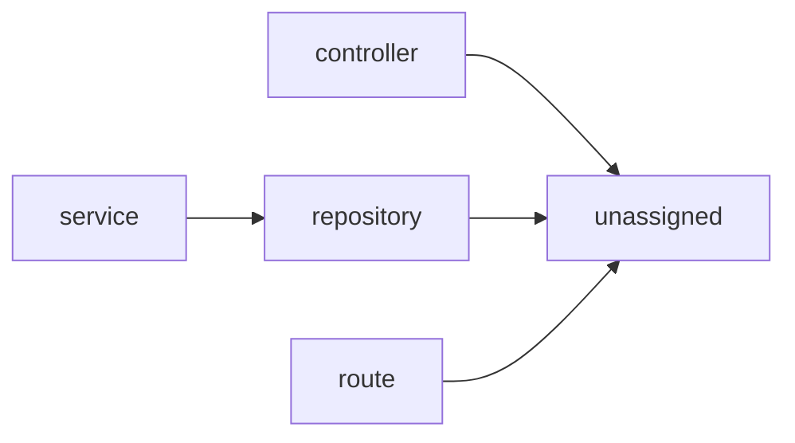

# Architecture — archsteer-public

> Auto-generated by ArchSteer from source. Do not edit by hand; run `archsteer docs`.

## Overview
- **Components:** 2165
- **Layers:** controller, handler, lib, middleware, model, repository, route, service
- **Data stores:** 1, ASGI3, CASE, Claude, CoreMetadata, Id, Pydantic, a, an, color, column, count, date, distutils, due, existing, fields, for, from, information, it, item, itself, json_schema, just, launcher, line, lines, may, menu, must, notifications, od, on, one, our, parameters, payments, progress, raw_sql, renderable, repository, row, scopes, should, status, strings, tab, the, them, things, time, timed, to, token, toolbar, truthy, undefined, unregister, values, views, what, with, your
- **External call sites:** 765

## Layer map

## Components by layer
- **controller** — 1 component(s)
- **handler** — 6 component(s)
- **lib** — 2103 component(s)
- **middleware** — 20 component(s)
- **model** — 13 component(s)
- **repository** — 1 component(s)
- **route** — 1 component(s)
- **service** — 1 component(s)
- **unassigned** — 19 component(s)

## Component catalog

| Component | Layer | Exports | Data access | External |
|---|---|---|---|---|
| `.testvenv/lib/python3.11/site-packages/__editable___archsteer_0_6_0_finder.py` | lib | _EditableFinder, _EditableNamespaceFinder, install | — | — |
| `.testvenv/lib/python3.11/site-packages/_distutils_hack/__init__.py` | lib | warn_distutils_present, clear_distutils, enabled, ensure_local_distutils | — | — |
| `.testvenv/lib/python3.11/site-packages/_distutils_hack/override.py` | lib | — | — | — |
| `.testvenv/lib/python3.11/site-packages/_pytest/__init__.py` | lib | — | — | — |
| `.testvenv/lib/python3.11/site-packages/_pytest/_argcomplete.py` | lib | FastFilesCompleter | — | — |
| `.testvenv/lib/python3.11/site-packages/_pytest/_code/__init__.py` | lib | — | — | — |
| `.testvenv/lib/python3.11/site-packages/_pytest/_code/code.py` | lib | Code, Frame, TracebackEntry, Traceback | — | 1 |
| `.testvenv/lib/python3.11/site-packages/_pytest/_code/source.py` | lib | Source, findsource, getrawcode, deindent | — | — |
| `.testvenv/lib/python3.11/site-packages/_pytest/_io/__init__.py` | lib | — | — | — |
| `.testvenv/lib/python3.11/site-packages/_pytest/_io/pprint.py` | lib | _safe_key, _safe_tuple, PrettyPrinter, _recursion | — | — |
| `.testvenv/lib/python3.11/site-packages/_pytest/_io/saferepr.py` | lib | _try_repr_or_str, _format_repr_exception, _ellipsize, SafeRepr | — | — |
| `.testvenv/lib/python3.11/site-packages/_pytest/_io/terminalwriter.py` | lib | get_terminal_width, should_do_markup, TerminalWriter | — | — |
| `.testvenv/lib/python3.11/site-packages/_pytest/_io/wcwidth.py` | lib | wcwidth, wcswidth | — | — |
| `.testvenv/lib/python3.11/site-packages/_pytest/_py/__init__.py` | lib | — | — | — |
| `.testvenv/lib/python3.11/site-packages/_pytest/_py/error.py` | lib | Error, ErrorMaker, __getattr__ | — | — |
| `.testvenv/lib/python3.11/site-packages/_pytest/_py/path.py` | lib | Checkers, NeverRaised, Visitor, FNMatcher | — | — |
| `.testvenv/lib/python3.11/site-packages/_pytest/_version.py` | lib | — | — | — |
| `.testvenv/lib/python3.11/site-packages/_pytest/assertion/__init__.py` | lib | pytest_addoption, pytest_configure, register_assert_rewrite, RewriteHook | — | — |
| `.testvenv/lib/python3.11/site-packages/_pytest/assertion/_compare_any.py` | lib | _compare_eq_any, _compare_eq_cls | — | — |
| `.testvenv/lib/python3.11/site-packages/_pytest/assertion/_compare_mapping.py` | lib | _compare_eq_mapping | — | — |
| `.testvenv/lib/python3.11/site-packages/_pytest/assertion/_compare_sequence.py` | lib | _compare_eq_iterable, _compare_eq_sequence | — | — |
| `.testvenv/lib/python3.11/site-packages/_pytest/assertion/_compare_set.py` | lib | _set_one_sided_diff, _compare_eq_set, _compare_gte_set, _compare_lte_set | — | — |
| `.testvenv/lib/python3.11/site-packages/_pytest/assertion/_guards.py` | lib | issequence, istext, ismapping, isset | — | — |
| `.testvenv/lib/python3.11/site-packages/_pytest/assertion/_typing.py` | lib | _HighlightFunc | — | — |
| `.testvenv/lib/python3.11/site-packages/_pytest/assertion/compare_text.py` | lib | _compare_eq_text, _diff_text_block, _format_text_block_lines, _diff_text | — | — |
| `.testvenv/lib/python3.11/site-packages/_pytest/assertion/highlight.py` | lib | dummy_highlighter | — | — |
| `.testvenv/lib/python3.11/site-packages/_pytest/assertion/rewrite.py` | lib | Sentinel, AssertionRewritingHook, _write_pyc_fp, _write_pyc | — | — |
| `.testvenv/lib/python3.11/site-packages/_pytest/assertion/truncate.py` | lib | truncate_if_required, _get_truncation_parameters, _truncate_explanation, _truncate_by_char_count | — | — |
| `.testvenv/lib/python3.11/site-packages/_pytest/assertion/util.py` | lib | get_assertion_text_diff_style, validate_assertion_text_diff_style, format_explanation, _split_explanation | — | — |
| `.testvenv/lib/python3.11/site-packages/_pytest/cacheprovider.py` | lib | _make_cachedir, Cache, LFPluginCollWrapper, LFPluginCollSkipfiles | — | — |
| `.testvenv/lib/python3.11/site-packages/_pytest/capture.py` | lib | pytest_addoption, _colorama_workaround, _readline_workaround, _windowsconsoleio_workaround | — | — |
| `.testvenv/lib/python3.11/site-packages/_pytest/compat.py` | lib | legacy_path, NotSetType, iscoroutinefunction, is_async_function | — | — |
| `.testvenv/lib/python3.11/site-packages/_pytest/config/__init__.py` | lib | ExitCode, ConftestImportFailure, filter_traceback_for_conftest_import_failure, print_conftest_import_error | — | — |
| `.testvenv/lib/python3.11/site-packages/_pytest/config/argparsing.py` | lib | Parser, get_ini_default_for_type, Argument, OptionGroup | — | — |
| `.testvenv/lib/python3.11/site-packages/_pytest/config/exceptions.py` | lib | UsageError, PrintHelp | — | — |
| `.testvenv/lib/python3.11/site-packages/_pytest/config/findpaths.py` | lib | ConfigValue, _parse_ini_config, load_config_dict_from_file, locate_config | — | — |
| `.testvenv/lib/python3.11/site-packages/_pytest/debugging.py` | lib | _validate_usepdb_cls, pytest_addoption, pytest_configure, pytestPDB | — | — |
| `.testvenv/lib/python3.11/site-packages/_pytest/deprecated.py` | lib | check_ispytest | — | — |
| `.testvenv/lib/python3.11/site-packages/_pytest/doctest.py` | lib | pytest_addoption, pytest_unconfigure, pytest_collect_file, _is_setup_py | — | — |
| `.testvenv/lib/python3.11/site-packages/_pytest/faulthandler.py` | lib | pytest_addoption, pytest_configure, pytest_unconfigure, get_stderr_fileno | — | — |
| `.testvenv/lib/python3.11/site-packages/_pytest/fixtures.py` | lib | pytest_sessionstart, get_scope_package, is_visibility_more_specific, get_scope_node | raw_sql | — |
| `.testvenv/lib/python3.11/site-packages/_pytest/freeze_support.py` | lib | freeze_includes, _iter_all_modules | — | — |
| `.testvenv/lib/python3.11/site-packages/_pytest/helpconfig.py` | lib | HelpAction, pytest_addoption, pytest_cmdline_parse, show_version_verbose | — | — |
| `.testvenv/lib/python3.11/site-packages/_pytest/hookspec.py` | lib | pytest_addhooks, pytest_plugin_registered, pytest_addoption, pytest_configure | — | — |
| `.testvenv/lib/python3.11/site-packages/_pytest/junitxml.py` | lib | bin_xml_escape, merge_family, _NodeReporter, _warn_incompatibility_with_xunit2 | the | — |
| `.testvenv/lib/python3.11/site-packages/_pytest/legacypath.py` | lib | Testdir, LegacyTestdirPlugin, TempdirFactory, LegacyTmpdirPlugin | — | — |
| `.testvenv/lib/python3.11/site-packages/_pytest/logging.py` | lib | _remove_ansi_escape_sequences, DatetimeFormatter, ColoredLevelFormatter, PercentStyleMultiline | color | — |
| `.testvenv/lib/python3.11/site-packages/_pytest/main.py` | lib | pytest_addoption, validate_basetemp, wrap_session, pytest_cmdline_main | item | — |
| `.testvenv/lib/python3.11/site-packages/_pytest/mark/__init__.py` | lib | param, pytest_addoption, pytest_cmdline_main, KeywordMatcher | — | — |
| `.testvenv/lib/python3.11/site-packages/_pytest/mark/expression.py` | lib | TokenType, Token, Scanner, expression | — | — |
| `.testvenv/lib/python3.11/site-packages/_pytest/mark/structures.py` | lib | _HiddenParam, istestfunc, get_empty_parameterset_mark, ParameterSet | — | — |
| `.testvenv/lib/python3.11/site-packages/_pytest/monkeypatch.py` | lib | monkeypatch, resolve, annotated_getattr, derive_importpath | — | — |
| `.testvenv/lib/python3.11/site-packages/_pytest/nodes.py` | lib | norm_sep, NodeMeta, Node, get_fslocation_from_item | — | — |
| `.testvenv/lib/python3.11/site-packages/_pytest/outcomes.py` | lib | OutcomeException, Skipped, Failed, Exit | — | — |
| `.testvenv/lib/python3.11/site-packages/_pytest/pastebin.py` | lib | pytest_addoption, pytest_configure, pytest_unconfigure, create_new_paste | — | 4 |
| `.testvenv/lib/python3.11/site-packages/_pytest/pathlib.py` | lib | _ignore_error, get_lock_path, on_rm_rf_error, ensure_extended_length_path | — | — |
| `.testvenv/lib/python3.11/site-packages/_pytest/pytester.py` | lib | pytest_addoption, pytest_configure, LsofFdLeakChecker, _pytest | — | — |
| `.testvenv/lib/python3.11/site-packages/_pytest/pytester_assertions.py` | lib | assertoutcome, assert_outcomes | — | — |
| `.testvenv/lib/python3.11/site-packages/_pytest/python.py` | lib | pytest_addoption, pytest_generate_tests, pytest_configure, async_fail | — | — |
| `.testvenv/lib/python3.11/site-packages/_pytest/python_api.py` | lib | _compare_approx, ApproxBase, _recursive_sequence_map, ApproxNumpy | — | — |
| `.testvenv/lib/python3.11/site-packages/_pytest/raises.py` | lib | raises, raises, raises, raises | — | — |
| `.testvenv/lib/python3.11/site-packages/_pytest/recwarn.py` | lib | recwarn, deprecated_call, deprecated_call, deprecated_call | — | — |
| `.testvenv/lib/python3.11/site-packages/_pytest/reports.py` | lib | getworkerinfoline, BaseReport, _report_unserialization_failure, _format_failed_longrepr | — | — |
| `.testvenv/lib/python3.11/site-packages/_pytest/runner.py` | lib | pytest_addoption, pytest_terminal_summary, pytest_sessionstart, pytest_sessionfinish | raw_sql | — |
| `.testvenv/lib/python3.11/site-packages/_pytest/scope.py` | lib | Scope | — | — |
| `.testvenv/lib/python3.11/site-packages/_pytest/setuponly.py` | lib | pytest_addoption, pytest_fixture_setup, pytest_fixture_post_finalizer, _show_fixture_action | — | — |
| `.testvenv/lib/python3.11/site-packages/_pytest/setupplan.py` | lib | pytest_addoption, pytest_fixture_setup, pytest_cmdline_main | — | — |
| `.testvenv/lib/python3.11/site-packages/_pytest/skipping.py` | lib | pytest_addoption, pytest_configure, evaluate_condition, Skip | — | — |
| `.testvenv/lib/python3.11/site-packages/_pytest/stash.py` | lib | StashKey, Stash | — | — |
| `.testvenv/lib/python3.11/site-packages/_pytest/stepwise.py` | lib | pytest_addoption, pytest_configure, pytest_sessionfinish, StepwiseCacheInfo | — | — |
| `.testvenv/lib/python3.11/site-packages/_pytest/subtests.py` | lib | pytest_addoption, SubtestContext, SubtestReport, subtests | — | — |
| `.testvenv/lib/python3.11/site-packages/_pytest/terminal.py` | lib | MoreQuietAction, TestShortLogReport, pytest_addoption, pytest_configure | — | — |
| `.testvenv/lib/python3.11/site-packages/_pytest/terminalprogress.py` | lib | pytest_configure | — | — |
| `.testvenv/lib/python3.11/site-packages/_pytest/threadexception.py` | lib | ThreadExceptionMeta, collect_thread_exception, cleanup, thread_exception_hook | — | — |
| `.testvenv/lib/python3.11/site-packages/_pytest/timing.py` | lib | Instant, Duration, MockTiming | — | — |
| `.testvenv/lib/python3.11/site-packages/_pytest/tmpdir.py` | lib | TempPathFactory, get_user, pytest_configure, pytest_addoption | — | — |
| `.testvenv/lib/python3.11/site-packages/_pytest/tracemalloc.py` | lib | tracemalloc_message | — | — |
| `.testvenv/lib/python3.11/site-packages/_pytest/unittest.py` | lib | pytest_pycollect_makeitem, UnitTestCase, TestCaseFunction, pytest_runtest_makereport | — | — |
| `.testvenv/lib/python3.11/site-packages/_pytest/unraisableexception.py` | lib | gc_collect_harder, UnraisableMeta, collect_unraisable, cleanup | — | — |
| `.testvenv/lib/python3.11/site-packages/_pytest/warning_types.py` | lib | PytestWarning, PytestAssertRewriteWarning, PytestCacheWarning, PytestConfigWarning | — | — |
| `.testvenv/lib/python3.11/site-packages/_pytest/warnings.py` | lib | catch_warnings_for_item, warning_record_to_str, pytest_runtest_protocol, pytest_collection | — | — |
| `.testvenv/lib/python3.11/site-packages/annotated_doc/__init__.py` | lib | — | — | — |
| `.testvenv/lib/python3.11/site-packages/annotated_doc/main.py` | lib | Doc | — | — |
| `.testvenv/lib/python3.11/site-packages/annotated_types/__init__.py` | lib | SupportsGt, SupportsGe, SupportsLt, SupportsLe | — | — |
| `.testvenv/lib/python3.11/site-packages/annotated_types/test_cases.py` | lib | Case, cases | — | — |
| `.testvenv/lib/python3.11/site-packages/anyio/__init__.py` | lib | __getattr__ | — | — |
| `.testvenv/lib/python3.11/site-packages/anyio/_backends/__init__.py` | lib | — | — | — |
| `.testvenv/lib/python3.11/site-packages/anyio/_backends/_asyncio.py` | lib | find_root_task, _task_started, is_anyio_cancellation, CancelScope | — | — |
| `.testvenv/lib/python3.11/site-packages/anyio/_backends/_trio.py` | lib | ensure_returns_coro, CancelScope, _TrioTaskStatus, TaskGroup | — | — |
| `.testvenv/lib/python3.11/site-packages/anyio/_core/__init__.py` | lib | — | — | — |
| `.testvenv/lib/python3.11/site-packages/anyio/_core/_asyncio_selector_thread.py` | lib | Selector, get_selector | — | — |
| `.testvenv/lib/python3.11/site-packages/anyio/_core/_contextmanagers.py` | lib | _SupportsCtxMgr, _SupportsAsyncCtxMgr, ContextManagerMixin, AsyncContextManagerMixin | — | — |
| `.testvenv/lib/python3.11/site-packages/anyio/_core/_eventloop.py` | lib | run, sleep, sleep_forever, sleep_until | — | — |
| `.testvenv/lib/python3.11/site-packages/anyio/_core/_exceptions.py` | lib | BrokenResourceError, BrokenWorkerProcess, BrokenWorkerInterpreter, BusyResourceError | — | — |
| `.testvenv/lib/python3.11/site-packages/anyio/_core/_fileio.py` | lib | AsyncFile, open_file, open_file, open_file | — | — |
| `.testvenv/lib/python3.11/site-packages/anyio/_core/_resources.py` | lib | aclose_forcefully | — | — |
| `.testvenv/lib/python3.11/site-packages/anyio/_core/_signals.py` | lib | open_signal_receiver | — | — |
| `.testvenv/lib/python3.11/site-packages/anyio/_core/_sockets.py` | lib | idna2008_resolve, connect_tcp, connect_tcp, connect_tcp | — | — |
| `.testvenv/lib/python3.11/site-packages/anyio/_core/_streams.py` | lib | create_memory_object_stream | — | — |
| `.testvenv/lib/python3.11/site-packages/anyio/_core/_subprocesses.py` | lib | run_process, open_process | — | — |
| `.testvenv/lib/python3.11/site-packages/anyio/_core/_synchronization.py` | lib | EventStatistics, CapacityLimiterStatistics, LockStatistics, ConditionStatistics | — | — |
| `.testvenv/lib/python3.11/site-packages/anyio/_core/_tasks.py` | lib | _IgnoredTaskStatus, CancelScope, fail_after, move_on_after | — | — |
| `.testvenv/lib/python3.11/site-packages/anyio/_core/_tempfile.py` | lib | TemporaryFile, NamedTemporaryFile, SpooledTemporaryFile, TemporaryDirectory | — | — |
| `.testvenv/lib/python3.11/site-packages/anyio/_core/_testing.py` | lib | TaskInfo, get_current_task, get_running_tasks, wait_all_tasks_blocked | — | — |
| `.testvenv/lib/python3.11/site-packages/anyio/_core/_typedattr.py` | lib | typed_attribute, TypedAttributeSet, TypedAttributeProvider | — | — |
| `.testvenv/lib/python3.11/site-packages/anyio/abc/__init__.py` | lib | — | — | — |
| `.testvenv/lib/python3.11/site-packages/anyio/abc/_eventloop.py` | lib | AsyncBackend | — | — |
| `.testvenv/lib/python3.11/site-packages/anyio/abc/_resources.py` | lib | AsyncResource | — | — |
| `.testvenv/lib/python3.11/site-packages/anyio/abc/_sockets.py` | lib | _validate_socket, SocketAttribute, _SocketProvider, SocketStream | — | — |
| `.testvenv/lib/python3.11/site-packages/anyio/abc/_streams.py` | lib | UnreliableObjectReceiveStream, UnreliableObjectSendStream, UnreliableObjectStream, ObjectReceiveStream | — | — |
| `.testvenv/lib/python3.11/site-packages/anyio/abc/_subprocesses.py` | lib | Process | — | — |
| `.testvenv/lib/python3.11/site-packages/anyio/abc/_tasks.py` | lib | get_callable_name, call_for_coroutine, TaskStatus, TaskGroup | — | — |
| `.testvenv/lib/python3.11/site-packages/anyio/abc/_testing.py` | lib | TestRunner | — | — |
| `.testvenv/lib/python3.11/site-packages/anyio/from_thread.py` | lib | _token_or_error, run, run_sync, _BlockingAsyncContextManager | — | — |
| `.testvenv/lib/python3.11/site-packages/anyio/functools.py` | lib | _InitialMissingType, AsyncCacheInfo, AsyncCacheParameters, _LRUMethodWrapper | — | — |
| `.testvenv/lib/python3.11/site-packages/anyio/itertools.py` | lib | _IterableAsyncIterator, _iterate, _TeeLink, _TeeState | — | — |
| `.testvenv/lib/python3.11/site-packages/anyio/lowlevel.py` | lib | checkpoint, checkpoint_if_cancelled, cancel_shielded_checkpoint, EventLoopToken | — | — |
| `.testvenv/lib/python3.11/site-packages/anyio/pytest_plugin.py` | lib | extract_backend_and_options, get_runner, pytest_addoption, pytest_configure | — | — |
| `.testvenv/lib/python3.11/site-packages/anyio/streams/__init__.py` | lib | — | — | — |
| `.testvenv/lib/python3.11/site-packages/anyio/streams/buffered.py` | lib | BufferedByteReceiveStream, BufferedByteStream, BufferedConnectable | — | — |
| `.testvenv/lib/python3.11/site-packages/anyio/streams/file.py` | lib | FileStreamAttribute, _BaseFileStream, FileReadStream, FileWriteStream | — | — |
| `.testvenv/lib/python3.11/site-packages/anyio/streams/memory.py` | lib | MemoryObjectStreamStatistics, _MemoryObjectItemReceiver, _MemoryObjectStreamState, MemoryObjectReceiveStream | — | — |
| `.testvenv/lib/python3.11/site-packages/anyio/streams/stapled.py` | lib | StapledByteStream, StapledObjectStream, MultiListener | — | — |
| `.testvenv/lib/python3.11/site-packages/anyio/streams/text.py` | lib | TextReceiveStream, TextSendStream, TextStream, TextConnectable | — | — |
| `.testvenv/lib/python3.11/site-packages/anyio/streams/tls.py` | lib | TLSAttribute, TLSStream, TLSListener, TLSConnectable | — | — |
| `.testvenv/lib/python3.11/site-packages/anyio/to_interpreter.py` | lib | _stop_workers, run_sync, current_default_interpreter_limiter | — | — |
| `.testvenv/lib/python3.11/site-packages/anyio/to_process.py` | lib | run_sync, current_default_process_limiter, process_worker | — | — |
| `.testvenv/lib/python3.11/site-packages/anyio/to_thread.py` | lib | run_sync, current_default_thread_limiter | — | — |
| `.testvenv/lib/python3.11/site-packages/attr/__init__.py` | lib | AttrsInstance, _make_getattr | — | — |
| `.testvenv/lib/python3.11/site-packages/attr/_cmp.py` | lib | cmp_using, _make_init, _make_operator, _is_comparable_to | — | — |
| `.testvenv/lib/python3.11/site-packages/attr/_compat.py` | lib | _AnnotationExtractor, get_generic_base | — | — |
| `.testvenv/lib/python3.11/site-packages/attr/_config.py` | lib | set_run_validators, get_run_validators | — | — |
| `.testvenv/lib/python3.11/site-packages/attr/_funcs.py` | lib | asdict, _asdict_anything, astuple, has | — | — |
| `.testvenv/lib/python3.11/site-packages/attr/_make.py` | lib | _Nothing, _CacheHashWrapper, attrib, _compile_and_eval | — | — |
| `.testvenv/lib/python3.11/site-packages/attr/_next_gen.py` | lib | define, field, asdict, astuple | — | — |
| `.testvenv/lib/python3.11/site-packages/attr/_version_info.py` | lib | VersionInfo | — | — |
| `.testvenv/lib/python3.11/site-packages/attr/converters.py` | lib | optional, default_if_none, to_bool | — | — |
| `.testvenv/lib/python3.11/site-packages/attr/exceptions.py` | lib | FrozenError, FrozenInstanceError, FrozenAttributeError, AttrsAttributeNotFoundError | — | — |
| `.testvenv/lib/python3.11/site-packages/attr/filters.py` | lib | _split_what, include, exclude | — | — |
| `.testvenv/lib/python3.11/site-packages/attr/setters.py` | lib | pipe, frozen, validate, convert | — | — |
| `.testvenv/lib/python3.11/site-packages/attr/validators.py` | lib | set_disabled, get_disabled, disabled, _InstanceOfValidator | — | — |
| `.testvenv/lib/python3.11/site-packages/attrs/__init__.py` | lib | — | — | — |
| `.testvenv/lib/python3.11/site-packages/attrs/converters.py` | lib | — | — | — |
| `.testvenv/lib/python3.11/site-packages/attrs/exceptions.py` | lib | — | — | — |
| `.testvenv/lib/python3.11/site-packages/attrs/filters.py` | lib | — | — | — |
| `.testvenv/lib/python3.11/site-packages/attrs/setters.py` | lib | — | — | — |
| `.testvenv/lib/python3.11/site-packages/attrs/validators.py` | lib | — | — | — |
| `.testvenv/lib/python3.11/site-packages/certifi/__init__.py` | lib | — | — | — |
| `.testvenv/lib/python3.11/site-packages/certifi/__main__.py` | lib | — | — | — |
| `.testvenv/lib/python3.11/site-packages/certifi/core.py` | lib | exit_cacert_ctx | — | — |
| `.testvenv/lib/python3.11/site-packages/certifi/tests/__init__.py` | lib | — | — | — |
| `.testvenv/lib/python3.11/site-packages/certifi/tests/test_certify.py` | lib | TestCertifi | — | — |
| `.testvenv/lib/python3.11/site-packages/cffi/__init__.py` | lib | — | — | — |
| `.testvenv/lib/python3.11/site-packages/cffi/_cffi_gen_src.py` | lib | _execfile, find_ffi_in_python_script, make_ffi_from_sources, generate_c_source | — | — |
| `.testvenv/lib/python3.11/site-packages/cffi/_imp_emulation.py` | lib | — | — | — |
| `.testvenv/lib/python3.11/site-packages/cffi/_shimmed_dist_utils.py` | lib | — | — | — |
| `.testvenv/lib/python3.11/site-packages/cffi/api.py` | lib | FFI, _load_backend_lib, _make_ffi_library, _builtin_function_type | — | — |
| `.testvenv/lib/python3.11/site-packages/cffi/backend_ctypes.py` | lib | CTypesType, CTypesData, CTypesGenericPrimitive, CTypesGenericArray | — | — |
| `.testvenv/lib/python3.11/site-packages/cffi/cffi_opcode.py` | lib | CffiOp, format_four_bytes | — | — |
| `.testvenv/lib/python3.11/site-packages/cffi/commontypes.py` | lib | resolve_common_type, win_common_types | — | — |
| `.testvenv/lib/python3.11/site-packages/cffi/cparser.py` | lib | _workaround_for_static_import_finders, _get_parser, _workaround_for_old_pycparser, _preprocess_extern_python | — | — |
| `.testvenv/lib/python3.11/site-packages/cffi/error.py` | lib | FFIError, CDefError, VerificationError, VerificationMissing | — | — |
| `.testvenv/lib/python3.11/site-packages/cffi/ffiplatform.py` | lib | get_extension, compile, _build, maybe_relative_path | — | — |
| `.testvenv/lib/python3.11/site-packages/cffi/gen_src.py` | lib | — | — | — |
| `.testvenv/lib/python3.11/site-packages/cffi/lock.py` | lib | — | — | — |
| `.testvenv/lib/python3.11/site-packages/cffi/model.py` | lib | qualify, BaseTypeByIdentity, BaseType, VoidType | — | — |
| `.testvenv/lib/python3.11/site-packages/cffi/pkgconfig.py` | lib | merge_flags, call, flags_from_pkgconfig | — | — |
| `.testvenv/lib/python3.11/site-packages/cffi/recompiler.py` | lib | GlobalExpr, FieldExpr, StructUnionExpr, EnumExpr | — | — |
| `.testvenv/lib/python3.11/site-packages/cffi/setuptools_ext.py` | lib | error, execfile, add_cffi_module, _set_py_limited_api | — | — |
| `.testvenv/lib/python3.11/site-packages/cffi/vengine_cpy.py` | lib | VCPythonEngine | — | — |
| `.testvenv/lib/python3.11/site-packages/cffi/vengine_gen.py` | lib | VGenericEngine | — | — |
| `.testvenv/lib/python3.11/site-packages/cffi/verifier.py` | lib | Verifier, _locate_engine_class, _caller_dir_pycache, set_tmpdir | — | — |
| `.testvenv/lib/python3.11/site-packages/click/__init__.py` | lib | __getattr__ | — | — |
| `.testvenv/lib/python3.11/site-packages/click/_compat.py` | lib | _make_text_stream, is_ascii_encoding, get_best_encoding, _NonClosingTextIOWrapper | — | — |
| `.testvenv/lib/python3.11/site-packages/click/_termui_impl.py` | lib | _BufferedTextPagerStream, _has_binary_buffer, ProgressBar, MaybeStripAnsi | the | 1 |
| `.testvenv/lib/python3.11/site-packages/click/_textwrap.py` | lib | _truncate_visible, TextWrapper | — | — |
| `.testvenv/lib/python3.11/site-packages/click/_utils.py` | lib | Sentinel | — | — |
| `.testvenv/lib/python3.11/site-packages/click/_winconsole.py` | lib | _WindowsConsoleRawIOBase, _WindowsConsoleReader, _WindowsConsoleWriter, ConsoleStream | — | — |
| `.testvenv/lib/python3.11/site-packages/click/core.py` | lib | _complete_visible_commands, _check_nested_chain, _format_deprecated_label, _format_deprecated_suffix | — | — |
| `.testvenv/lib/python3.11/site-packages/click/decorators.py` | lib | pass_context, pass_obj, make_pass_decorator, pass_meta_key | — | — |
| `.testvenv/lib/python3.11/site-packages/click/exceptions.py` | lib | _join_param_hints, _format_possibilities, ClickException, UsageError | — | — |
| `.testvenv/lib/python3.11/site-packages/click/formatting.py` | lib | measure_table, iter_rows, wrap_text, HelpFormatter | — | — |
| `.testvenv/lib/python3.11/site-packages/click/globals.py` | lib | get_current_context, get_current_context, get_current_context, push_context | — | — |
| `.testvenv/lib/python3.11/site-packages/click/parser.py` | lib | _unpack_args, _split_opt, _normalize_opt, _Option | — | — |
| `.testvenv/lib/python3.11/site-packages/click/shell_completion.py` | lib | shell_complete, CompletionItem, _SourceVarsDict, ShellComplete | — | — |
| `.testvenv/lib/python3.11/site-packages/click/termui.py` | lib | _mask_hidden_input, hidden_prompt_func, _readline_prompt, _build_prompt | — | — |
| `.testvenv/lib/python3.11/site-packages/click/testing.py` | lib | EchoingStdin, _pause_echo, _FDCapture, BytesIOCopy | — | — |
| `.testvenv/lib/python3.11/site-packages/click/types.py` | lib | ParamTypeInfoDict, ParamType, CompositeParamType, FuncParamType | — | — |
| `.testvenv/lib/python3.11/site-packages/click/utils.py` | lib | _posixify, safecall, make_str, make_default_short_help | — | — |
| `.testvenv/lib/python3.11/site-packages/cryptography/__about__.py` | lib | — | — | — |
| `.testvenv/lib/python3.11/site-packages/cryptography/__init__.py` | lib | — | — | — |
| `.testvenv/lib/python3.11/site-packages/cryptography/exceptions.py` | lib | UnsupportedAlgorithm, AlreadyFinalized, AlreadyUpdated, NotYetFinalized | — | — |
| `.testvenv/lib/python3.11/site-packages/cryptography/fernet.py` | lib | InvalidToken, Fernet, MultiFernet | — | — |
| `.testvenv/lib/python3.11/site-packages/cryptography/hazmat/__init__.py` | lib | — | — | — |
| `.testvenv/lib/python3.11/site-packages/cryptography/hazmat/_oid.py` | lib | ExtensionOID, OCSPExtensionOID, CRLEntryExtensionOID, NameOID | — | — |
| `.testvenv/lib/python3.11/site-packages/cryptography/hazmat/asn1/__init__.py` | lib | — | — | — |
| `.testvenv/lib/python3.11/site-packages/cryptography/hazmat/asn1/asn1.py` | lib | _normalize_field_type, _annotate_fields, _register_asn1_sequence | — | — |
| `.testvenv/lib/python3.11/site-packages/cryptography/hazmat/backends/__init__.py` | lib | default_backend | — | — |
| `.testvenv/lib/python3.11/site-packages/cryptography/hazmat/backends/openssl/__init__.py` | lib | — | — | — |
| `.testvenv/lib/python3.11/site-packages/cryptography/hazmat/backends/openssl/backend.py` | lib | Backend | — | — |
| `.testvenv/lib/python3.11/site-packages/cryptography/hazmat/bindings/__init__.py` | lib | — | — | — |
| `.testvenv/lib/python3.11/site-packages/cryptography/hazmat/bindings/openssl/__init__.py` | lib | — | — | — |
| `.testvenv/lib/python3.11/site-packages/cryptography/hazmat/bindings/openssl/_conditional.py` | lib | cryptography_has_set_cert_cb, cryptography_has_ssl_st, cryptography_has_tls_st, cryptography_has_ssl_sigalgs | — | — |
| `.testvenv/lib/python3.11/site-packages/cryptography/hazmat/bindings/openssl/binding.py` | lib | _openssl_assert, build_conditional_library, Binding, _verify_package_version | — | — |
| `.testvenv/lib/python3.11/site-packages/cryptography/hazmat/decrepit/__init__.py` | lib | — | — | — |
| `.testvenv/lib/python3.11/site-packages/cryptography/hazmat/decrepit/ciphers/__init__.py` | lib | — | — | — |
| `.testvenv/lib/python3.11/site-packages/cryptography/hazmat/decrepit/ciphers/algorithms.py` | lib | ARC4, TripleDES, _DES, Blowfish | — | — |
| `.testvenv/lib/python3.11/site-packages/cryptography/hazmat/primitives/__init__.py` | lib | — | — | — |
| `.testvenv/lib/python3.11/site-packages/cryptography/hazmat/primitives/_asymmetric.py` | lib | AsymmetricPadding | — | — |
| `.testvenv/lib/python3.11/site-packages/cryptography/hazmat/primitives/_cipheralgorithm.py` | lib | CipherAlgorithm, BlockCipherAlgorithm, _verify_key_size | — | — |
| `.testvenv/lib/python3.11/site-packages/cryptography/hazmat/primitives/_serialization.py` | lib | PBES, Encoding, PrivateFormat, PublicFormat | — | — |
| `.testvenv/lib/python3.11/site-packages/cryptography/hazmat/primitives/asymmetric/__init__.py` | lib | — | — | — |
| `.testvenv/lib/python3.11/site-packages/cryptography/hazmat/primitives/asymmetric/dh.py` | lib | DHParameters, DHPublicKey, DHPrivateKey | — | — |
| `.testvenv/lib/python3.11/site-packages/cryptography/hazmat/primitives/asymmetric/dsa.py` | lib | DSAParameters, DSAPrivateKey, DSAPublicKey, generate_parameters | — | — |
| `.testvenv/lib/python3.11/site-packages/cryptography/hazmat/primitives/asymmetric/ec.py` | lib | EllipticCurveOID, EllipticCurve, EllipticCurveSignatureAlgorithm, EllipticCurvePrivateKey | — | — |
| `.testvenv/lib/python3.11/site-packages/cryptography/hazmat/primitives/asymmetric/ed25519.py` | lib | Ed25519PublicKey, Ed25519PrivateKey | — | — |
| `.testvenv/lib/python3.11/site-packages/cryptography/hazmat/primitives/asymmetric/ed448.py` | lib | Ed448PublicKey, Ed448PrivateKey | — | — |
| `.testvenv/lib/python3.11/site-packages/cryptography/hazmat/primitives/asymmetric/padding.py` | lib | PKCS1v15, _MaxLength, _Auto, _DigestLength | — | — |
| `.testvenv/lib/python3.11/site-packages/cryptography/hazmat/primitives/asymmetric/rsa.py` | lib | RSAPrivateKey, RSAPublicKey, generate_private_key, _verify_rsa_parameters | — | — |
| `.testvenv/lib/python3.11/site-packages/cryptography/hazmat/primitives/asymmetric/types.py` | lib | — | — | — |
| `.testvenv/lib/python3.11/site-packages/cryptography/hazmat/primitives/asymmetric/utils.py` | lib | Prehashed | — | — |
| `.testvenv/lib/python3.11/site-packages/cryptography/hazmat/primitives/asymmetric/x25519.py` | lib | X25519PublicKey, X25519PrivateKey | — | — |
| `.testvenv/lib/python3.11/site-packages/cryptography/hazmat/primitives/asymmetric/x448.py` | lib | X448PublicKey, X448PrivateKey | — | — |
| `.testvenv/lib/python3.11/site-packages/cryptography/hazmat/primitives/ciphers/__init__.py` | lib | — | — | — |
| `.testvenv/lib/python3.11/site-packages/cryptography/hazmat/primitives/ciphers/aead.py` | lib | — | — | — |
| `.testvenv/lib/python3.11/site-packages/cryptography/hazmat/primitives/ciphers/algorithms.py` | lib | AES, AES128, AES256, Camellia | — | — |
| `.testvenv/lib/python3.11/site-packages/cryptography/hazmat/primitives/ciphers/base.py` | lib | CipherContext, AEADCipherContext, AEADDecryptionContext, AEADEncryptionContext | — | — |
| `.testvenv/lib/python3.11/site-packages/cryptography/hazmat/primitives/ciphers/modes.py` | lib | Mode, ModeWithInitializationVector, ModeWithTweak, ModeWithNonce | — | — |
| `.testvenv/lib/python3.11/site-packages/cryptography/hazmat/primitives/cmac.py` | lib | — | — | — |
| `.testvenv/lib/python3.11/site-packages/cryptography/hazmat/primitives/constant_time.py` | lib | bytes_eq | — | — |
| `.testvenv/lib/python3.11/site-packages/cryptography/hazmat/primitives/hashes.py` | lib | HashAlgorithm, HashContext, ExtendableOutputFunction, SHA1 | — | — |
| `.testvenv/lib/python3.11/site-packages/cryptography/hazmat/primitives/hmac.py` | lib | — | — | — |
| `.testvenv/lib/python3.11/site-packages/cryptography/hazmat/primitives/kdf/__init__.py` | lib | KeyDerivationFunction | — | — |
| `.testvenv/lib/python3.11/site-packages/cryptography/hazmat/primitives/kdf/argon2.py` | lib | — | — | — |
| `.testvenv/lib/python3.11/site-packages/cryptography/hazmat/primitives/kdf/concatkdf.py` | lib | _int_to_u32be, _common_args_checks, _concatkdf_derive, ConcatKDFHash | — | — |
| `.testvenv/lib/python3.11/site-packages/cryptography/hazmat/primitives/kdf/hkdf.py` | lib | — | — | — |
| `.testvenv/lib/python3.11/site-packages/cryptography/hazmat/primitives/kdf/kbkdf.py` | lib | Mode, CounterLocation, _KBKDFDeriver, KBKDFHMAC | — | — |
| `.testvenv/lib/python3.11/site-packages/cryptography/hazmat/primitives/kdf/pbkdf2.py` | lib | PBKDF2HMAC | — | — |
| `.testvenv/lib/python3.11/site-packages/cryptography/hazmat/primitives/kdf/scrypt.py` | lib | — | — | — |
| `.testvenv/lib/python3.11/site-packages/cryptography/hazmat/primitives/kdf/x963kdf.py` | lib | _int_to_u32be, X963KDF | — | — |
| `.testvenv/lib/python3.11/site-packages/cryptography/hazmat/primitives/keywrap.py` | lib | _wrap_core, aes_key_wrap, _unwrap_core, aes_key_wrap_with_padding | — | — |
| `.testvenv/lib/python3.11/site-packages/cryptography/hazmat/primitives/padding.py` | lib | PaddingContext, _byte_padding_check, PKCS7, ANSIX923 | — | — |
| `.testvenv/lib/python3.11/site-packages/cryptography/hazmat/primitives/poly1305.py` | lib | — | — | — |
| `.testvenv/lib/python3.11/site-packages/cryptography/hazmat/primitives/serialization/__init__.py` | lib | — | — | — |
| `.testvenv/lib/python3.11/site-packages/cryptography/hazmat/primitives/serialization/base.py` | lib | — | — | — |
| `.testvenv/lib/python3.11/site-packages/cryptography/hazmat/primitives/serialization/pkcs12.py` | lib | PKCS12KeyAndCertificates, serialize_java_truststore, serialize_key_and_certificates | — | — |
| `.testvenv/lib/python3.11/site-packages/cryptography/hazmat/primitives/serialization/pkcs7.py` | lib | PKCS7Options, PKCS7SignatureBuilder, PKCS7EnvelopeBuilder, _smime_signed_encode | — | — |
| `.testvenv/lib/python3.11/site-packages/cryptography/hazmat/primitives/serialization/ssh.py` | lib | _SSHCipher, _get_ssh_key_type, _ecdsa_key_type, _ssh_pem_encode | — | — |
| `.testvenv/lib/python3.11/site-packages/cryptography/hazmat/primitives/twofactor/__init__.py` | lib | InvalidToken | — | — |
| `.testvenv/lib/python3.11/site-packages/cryptography/hazmat/primitives/twofactor/hotp.py` | lib | _generate_uri, HOTP | — | 1 |
| `.testvenv/lib/python3.11/site-packages/cryptography/hazmat/primitives/twofactor/totp.py` | lib | TOTP | — | — |
| `.testvenv/lib/python3.11/site-packages/cryptography/utils.py` | lib | CryptographyDeprecationWarning, _check_bytes, _check_byteslike, int_to_bytes | — | — |
| `.testvenv/lib/python3.11/site-packages/cryptography/x509/__init__.py` | lib | — | — | — |
| `.testvenv/lib/python3.11/site-packages/cryptography/x509/base.py` | lib | AttributeNotFound, _reject_duplicate_extension, _reject_duplicate_attribute, _convert_to_naive_utc_time | date, may, time | — |
| `.testvenv/lib/python3.11/site-packages/cryptography/x509/certificate_transparency.py` | lib | LogEntryType, Version, SignatureAlgorithm | — | — |
| `.testvenv/lib/python3.11/site-packages/cryptography/x509/extensions.py` | lib | _key_identifier_from_public_key, _make_sequence_methods, DuplicateExtension, ExtensionNotFound | — | — |
| `.testvenv/lib/python3.11/site-packages/cryptography/x509/general_name.py` | lib | UnsupportedGeneralNameType, GeneralName, RFC822Name, DNSName | — | — |
| `.testvenv/lib/python3.11/site-packages/cryptography/x509/name.py` | lib | _ASN1Type, _escape_dn_value, _unescape_dn_value, NameAttribute | — | — |
| `.testvenv/lib/python3.11/site-packages/cryptography/x509/ocsp.py` | lib | OCSPResponderEncoding, OCSPResponseStatus, _verify_algorithm, OCSPCertStatus | must | — |
| `.testvenv/lib/python3.11/site-packages/cryptography/x509/oid.py` | lib | — | — | — |
| `.testvenv/lib/python3.11/site-packages/cryptography/x509/verification.py` | lib | — | — | — |
| `.testvenv/lib/python3.11/site-packages/dotenv/__init__.py` | lib | load_ipython_extension, get_cli_string | — | — |
| `.testvenv/lib/python3.11/site-packages/dotenv/__main__.py` | lib | — | — | — |
| `.testvenv/lib/python3.11/site-packages/dotenv/cli.py` | lib | enumerate_env, cli, stream_file, list_values | — | — |
| `.testvenv/lib/python3.11/site-packages/dotenv/ipython.py` | lib | IPythonDotEnv, load_ipython_extension | — | — |
| `.testvenv/lib/python3.11/site-packages/dotenv/main.py` | lib | _load_dotenv_disabled, with_warn_for_invalid_lines, DotEnv, get_key | raw_sql | — |
| `.testvenv/lib/python3.11/site-packages/dotenv/parser.py` | lib | make_regex, Original, Binding, Position | — | — |
| `.testvenv/lib/python3.11/site-packages/dotenv/variables.py` | lib | Atom, Literal, Variable, parse_variables | — | — |
| `.testvenv/lib/python3.11/site-packages/dotenv/version.py` | lib | — | — | — |
| `.testvenv/lib/python3.11/site-packages/h11/__init__.py` | lib | — | — | — |
| `.testvenv/lib/python3.11/site-packages/h11/_abnf.py` | lib | — | — | — |
| `.testvenv/lib/python3.11/site-packages/h11/_connection.py` | lib | NEED_DATA, PAUSED, _keep_alive, _body_framing | our | — |
| `.testvenv/lib/python3.11/site-packages/h11/_events.py` | lib | Event, Request, _ResponseBase, InformationalResponse | — | — |
| `.testvenv/lib/python3.11/site-packages/h11/_headers.py` | lib | Headers, normalize_and_validate, normalize_and_validate, normalize_and_validate | — | — |
| `.testvenv/lib/python3.11/site-packages/h11/_readers.py` | lib | _obsolete_line_fold, _decode_header_lines, maybe_read_from_IDLE_client, maybe_read_from_SEND_RESPONSE_server | — | — |
| `.testvenv/lib/python3.11/site-packages/h11/_receivebuffer.py` | lib | ReceiveBuffer | — | — |
| `.testvenv/lib/python3.11/site-packages/h11/_state.py` | lib | CLIENT, SERVER, IDLE, SEND_RESPONSE | — | — |
| `.testvenv/lib/python3.11/site-packages/h11/_util.py` | lib | ProtocolError, LocalProtocolError, RemoteProtocolError, validate | — | — |
| `.testvenv/lib/python3.11/site-packages/h11/_version.py` | lib | — | — | — |
| `.testvenv/lib/python3.11/site-packages/h11/_writers.py` | lib | write_headers, write_request, write_any_response, BodyWriter | — | — |
| `.testvenv/lib/python3.11/site-packages/httpcore/__init__.py` | lib | — | — | — |
| `.testvenv/lib/python3.11/site-packages/httpcore/_api.py` | lib | request, stream | — | — |
| `.testvenv/lib/python3.11/site-packages/httpcore/_async/__init__.py` | lib | — | — | — |
| `.testvenv/lib/python3.11/site-packages/httpcore/_async/connection.py` | lib | exponential_backoff, AsyncHTTPConnection | — | 1 |
| `.testvenv/lib/python3.11/site-packages/httpcore/_async/connection_pool.py` | lib | AsyncPoolRequest, AsyncConnectionPool, PoolByteStream | — | 3 |
| `.testvenv/lib/python3.11/site-packages/httpcore/_async/http11.py` | lib | HTTPConnectionState, AsyncHTTP11Connection, HTTP11ConnectionByteStream, AsyncHTTP11UpgradeStream | — | — |
| `.testvenv/lib/python3.11/site-packages/httpcore/_async/http2.py` | lib | has_body_headers, HTTPConnectionState, AsyncHTTP2Connection, HTTP2ConnectionByteStream | — | 2 |
| `.testvenv/lib/python3.11/site-packages/httpcore/_async/http_proxy.py` | lib | merge_headers, AsyncHTTPProxy, AsyncForwardHTTPConnection, AsyncTunnelHTTPConnection | — | 2 |
| `.testvenv/lib/python3.11/site-packages/httpcore/_async/interfaces.py` | lib | AsyncRequestInterface, AsyncConnectionInterface | — | — |
| `.testvenv/lib/python3.11/site-packages/httpcore/_async/socks_proxy.py` | lib | _init_socks5_connection, AsyncSOCKSProxy, AsyncSocks5Connection | — | 2 |
| `.testvenv/lib/python3.11/site-packages/httpcore/_backends/__init__.py` | lib | — | — | — |
| `.testvenv/lib/python3.11/site-packages/httpcore/_backends/anyio.py` | lib | AnyIOStream, AnyIOBackend | — | — |
| `.testvenv/lib/python3.11/site-packages/httpcore/_backends/auto.py` | lib | AutoBackend | — | — |
| `.testvenv/lib/python3.11/site-packages/httpcore/_backends/base.py` | lib | NetworkStream, NetworkBackend, AsyncNetworkStream, AsyncNetworkBackend | — | — |
| `.testvenv/lib/python3.11/site-packages/httpcore/_backends/mock.py` | lib | MockSSLObject, MockStream, MockBackend, AsyncMockStream | — | — |
| `.testvenv/lib/python3.11/site-packages/httpcore/_backends/sync.py` | lib | TLSinTLSStream, SyncStream, SyncBackend | — | — |
| `.testvenv/lib/python3.11/site-packages/httpcore/_backends/trio.py` | lib | TrioStream, TrioBackend | — | — |
| `.testvenv/lib/python3.11/site-packages/httpcore/_exceptions.py` | lib | map_exceptions, ConnectionNotAvailable, ProxyError, UnsupportedProtocol | — | — |
| `.testvenv/lib/python3.11/site-packages/httpcore/_models.py` | lib | enforce_bytes, enforce_url, enforce_headers, enforce_stream | — | 2 |
| `.testvenv/lib/python3.11/site-packages/httpcore/_ssl.py` | lib | default_ssl_context | — | — |
| `.testvenv/lib/python3.11/site-packages/httpcore/_sync/__init__.py` | lib | — | — | — |
| `.testvenv/lib/python3.11/site-packages/httpcore/_sync/connection.py` | lib | exponential_backoff, HTTPConnection | — | 1 |
| `.testvenv/lib/python3.11/site-packages/httpcore/_sync/connection_pool.py` | lib | PoolRequest, ConnectionPool, PoolByteStream | — | 3 |
| `.testvenv/lib/python3.11/site-packages/httpcore/_sync/http11.py` | lib | HTTPConnectionState, HTTP11Connection, HTTP11ConnectionByteStream, HTTP11UpgradeStream | — | — |
| `.testvenv/lib/python3.11/site-packages/httpcore/_sync/http2.py` | lib | has_body_headers, HTTPConnectionState, HTTP2Connection, HTTP2ConnectionByteStream | — | 2 |
| `.testvenv/lib/python3.11/site-packages/httpcore/_sync/http_proxy.py` | lib | merge_headers, HTTPProxy, ForwardHTTPConnection, TunnelHTTPConnection | — | 2 |
| `.testvenv/lib/python3.11/site-packages/httpcore/_sync/interfaces.py` | lib | RequestInterface, ConnectionInterface | — | — |
| `.testvenv/lib/python3.11/site-packages/httpcore/_sync/socks_proxy.py` | lib | _init_socks5_connection, SOCKSProxy, Socks5Connection | — | 2 |
| `.testvenv/lib/python3.11/site-packages/httpcore/_synchronization.py` | lib | current_async_library, AsyncLock, AsyncThreadLock, AsyncEvent | — | — |
| `.testvenv/lib/python3.11/site-packages/httpcore/_trace.py` | lib | Trace | — | — |
| `.testvenv/lib/python3.11/site-packages/httpcore/_utils.py` | lib | is_socket_readable | — | — |
| `.testvenv/lib/python3.11/site-packages/httpx/__init__.py` | lib | — | — | — |
| `.testvenv/lib/python3.11/site-packages/httpx/__version__.py` | lib | — | — | — |
| `.testvenv/lib/python3.11/site-packages/httpx/_api.py` | lib | request, stream, get, options | — | 10 |
| `.testvenv/lib/python3.11/site-packages/httpx/_auth.py` | lib | Auth, FunctionAuth, BasicAuth, NetRCAuth | — | 1 |
| `.testvenv/lib/python3.11/site-packages/httpx/_client.py` | lib | _is_https_redirect, _port_or_default, _same_origin, UseClientDefault | — | 33 |
| `.testvenv/lib/python3.11/site-packages/httpx/_config.py` | lib | UnsetType, create_ssl_context, Timeout, Limits | — | 1 |
| `.testvenv/lib/python3.11/site-packages/httpx/_content.py` | lib | ByteStream, IteratorByteStream, AsyncIteratorByteStream, UnattachedStream | — | 2 |
| `.testvenv/lib/python3.11/site-packages/httpx/_decoders.py` | lib | ContentDecoder, IdentityDecoder, DeflateDecoder, GZipDecoder | — | — |
| `.testvenv/lib/python3.11/site-packages/httpx/_exceptions.py` | lib | HTTPError, RequestError, TransportError, TimeoutException | — | 2 |
| `.testvenv/lib/python3.11/site-packages/httpx/_main.py` | lib | print_help, get_lexer_for_response, format_request_headers, format_response_headers | — | — |
| `.testvenv/lib/python3.11/site-packages/httpx/_models.py` | lib | _is_known_encoding, _normalize_header_key, _normalize_header_value, _parse_content_type_charset | raw_sql | 2 |
| `.testvenv/lib/python3.11/site-packages/httpx/_multipart.py` | lib | _format_form_param, _guess_content_type, get_multipart_boundary_from_content_type, DataField | — | — |
| `.testvenv/lib/python3.11/site-packages/httpx/_status_codes.py` | lib | codes | — | — |
| `.testvenv/lib/python3.11/site-packages/httpx/_transports/__init__.py` | lib | — | — | — |
| `.testvenv/lib/python3.11/site-packages/httpx/_transports/asgi.py` | lib | is_running_trio, create_event, ASGIResponseStream, ASGITransport | — | 3 |
| `.testvenv/lib/python3.11/site-packages/httpx/_transports/base.py` | lib | BaseTransport, AsyncBaseTransport | — | 2 |
| `.testvenv/lib/python3.11/site-packages/httpx/_transports/default.py` | lib | _load_httpcore_exceptions, map_httpcore_exceptions, ResponseStream, HTTPTransport | — | 10 |
| `.testvenv/lib/python3.11/site-packages/httpx/_transports/mock.py` | lib | MockTransport | — | — |
| `.testvenv/lib/python3.11/site-packages/httpx/_transports/wsgi.py` | lib | _skip_leading_empty_chunks, WSGIByteStream, WSGITransport | — | 4 |
| `.testvenv/lib/python3.11/site-packages/httpx/_types.py` | lib | SyncByteStream, AsyncByteStream | — | — |
| `.testvenv/lib/python3.11/site-packages/httpx/_urlparse.py` | lib | ParseResult, urlparse, encode_host, normalize_port | — | — |
| `.testvenv/lib/python3.11/site-packages/httpx/_urls.py` | lib | URL, QueryParams | raw_sql | 45 |
| `.testvenv/lib/python3.11/site-packages/httpx/_utils.py` | lib | primitive_value_to_str, get_environment_proxies, to_bytes, to_str | — | 13 |
| `.testvenv/lib/python3.11/site-packages/httpx_sse/__init__.py` | lib | — | — | — |
| `.testvenv/lib/python3.11/site-packages/httpx_sse/_api.py` | lib | EventSource, connect_sse, aconnect_sse, _aiter_sse_lines | — | 6 |
| `.testvenv/lib/python3.11/site-packages/httpx_sse/_decoders.py` | lib | _splitlines_sse, SSELineDecoder, SSEDecoder | — | 2 |
| `.testvenv/lib/python3.11/site-packages/httpx_sse/_exceptions.py` | lib | SSEError | — | 1 |
| `.testvenv/lib/python3.11/site-packages/httpx_sse/_models.py` | lib | ServerSentEvent | — | — |
| `.testvenv/lib/python3.11/site-packages/idna/__init__.py` | lib | — | — | — |
| `.testvenv/lib/python3.11/site-packages/idna/__main__.py` | lib | — | — | — |
| `.testvenv/lib/python3.11/site-packages/idna/cli.py` | lib | _looks_like_alabel, _build_parser, _iter_stdin, _convert_one | — | — |
| `.testvenv/lib/python3.11/site-packages/idna/codec.py` | lib | Codec, IncrementalEncoder, IncrementalDecoder, StreamWriter | — | — |
| `.testvenv/lib/python3.11/site-packages/idna/compat.py` | lib | ToASCII, ToUnicode, nameprep | — | — |
| `.testvenv/lib/python3.11/site-packages/idna/core.py` | lib | _joining_type, IDNAError, IDNABidiError, InvalidCodepoint | — | — |
| `.testvenv/lib/python3.11/site-packages/idna/idnadata.py` | lib | — | — | — |
| `.testvenv/lib/python3.11/site-packages/idna/intranges.py` | lib | intranges_from_list, _encode_range, _decode_range, intranges_contain | — | — |
| `.testvenv/lib/python3.11/site-packages/idna/package_data.py` | lib | — | — | — |
| `.testvenv/lib/python3.11/site-packages/idna/uts46data.py` | lib | — | — | — |
| `.testvenv/lib/python3.11/site-packages/iniconfig/__init__.py` | lib | SectionWrapper, IniConfig | — | — |
| `.testvenv/lib/python3.11/site-packages/iniconfig/_parse.py` | lib | ParsedLine, parse_ini_data, parse_lines, _parseline | — | — |
| `.testvenv/lib/python3.11/site-packages/iniconfig/_version.py` | lib | — | — | — |
| `.testvenv/lib/python3.11/site-packages/iniconfig/exceptions.py` | lib | ParseError | — | — |
| `.testvenv/lib/python3.11/site-packages/jinja2/__init__.py` | lib | — | — | — |
| `.testvenv/lib/python3.11/site-packages/jinja2/_identifier.py` | lib | — | — | — |
| `.testvenv/lib/python3.11/site-packages/jinja2/async_utils.py` | lib | async_variant, auto_await, _IteratorToAsyncIterator, auto_aiter | — | — |
| `.testvenv/lib/python3.11/site-packages/jinja2/bccache.py` | lib | Bucket, BytecodeCache, FileSystemBytecodeCache, MemcachedBytecodeCache | — | — |
| `.testvenv/lib/python3.11/site-packages/jinja2/compiler.py` | lib | optimizeconst, _make_binop, _make_unop, generate | — | — |
| `.testvenv/lib/python3.11/site-packages/jinja2/constants.py` | lib | — | — | — |
| `.testvenv/lib/python3.11/site-packages/jinja2/debug.py` | lib | rewrite_traceback_stack, fake_traceback, get_template_locals | — | — |
| `.testvenv/lib/python3.11/site-packages/jinja2/defaults.py` | lib | — | — | — |
| `.testvenv/lib/python3.11/site-packages/jinja2/environment.py` | lib | get_spontaneous_environment, create_cache, copy_cache, load_extensions | from, the | — |
| `.testvenv/lib/python3.11/site-packages/jinja2/exceptions.py` | lib | TemplateError, TemplateNotFound, TemplatesNotFound, TemplateSyntaxError | — | — |
| `.testvenv/lib/python3.11/site-packages/jinja2/ext.py` | lib | Extension, _gettext_alias, _make_new_gettext, _make_new_ngettext | — | — |
| `.testvenv/lib/python3.11/site-packages/jinja2/filters.py` | lib | ignore_case, make_attrgetter, make_multi_attrgetter, _prepare_attribute_parts | — | 2 |
| `.testvenv/lib/python3.11/site-packages/jinja2/idtracking.py` | lib | find_symbols, symbols_for_node, Symbols, RootVisitor | — | — |
| `.testvenv/lib/python3.11/site-packages/jinja2/lexer.py` | lib | _describe_token_type, describe_token, describe_token_expr, count_newlines | — | — |
| `.testvenv/lib/python3.11/site-packages/jinja2/loaders.py` | lib | split_template_path, BaseLoader, FileSystemLoader, PackageLoader | — | — |
| `.testvenv/lib/python3.11/site-packages/jinja2/meta.py` | lib | TrackingCodeGenerator, find_undeclared_variables, find_referenced_templates | — | — |
| `.testvenv/lib/python3.11/site-packages/jinja2/nativetypes.py` | lib | native_concat, NativeCodeGenerator, NativeEnvironment, NativeTemplate | — | — |
| `.testvenv/lib/python3.11/site-packages/jinja2/nodes.py` | lib | Impossible, NodeType, EvalContext, get_eval_context | — | — |
| `.testvenv/lib/python3.11/site-packages/jinja2/optimizer.py` | lib | optimize, Optimizer | — | — |
| `.testvenv/lib/python3.11/site-packages/jinja2/parser.py` | lib | Parser | — | — |
| `.testvenv/lib/python3.11/site-packages/jinja2/runtime.py` | lib | identity, markup_join, str_join, new_context | — | — |
| `.testvenv/lib/python3.11/site-packages/jinja2/sandbox.py` | lib | safe_range, unsafe, is_internal_attribute, modifies_known_mutable | — | — |
| `.testvenv/lib/python3.11/site-packages/jinja2/tests.py` | lib | test_odd, test_even, test_divisibleby, test_defined | — | — |
| `.testvenv/lib/python3.11/site-packages/jinja2/utils.py` | lib | _MissingType, pass_context, pass_eval_context, pass_environment | — | 1 |
| `.testvenv/lib/python3.11/site-packages/jinja2/visitor.py` | lib | NodeVisitor, NodeTransformer | — | — |
| `.testvenv/lib/python3.11/site-packages/jsonschema/__init__.py` | lib | __getattr__ | — | — |
| `.testvenv/lib/python3.11/site-packages/jsonschema/__main__.py` | lib | — | — | — |
| `.testvenv/lib/python3.11/site-packages/jsonschema/_format.py` | lib | FormatChecker, _checks_drafts, is_email, is_ipv4 | — | — |
| `.testvenv/lib/python3.11/site-packages/jsonschema/_keywords.py` | lib | patternProperties, propertyNames, additionalProperties, items | — | — |
| `.testvenv/lib/python3.11/site-packages/jsonschema/_legacy_keywords.py` | lib | ignore_ref_siblings, dependencies_draft3, dependencies_draft4_draft6_draft7, disallow_draft3 | — | — |
| `.testvenv/lib/python3.11/site-packages/jsonschema/_types.py` | lib | _typed_map_converter, is_array, is_bool, is_integer | — | — |
| `.testvenv/lib/python3.11/site-packages/jsonschema/_typing.py` | lib | SchemaKeywordValidator | — | — |
| `.testvenv/lib/python3.11/site-packages/jsonschema/_utils.py` | lib | URIDict, Unset, format_as_index, find_additional_properties | — | 1 |
| `.testvenv/lib/python3.11/site-packages/jsonschema/benchmarks/__init__.py` | lib | — | — | — |
| `.testvenv/lib/python3.11/site-packages/jsonschema/benchmarks/const_vs_enum.py` | lib | — | — | — |
| `.testvenv/lib/python3.11/site-packages/jsonschema/benchmarks/contains.py` | lib | — | — | — |
| `.testvenv/lib/python3.11/site-packages/jsonschema/benchmarks/import_benchmark.py` | lib | import_time | — | — |
| `.testvenv/lib/python3.11/site-packages/jsonschema/benchmarks/issue232.py` | lib | — | — | — |
| `.testvenv/lib/python3.11/site-packages/jsonschema/benchmarks/json_schema_test_suite.py` | lib | — | — | — |
| `.testvenv/lib/python3.11/site-packages/jsonschema/benchmarks/nested_schemas.py` | lib | nested_schema | — | — |
| `.testvenv/lib/python3.11/site-packages/jsonschema/benchmarks/subcomponents.py` | lib | registry_data_structures, registry_add | — | — |
| `.testvenv/lib/python3.11/site-packages/jsonschema/benchmarks/unused_registry.py` | lib | — | — | — |
| `.testvenv/lib/python3.11/site-packages/jsonschema/benchmarks/useless_applicator_schemas.py` | lib | — | — | — |
| `.testvenv/lib/python3.11/site-packages/jsonschema/benchmarks/useless_keywords.py` | lib | — | — | — |
| `.testvenv/lib/python3.11/site-packages/jsonschema/benchmarks/validator_creation.py` | lib | — | — | — |
| `.testvenv/lib/python3.11/site-packages/jsonschema/cli.py` | lib | _CannotLoadFile, _Outputter, _PrettyFormatter, _PlainFormatter | — | — |
| `.testvenv/lib/python3.11/site-packages/jsonschema/exceptions.py` | lib | _pretty, __getattr__, _Error, ValidationError | — | — |
| `.testvenv/lib/python3.11/site-packages/jsonschema/protocols.py` | lib | Validator | — | — |
| `.testvenv/lib/python3.11/site-packages/jsonschema/tests/__init__.py` | lib | — | — | — |
| `.testvenv/lib/python3.11/site-packages/jsonschema/tests/_suite.py` | lib | _find_suite, Suite, Version, _Case | — | — |
| `.testvenv/lib/python3.11/site-packages/jsonschema/tests/fuzz_validate.py` | lib | test_schemas, main | — | — |
| `.testvenv/lib/python3.11/site-packages/jsonschema/tests/test_cli.py` | lib | fake_validator, fake_open, _message_for, TestCLI | — | — |
| `.testvenv/lib/python3.11/site-packages/jsonschema/tests/test_deprecations.py` | lib | TestDeprecations | — | 4 |
| `.testvenv/lib/python3.11/site-packages/jsonschema/tests/test_exceptions.py` | lib | TestBestMatch, TestByRelevance, TestErrorTree, TestErrorInitReprStr | — | — |
| `.testvenv/lib/python3.11/site-packages/jsonschema/tests/test_format.py` | lib | boom, TestFormatChecker | — | — |
| `.testvenv/lib/python3.11/site-packages/jsonschema/tests/test_jsonschema_test_suite.py` | lib | skip, ecmascript_regex, missing_format, complex_email_validation | — | — |
| `.testvenv/lib/python3.11/site-packages/jsonschema/tests/test_types.py` | lib | equals_2, is_namedtuple, is_object_or_named_tuple, TestTypeChecker | — | — |
| `.testvenv/lib/python3.11/site-packages/jsonschema/tests/test_utils.py` | lib | TestEqual, TestDictEqual, TestListEqual | — | — |
| `.testvenv/lib/python3.11/site-packages/jsonschema/tests/test_validators.py` | lib | fail, TestCreateAndExtend, TestValidationErrorMessages, TestValidationErrorDetails | — | 2 |
| `.testvenv/lib/python3.11/site-packages/jsonschema/tests/typing/__init__.py` | lib | — | — | — |
| `.testvenv/lib/python3.11/site-packages/jsonschema/tests/typing/test_all_concrete_validators_match_protocol.py` | lib | to | — | — |
| `.testvenv/lib/python3.11/site-packages/jsonschema/validators.py` | lib | __getattr__, validates, _warn_for_remote_retrieve, create | — | 4 |
| `.testvenv/lib/python3.11/site-packages/jsonschema_specifications/__init__.py` | lib | — | — | — |
| `.testvenv/lib/python3.11/site-packages/jsonschema_specifications/_core.py` | lib | _schemas | — | — |
| `.testvenv/lib/python3.11/site-packages/jsonschema_specifications/tests/__init__.py` | lib | — | — | — |
| `.testvenv/lib/python3.11/site-packages/jsonschema_specifications/tests/test_jsonschema_specifications.py` | lib | test_it_contains_metaschemas, test_it_is_crawled, test_it_copes_with_dotfiles | — | — |
| `.testvenv/lib/python3.11/site-packages/jwt/__init__.py` | lib | — | — | — |
| `.testvenv/lib/python3.11/site-packages/jwt/algorithms.py` | lib | get_default_algorithms, Algorithm, NoneAlgorithm, HMACAlgorithm | — | — |
| `.testvenv/lib/python3.11/site-packages/jwt/api_jwk.py` | lib | PyJWK, PyJWKSet, PyJWTSetWithTimestamp | — | — |
| `.testvenv/lib/python3.11/site-packages/jwt/api_jws.py` | lib | PyJWS | — | — |
| `.testvenv/lib/python3.11/site-packages/jwt/api_jwt.py` | lib | PyJWT | — | — |
| `.testvenv/lib/python3.11/site-packages/jwt/exceptions.py` | lib | PyJWTError, InvalidTokenError, DecodeError, InvalidSignatureError | — | — |
| `.testvenv/lib/python3.11/site-packages/jwt/help.py` | lib | info, main | — | — |
| `.testvenv/lib/python3.11/site-packages/jwt/jwk_set_cache.py` | lib | JWKSetCache | — | — |
| `.testvenv/lib/python3.11/site-packages/jwt/jwks_client.py` | lib | PyJWKClient | — | 6 |
| `.testvenv/lib/python3.11/site-packages/jwt/types.py` | lib | SigOptions, Options, FullOptions | — | — |
| `.testvenv/lib/python3.11/site-packages/jwt/utils.py` | lib | force_bytes, base64url_decode, base64url_encode, to_base64url_uint | — | — |
| `.testvenv/lib/python3.11/site-packages/jwt/warnings.py` | lib | RemovedInPyjwt3Warning, InsecureKeyLengthWarning | — | — |
| `.testvenv/lib/python3.11/site-packages/markdown_it/__init__.py` | lib | — | — | — |
| `.testvenv/lib/python3.11/site-packages/markdown_it/_compat.py` | lib | — | — | — |
| `.testvenv/lib/python3.11/site-packages/markdown_it/_punycode.py` | lib | encode, decode, map_domain, to_unicode | — | — |
| `.testvenv/lib/python3.11/site-packages/markdown_it/cli/__init__.py` | lib | — | — | — |
| `.testvenv/lib/python3.11/site-packages/markdown_it/cli/parse.py` | lib | main, convert, convert_stdin, convert_file | — | — |
| `.testvenv/lib/python3.11/site-packages/markdown_it/common/__init__.py` | lib | — | — | — |
| `.testvenv/lib/python3.11/site-packages/markdown_it/common/entities.py` | lib | — | — | — |
| `.testvenv/lib/python3.11/site-packages/markdown_it/common/html_blocks.py` | lib | — | — | — |
| `.testvenv/lib/python3.11/site-packages/markdown_it/common/html_re.py` | lib | — | — | — |
| `.testvenv/lib/python3.11/site-packages/markdown_it/common/normalize_url.py` | lib | normalizeLink, normalizeLinkText, validateLink | — | 1 |
| `.testvenv/lib/python3.11/site-packages/markdown_it/common/utils.py` | lib | charCodeAt, charStrAt, arrayReplaceAt, isValidEntityCode | — | — |
| `.testvenv/lib/python3.11/site-packages/markdown_it/helpers/__init__.py` | lib | — | — | — |
| `.testvenv/lib/python3.11/site-packages/markdown_it/helpers/parse_link_destination.py` | lib | _Result, parseLinkDestination | — | — |
| `.testvenv/lib/python3.11/site-packages/markdown_it/helpers/parse_link_label.py` | lib | parseLinkLabel | — | — |
| `.testvenv/lib/python3.11/site-packages/markdown_it/helpers/parse_link_title.py` | lib | _State, parseLinkTitle | — | — |
| `.testvenv/lib/python3.11/site-packages/markdown_it/main.py` | lib | MarkdownIt | should | — |
| `.testvenv/lib/python3.11/site-packages/markdown_it/parser_block.py` | lib | ParserBlock | — | — |
| `.testvenv/lib/python3.11/site-packages/markdown_it/parser_core.py` | lib | ParserCore | — | — |
| `.testvenv/lib/python3.11/site-packages/markdown_it/parser_inline.py` | lib | _default_terminator_re, ParserInline | — | — |
| `.testvenv/lib/python3.11/site-packages/markdown_it/presets/__init__.py` | lib | gfm_like, gfm_like2 | — | — |
| `.testvenv/lib/python3.11/site-packages/markdown_it/presets/commonmark.py` | lib | make | — | — |
| `.testvenv/lib/python3.11/site-packages/markdown_it/presets/default.py` | lib | make | — | — |
| `.testvenv/lib/python3.11/site-packages/markdown_it/presets/zero.py` | lib | make | — | — |
| `.testvenv/lib/python3.11/site-packages/markdown_it/renderer.py` | lib | Renderer, RendererProtocol, RendererHTML | — | — |
| `.testvenv/lib/python3.11/site-packages/markdown_it/ruler.py` | lib | Ruler, StateBase, RuleOptionsType, Rule | — | — |
| `.testvenv/lib/python3.11/site-packages/markdown_it/rules_block/__init__.py` | lib | — | — | — |
| `.testvenv/lib/python3.11/site-packages/markdown_it/rules_block/blockquote.py` | lib | blockquote, _detect_alert | — | — |
| `.testvenv/lib/python3.11/site-packages/markdown_it/rules_block/code.py` | lib | code | — | — |
| `.testvenv/lib/python3.11/site-packages/markdown_it/rules_block/fence.py` | lib | make_fence_rule | — | — |
| `.testvenv/lib/python3.11/site-packages/markdown_it/rules_block/heading.py` | lib | heading | — | — |
| `.testvenv/lib/python3.11/site-packages/markdown_it/rules_block/hr.py` | lib | hr | — | — |
| `.testvenv/lib/python3.11/site-packages/markdown_it/rules_block/html_block.py` | lib | html_block | — | — |
| `.testvenv/lib/python3.11/site-packages/markdown_it/rules_block/lheading.py` | lib | lheading | — | — |
| `.testvenv/lib/python3.11/site-packages/markdown_it/rules_block/list.py` | lib | skipBulletListMarker, skipOrderedListMarker, markTightParagraphs, list_block | — | — |
| `.testvenv/lib/python3.11/site-packages/markdown_it/rules_block/paragraph.py` | lib | paragraph | — | — |
| `.testvenv/lib/python3.11/site-packages/markdown_it/rules_block/reference.py` | lib | reference, getNextLine | — | — |
| `.testvenv/lib/python3.11/site-packages/markdown_it/rules_block/state_block.py` | lib | StateBlock | — | — |
| `.testvenv/lib/python3.11/site-packages/markdown_it/rules_block/table.py` | lib | getLine, escapedSplit, table | — | — |
| `.testvenv/lib/python3.11/site-packages/markdown_it/rules_core/__init__.py` | lib | — | — | — |
| `.testvenv/lib/python3.11/site-packages/markdown_it/rules_core/block.py` | lib | block | — | — |
| `.testvenv/lib/python3.11/site-packages/markdown_it/rules_core/inline.py` | lib | inline | — | — |
| `.testvenv/lib/python3.11/site-packages/markdown_it/rules_core/linkify.py` | lib | linkify, _LinkType | — | — |
| `.testvenv/lib/python3.11/site-packages/markdown_it/rules_core/normalize.py` | lib | normalize | — | — |
| `.testvenv/lib/python3.11/site-packages/markdown_it/rules_core/replacements.py` | lib | replaceFn, replace_scoped, replace_rare, replace | — | — |
| `.testvenv/lib/python3.11/site-packages/markdown_it/rules_core/smartquotes.py` | lib | replaceAt, process_inlines, smartquotes | — | — |
| `.testvenv/lib/python3.11/site-packages/markdown_it/rules_core/state_core.py` | lib | StateCore | — | — |
| `.testvenv/lib/python3.11/site-packages/markdown_it/rules_core/text_join.py` | lib | text_join | — | — |
| `.testvenv/lib/python3.11/site-packages/markdown_it/rules_inline/__init__.py` | lib | — | — | — |
| `.testvenv/lib/python3.11/site-packages/markdown_it/rules_inline/autolink.py` | lib | autolink | — | — |
| `.testvenv/lib/python3.11/site-packages/markdown_it/rules_inline/backticks.py` | lib | backtick | — | — |
| `.testvenv/lib/python3.11/site-packages/markdown_it/rules_inline/balance_pairs.py` | lib | processDelimiters, link_pairs | — | — |
| `.testvenv/lib/python3.11/site-packages/markdown_it/rules_inline/emphasis.py` | lib | tokenize, _postProcess, postProcess | — | — |
| `.testvenv/lib/python3.11/site-packages/markdown_it/rules_inline/entity.py` | lib | entity | — | — |
| `.testvenv/lib/python3.11/site-packages/markdown_it/rules_inline/escape.py` | lib | escape | — | — |
| `.testvenv/lib/python3.11/site-packages/markdown_it/rules_inline/fragments_join.py` | lib | fragments_join | — | — |
| `.testvenv/lib/python3.11/site-packages/markdown_it/rules_inline/html_inline.py` | lib | isLetter, html_inline | — | — |
| `.testvenv/lib/python3.11/site-packages/markdown_it/rules_inline/image.py` | lib | image | — | — |
| `.testvenv/lib/python3.11/site-packages/markdown_it/rules_inline/link.py` | lib | link | — | — |
| `.testvenv/lib/python3.11/site-packages/markdown_it/rules_inline/linkify.py` | lib | linkify | — | — |
| `.testvenv/lib/python3.11/site-packages/markdown_it/rules_inline/newline.py` | lib | newline | — | — |
| `.testvenv/lib/python3.11/site-packages/markdown_it/rules_inline/state_inline.py` | lib | Delimiter, Scanned, StateInline | — | — |
| `.testvenv/lib/python3.11/site-packages/markdown_it/rules_inline/strikethrough.py` | lib | tokenize, _postProcess, postProcess | — | — |
| `.testvenv/lib/python3.11/site-packages/markdown_it/rules_inline/text.py` | lib | text | — | — |
| `.testvenv/lib/python3.11/site-packages/markdown_it/token.py` | lib | convert_attrs, Token | — | — |
| `.testvenv/lib/python3.11/site-packages/markdown_it/tree.py` | lib | _NesterTokens, SyntaxTreeNode | — | — |
| `.testvenv/lib/python3.11/site-packages/markdown_it/utils.py` | lib | OptionsType, PresetType, OptionsDict, read_fixture_file | — | — |
| `.testvenv/lib/python3.11/site-packages/markupsafe/__init__.py` | lib | _HasHTML, _TPEscape, escape, escape_silent | — | — |
| `.testvenv/lib/python3.11/site-packages/markupsafe/_native.py` | lib | _escape_inner | — | — |
| `.testvenv/lib/python3.11/site-packages/mcp/__init__.py` | lib | — | — | — |
| `.testvenv/lib/python3.11/site-packages/mcp/cli/__init__.py` | lib | — | — | — |
| `.testvenv/lib/python3.11/site-packages/mcp/cli/claude.py` | lib | get_claude_config_path, get_uv_path, update_claude_config | Claude, a | — |
| `.testvenv/lib/python3.11/site-packages/mcp/cli/cli.py` | lib | _get_npx_command, _parse_env_var, _build_uv_command, _parse_file_path | — | — |
| `.testvenv/lib/python3.11/site-packages/mcp/client/__init__.py` | lib | — | — | — |
| `.testvenv/lib/python3.11/site-packages/mcp/client/__main__.py` | lib | message_handler, run_session, main, cli | — | 1 |
| `.testvenv/lib/python3.11/site-packages/mcp/client/auth/__init__.py` | lib | — | — | — |
| `.testvenv/lib/python3.11/site-packages/mcp/client/auth/exceptions.py` | lib | OAuthFlowError, OAuthTokenError, OAuthRegistrationError | — | — |
| `.testvenv/lib/python3.11/site-packages/mcp/client/auth/extensions/__init__.py` | lib | — | — | — |
| `.testvenv/lib/python3.11/site-packages/mcp/client/auth/extensions/client_credentials.py` | lib | ClientCredentialsOAuthProvider, static_assertion_provider, SignedJWTParameters, PrivateKeyJWTOAuthProvider | — | 10 |
| `.testvenv/lib/python3.11/site-packages/mcp/client/auth/oauth2.py` | lib | PKCEParameters, TokenStorage, OAuthContext, OAuthClientProvider | token | 18 |
| `.testvenv/lib/python3.11/site-packages/mcp/client/auth/utils.py` | lib | extract_field_from_www_auth, extract_scope_from_www_auth, extract_resource_metadata_from_www_auth, build_protected_resource_metadata_discovery_urls | scopes | 1 |
| `.testvenv/lib/python3.11/site-packages/mcp/client/experimental/__init__.py` | lib | — | — | — |
| `.testvenv/lib/python3.11/site-packages/mcp/client/experimental/task_handlers.py` | lib | GetTaskHandlerFnT, GetTaskResultHandlerFnT, ListTasksHandlerFnT, CancelTaskHandlerFnT | — | 2 |
| `.testvenv/lib/python3.11/site-packages/mcp/client/experimental/tasks.py` | lib | ExperimentalClientFeatures | — | — |
| `.testvenv/lib/python3.11/site-packages/mcp/client/session.py` | lib | SamplingFnT, ElicitationFnT, ListRootsFnT, LoggingFnT | — | — |
| `.testvenv/lib/python3.11/site-packages/mcp/client/session_group.py` | lib | SseServerParameters, StreamableHttpParameters, ClientSessionParameters, ClientSessionGroup | — | 3 |
| `.testvenv/lib/python3.11/site-packages/mcp/client/sse.py` | lib | remove_request_params, _extract_session_id_from_endpoint, sse_client | — | 4 |
| `.testvenv/lib/python3.11/site-packages/mcp/client/stdio/__init__.py` | lib | get_default_environment, StdioServerParameters, stdio_client, _get_executable_command | — | — |
| `.testvenv/lib/python3.11/site-packages/mcp/client/streamable_http.py` | lib | StreamableHTTPError, ResumptionError, RequestContext, StreamableHTTPTransport | — | 17 |
| `.testvenv/lib/python3.11/site-packages/mcp/client/websocket.py` | lib | websocket_client | — | — |
| `.testvenv/lib/python3.11/site-packages/mcp/os/__init__.py` | lib | — | — | — |
| `.testvenv/lib/python3.11/site-packages/mcp/os/posix/__init__.py` | lib | — | — | — |
| `.testvenv/lib/python3.11/site-packages/mcp/os/posix/utilities.py` | lib | terminate_posix_process_tree | — | — |
| `.testvenv/lib/python3.11/site-packages/mcp/os/win32/__init__.py` | lib | — | — | — |
| `.testvenv/lib/python3.11/site-packages/mcp/os/win32/utilities.py` | lib | get_windows_executable_command, FallbackProcess, create_windows_process, _create_windows_fallback_process | — | — |
| `.testvenv/lib/python3.11/site-packages/mcp/server/__init__.py` | lib | — | — | — |
| `.testvenv/lib/python3.11/site-packages/mcp/server/__main__.py` | lib | receive_loop, main | — | — |
| `.testvenv/lib/python3.11/site-packages/mcp/server/auth/__init__.py` | lib | — | — | — |
| `.testvenv/lib/python3.11/site-packages/mcp/server/auth/errors.py` | lib | stringify_pydantic_error | — | — |
| `.testvenv/lib/python3.11/site-packages/mcp/server/auth/handlers/__init__.py` | handler | — | — | — |
| `.testvenv/lib/python3.11/site-packages/mcp/server/auth/handlers/authorize.py` | handler | AuthorizationRequest, AuthorizationErrorResponse, best_effort_extract_string, AnyUrlModel | — | — |
| `.testvenv/lib/python3.11/site-packages/mcp/server/auth/handlers/metadata.py` | handler | MetadataHandler, ProtectedResourceMetadataHandler | — | — |
| `.testvenv/lib/python3.11/site-packages/mcp/server/auth/handlers/register.py` | handler | RegistrationRequest, RegistrationErrorResponse, RegistrationHandler | — | — |
| `.testvenv/lib/python3.11/site-packages/mcp/server/auth/handlers/revoke.py` | handler | RevocationRequest, RevocationErrorResponse, RevocationHandler | — | — |
| `.testvenv/lib/python3.11/site-packages/mcp/server/auth/handlers/token.py` | handler | AuthorizationCodeRequest, RefreshTokenRequest, TokenRequest, TokenErrorResponse | — | — |
| `.testvenv/lib/python3.11/site-packages/mcp/server/auth/json_response.py` | lib | PydanticJSONResponse | — | — |
| `.testvenv/lib/python3.11/site-packages/mcp/server/auth/middleware/__init__.py` | middleware | — | — | — |
| `.testvenv/lib/python3.11/site-packages/mcp/server/auth/middleware/auth_context.py` | middleware | get_access_token, AuthContextMiddleware | — | — |
| `.testvenv/lib/python3.11/site-packages/mcp/server/auth/middleware/bearer_auth.py` | middleware | AuthenticatedUser, AuthorizationContext, authorization_context, BearerAuthBackend | — | — |
| `.testvenv/lib/python3.11/site-packages/mcp/server/auth/middleware/client_auth.py` | middleware | AuthenticationError, ClientAuthenticator | — | 1 |
| `.testvenv/lib/python3.11/site-packages/mcp/server/auth/provider.py` | lib | AuthorizationParams, AuthorizationCode, RefreshToken, AccessToken | — | 1 |
| `.testvenv/lib/python3.11/site-packages/mcp/server/auth/routes.py` | lib | validate_issuer_url, cors_middleware, create_auth_routes, build_metadata | — | 1 |
| `.testvenv/lib/python3.11/site-packages/mcp/server/auth/settings.py` | lib | ClientRegistrationOptions, RevocationOptions, AuthSettings | — | — |
| `.testvenv/lib/python3.11/site-packages/mcp/server/elicitation.py` | lib | AcceptedElicitation, DeclinedElicitation, CancelledElicitation, AcceptedUrlElicitation | — | — |
| `.testvenv/lib/python3.11/site-packages/mcp/server/experimental/__init__.py` | lib | — | — | — |
| `.testvenv/lib/python3.11/site-packages/mcp/server/experimental/request_context.py` | lib | Experimental | raw_sql | 1 |
| `.testvenv/lib/python3.11/site-packages/mcp/server/experimental/session_features.py` | lib | ExperimentalServerSessionFeatures | — | — |
| `.testvenv/lib/python3.11/site-packages/mcp/server/experimental/task_context.py` | lib | ServerTaskContext | — | — |
| `.testvenv/lib/python3.11/site-packages/mcp/server/experimental/task_result_handler.py` | lib | TaskResultHandler | — | — |
| `.testvenv/lib/python3.11/site-packages/mcp/server/experimental/task_scope.py` | lib | new_session_scope, scoped_task_id, session_scope_of, task_in_session_scope | — | — |
| `.testvenv/lib/python3.11/site-packages/mcp/server/experimental/task_support.py` | lib | TaskSupport | — | — |
| `.testvenv/lib/python3.11/site-packages/mcp/server/fastmcp/__init__.py` | lib | — | — | — |
| `.testvenv/lib/python3.11/site-packages/mcp/server/fastmcp/exceptions.py` | lib | FastMCPError, ValidationError, ResourceError, ToolError | — | — |
| `.testvenv/lib/python3.11/site-packages/mcp/server/fastmcp/prompts/__init__.py` | lib | — | — | — |
| `.testvenv/lib/python3.11/site-packages/mcp/server/fastmcp/prompts/base.py` | lib | Message, UserMessage, AssistantMessage, PromptArgument | — | — |
| `.testvenv/lib/python3.11/site-packages/mcp/server/fastmcp/prompts/manager.py` | lib | PromptManager | — | — |
| `.testvenv/lib/python3.11/site-packages/mcp/server/fastmcp/resources/__init__.py` | lib | — | — | — |
| `.testvenv/lib/python3.11/site-packages/mcp/server/fastmcp/resources/base.py` | lib | Resource | — | — |
| `.testvenv/lib/python3.11/site-packages/mcp/server/fastmcp/resources/resource_manager.py` | lib | ResourceManager | — | — |
| `.testvenv/lib/python3.11/site-packages/mcp/server/fastmcp/resources/templates.py` | lib | ResourceTemplate | — | — |
| `.testvenv/lib/python3.11/site-packages/mcp/server/fastmcp/resources/types.py` | lib | TextResource, BinaryResource, FunctionResource, FileResource | — | 1 |
| `.testvenv/lib/python3.11/site-packages/mcp/server/fastmcp/server.py` | lib | Settings, lifespan_wrapper, FastMCP, StreamableHTTPASGIApp | — | — |
| `.testvenv/lib/python3.11/site-packages/mcp/server/fastmcp/tools/__init__.py` | lib | — | — | — |
| `.testvenv/lib/python3.11/site-packages/mcp/server/fastmcp/tools/base.py` | lib | Tool, _is_async_callable | — | — |
| `.testvenv/lib/python3.11/site-packages/mcp/server/fastmcp/tools/tool_manager.py` | lib | ToolManager | — | — |
| `.testvenv/lib/python3.11/site-packages/mcp/server/fastmcp/utilities/__init__.py` | lib | — | — | — |
| `.testvenv/lib/python3.11/site-packages/mcp/server/fastmcp/utilities/context_injection.py` | lib | find_context_parameter, inject_context | — | — |
| `.testvenv/lib/python3.11/site-packages/mcp/server/fastmcp/utilities/func_metadata.py` | lib | StrictJsonSchema, ArgModelBase, FuncMetadata, func_metadata | — | — |
| `.testvenv/lib/python3.11/site-packages/mcp/server/fastmcp/utilities/logging.py` | lib | get_logger, configure_logging | — | — |
| `.testvenv/lib/python3.11/site-packages/mcp/server/fastmcp/utilities/types.py` | lib | Image, Audio | — | — |
| `.testvenv/lib/python3.11/site-packages/mcp/server/lowlevel/__init__.py` | lib | — | — | — |
| `.testvenv/lib/python3.11/site-packages/mcp/server/lowlevel/experimental.py` | lib | ExperimentalHandlers | — | — |
| `.testvenv/lib/python3.11/site-packages/mcp/server/lowlevel/func_inspection.py` | lib | create_call_wrapper | — | — |
| `.testvenv/lib/python3.11/site-packages/mcp/server/lowlevel/helper_types.py` | lib | ReadResourceContents | — | — |
| `.testvenv/lib/python3.11/site-packages/mcp/server/lowlevel/server.py` | lib | NotificationOptions, lifespan, Server, _ping_handler | — | — |
| `.testvenv/lib/python3.11/site-packages/mcp/server/models.py` | lib | InitializationOptions | — | — |
| `.testvenv/lib/python3.11/site-packages/mcp/server/session.py` | lib | InitializationState, ServerSession | — | — |
| `.testvenv/lib/python3.11/site-packages/mcp/server/sse.py` | lib | SseServerTransport | — | 1 |
| `.testvenv/lib/python3.11/site-packages/mcp/server/stdio.py` | lib | stdio_server | — | — |
| `.testvenv/lib/python3.11/site-packages/mcp/server/streamable_http.py` | lib | EventMessage, EventStore, StreamableHTTPServerTransport | — | — |
| `.testvenv/lib/python3.11/site-packages/mcp/server/streamable_http_manager.py` | lib | StreamableHTTPSessionManager | — | 2 |
| `.testvenv/lib/python3.11/site-packages/mcp/server/transport_security.py` | lib | TransportSecuritySettings, TransportSecurityMiddleware | — | 1 |
| `.testvenv/lib/python3.11/site-packages/mcp/server/validation.py` | lib | check_sampling_tools_capability, validate_sampling_tools, validate_tool_use_result_messages | — | 1 |
| `.testvenv/lib/python3.11/site-packages/mcp/server/websocket.py` | lib | websocket_server | — | — |
| `.testvenv/lib/python3.11/site-packages/mcp/shared/__init__.py` | lib | — | — | — |
| `.testvenv/lib/python3.11/site-packages/mcp/shared/_httpx_utils.py` | lib | McpHttpClientFactory, create_mcp_http_client | — | 12 |
| `.testvenv/lib/python3.11/site-packages/mcp/shared/auth.py` | lib | OAuthToken, InvalidScopeError, InvalidRedirectUriError, OAuthClientMetadata | — | — |
| `.testvenv/lib/python3.11/site-packages/mcp/shared/auth_utils.py` | lib | resource_url_from_server_url, check_resource_allowed, calculate_token_expiry | — | 1 |
| `.testvenv/lib/python3.11/site-packages/mcp/shared/context.py` | lib | RequestContext | — | — |
| `.testvenv/lib/python3.11/site-packages/mcp/shared/exceptions.py` | lib | McpError, UrlElicitationRequiredError | — | — |
| `.testvenv/lib/python3.11/site-packages/mcp/shared/experimental/__init__.py` | lib | — | — | — |
| `.testvenv/lib/python3.11/site-packages/mcp/shared/experimental/tasks/__init__.py` | lib | — | — | — |
| `.testvenv/lib/python3.11/site-packages/mcp/shared/experimental/tasks/capabilities.py` | lib | check_tasks_capability, has_task_augmented_elicitation, has_task_augmented_sampling, require_task_augmented_elicitation | — | 12 |
| `.testvenv/lib/python3.11/site-packages/mcp/shared/experimental/tasks/context.py` | lib | TaskContext | — | — |
| `.testvenv/lib/python3.11/site-packages/mcp/shared/experimental/tasks/helpers.py` | lib | is_terminal, cancel_task, generate_task_id, create_task_state | — | — |
| `.testvenv/lib/python3.11/site-packages/mcp/shared/experimental/tasks/in_memory_task_store.py` | lib | StoredTask, InMemoryTaskStore | a | — |
| `.testvenv/lib/python3.11/site-packages/mcp/shared/experimental/tasks/message_queue.py` | lib | QueuedMessage, TaskMessageQueue, InMemoryTaskMessageQueue | — | — |
| `.testvenv/lib/python3.11/site-packages/mcp/shared/experimental/tasks/polling.py` | lib | poll_until_terminal | — | — |
| `.testvenv/lib/python3.11/site-packages/mcp/shared/experimental/tasks/resolver.py` | lib | Resolver | — | — |
| `.testvenv/lib/python3.11/site-packages/mcp/shared/experimental/tasks/store.py` | lib | TaskStore | — | — |
| `.testvenv/lib/python3.11/site-packages/mcp/shared/memory.py` | lib | create_client_server_memory_streams, create_connected_server_and_client_session | — | — |
| `.testvenv/lib/python3.11/site-packages/mcp/shared/message.py` | lib | ClientMessageMetadata, ServerMessageMetadata, SessionMessage | — | — |
| `.testvenv/lib/python3.11/site-packages/mcp/shared/metadata_utils.py` | lib | get_display_name | — | — |
| `.testvenv/lib/python3.11/site-packages/mcp/shared/progress.py` | lib | Progress, ProgressContext, progress | — | — |
| `.testvenv/lib/python3.11/site-packages/mcp/shared/response_router.py` | lib | ResponseRouter | — | — |
| `.testvenv/lib/python3.11/site-packages/mcp/shared/session.py` | lib | ProgressFnT, RequestResponder, BaseSession | — | 2 |
| `.testvenv/lib/python3.11/site-packages/mcp/shared/tool_name_validation.py` | lib | ToolNameValidationResult, validate_tool_name, issue_tool_name_warning, validate_and_warn_tool_name | — | — |
| `.testvenv/lib/python3.11/site-packages/mcp/shared/version.py` | lib | — | — | — |
| `.testvenv/lib/python3.11/site-packages/mcp/types.py` | lib | TaskMetadata, RequestParams, PaginatedRequestParams, NotificationParams | notifications | 12 |
| `.testvenv/lib/python3.11/site-packages/mdurl/__init__.py` | lib | — | — | — |
| `.testvenv/lib/python3.11/site-packages/mdurl/_decode.py` | lib | get_decode_cache, decode, repl_func_with_cache | — | — |
| `.testvenv/lib/python3.11/site-packages/mdurl/_encode.py` | lib | get_encode_cache, encode | — | 1 |
| `.testvenv/lib/python3.11/site-packages/mdurl/_format.py` | lib | format | — | — |
| `.testvenv/lib/python3.11/site-packages/mdurl/_parse.py` | lib | MutableURL, url_parse | — | — |
| `.testvenv/lib/python3.11/site-packages/mdurl/_url.py` | lib | URL | — | — |
| `.testvenv/lib/python3.11/site-packages/multipart/__init__.py` | lib | — | — | — |
| `.testvenv/lib/python3.11/site-packages/multipart/decoders.py` | lib | — | — | — |
| `.testvenv/lib/python3.11/site-packages/multipart/exceptions.py` | lib | — | — | — |
| `.testvenv/lib/python3.11/site-packages/multipart/multipart.py` | lib | — | — | — |
| `.testvenv/lib/python3.11/site-packages/packaging/__init__.py` | lib | — | — | — |
| `.testvenv/lib/python3.11/site-packages/packaging/_elffile.py` | lib | ELFInvalid, EIClass, EIData, EMachine | — | — |
| `.testvenv/lib/python3.11/site-packages/packaging/_manylinux.py` | lib | _parse_elf, _is_linux_armhf, _is_linux_i686, _have_compatible_abi | — | — |
| `.testvenv/lib/python3.11/site-packages/packaging/_musllinux.py` | lib | _MuslVersion, _parse_musl_version, _get_musl_version, platform_tags | — | — |
| `.testvenv/lib/python3.11/site-packages/packaging/_parser.py` | lib | Node, Variable, Value, Op | — | — |
| `.testvenv/lib/python3.11/site-packages/packaging/_structures.py` | lib | InfinityType, NegativeInfinityType | — | — |
| `.testvenv/lib/python3.11/site-packages/packaging/_tokenizer.py` | lib | Token, ParserSyntaxError, Tokenizer | — | — |
| `.testvenv/lib/python3.11/site-packages/packaging/dependency_groups.py` | lib | __dir__, DuplicateGroupNames, CyclicDependencyGroup, InvalidDependencyGroupObject | — | — |
| `.testvenv/lib/python3.11/site-packages/packaging/direct_url.py` | lib | __dir__, _FromMappingProtocol, _json_dict_factory, _get | — | 3 |
| `.testvenv/lib/python3.11/site-packages/packaging/errors.py` | lib | __dir__, _ErrorCollector | — | — |
| `.testvenv/lib/python3.11/site-packages/packaging/licenses/__init__.py` | lib | __dir__, InvalidLicenseExpression, canonicalize_license_expression | — | — |
| `.testvenv/lib/python3.11/site-packages/packaging/licenses/_spdx.py` | lib | SPDXLicense, SPDXException | — | — |
| `.testvenv/lib/python3.11/site-packages/packaging/markers.py` | lib | __dir__, InvalidMarker, UndefinedComparison, UndefinedEnvironmentName | — | — |
| `.testvenv/lib/python3.11/site-packages/packaging/metadata.py` | lib | __dir__, InvalidMetadata, RawMetadata, _parse_keywords | — | — |
| `.testvenv/lib/python3.11/site-packages/packaging/pylock.py` | lib | __dir__, _FromMappingProtocol, is_valid_pylock_path, _toml_key | what | 1 |
| `.testvenv/lib/python3.11/site-packages/packaging/requirements.py` | lib | __dir__, InvalidRequirement, Requirement | — | — |
| `.testvenv/lib/python3.11/site-packages/packaging/specifiers.py` | lib | __dir__, _validate_spec, _validate_pre, _trim_release | — | — |
| `.testvenv/lib/python3.11/site-packages/packaging/tags.py` | lib | __dir__, _compute_32_bit_interpreter, UnsortedTagsError, Tag | things | — |
| `.testvenv/lib/python3.11/site-packages/packaging/utils.py` | lib | __dir__, InvalidName, InvalidWheelFilename, InvalidSdistFilename | — | — |
| `.testvenv/lib/python3.11/site-packages/packaging/version.py` | lib | __dir__, _VersionReplace, normalize_pre, parse | — | — |
| `.testvenv/lib/python3.11/site-packages/pip/__init__.py` | lib | main | — | — |
| `.testvenv/lib/python3.11/site-packages/pip/__main__.py` | lib | — | — | — |
| `.testvenv/lib/python3.11/site-packages/pip/__pip-runner__.py` | lib | version_str, PipImportRedirectingFinder | — | — |
| `.testvenv/lib/python3.11/site-packages/pip/_internal/__init__.py` | lib | main | — | — |
| `.testvenv/lib/python3.11/site-packages/pip/_internal/build_env.py` | lib | _dedup, _Prefix, get_runnable_pip, _get_system_sitepackages | — | — |
| `.testvenv/lib/python3.11/site-packages/pip/_internal/cache.py` | lib | _hash_dict, Cache, SimpleWheelCache, EphemWheelCache | — | — |
| `.testvenv/lib/python3.11/site-packages/pip/_internal/cli/__init__.py` | lib | — | — | — |
| `.testvenv/lib/python3.11/site-packages/pip/_internal/cli/autocompletion.py` | lib | autocomplete, get_path_completion_type, auto_complete_paths | — | — |
| `.testvenv/lib/python3.11/site-packages/pip/_internal/cli/base_command.py` | lib | Command | — | — |
| `.testvenv/lib/python3.11/site-packages/pip/_internal/cli/cmdoptions.py` | lib | raise_option_error, make_option_group, check_dist_restriction, check_build_constraints | — | — |
| `.testvenv/lib/python3.11/site-packages/pip/_internal/cli/command_context.py` | lib | CommandContextMixIn | — | — |
| `.testvenv/lib/python3.11/site-packages/pip/_internal/cli/index_command.py` | lib | _create_truststore_ssl_context, SessionCommandMixin, _pip_self_version_check, IndexGroupCommand | — | 1 |
| `.testvenv/lib/python3.11/site-packages/pip/_internal/cli/main.py` | lib | main | — | — |
| `.testvenv/lib/python3.11/site-packages/pip/_internal/cli/main_parser.py` | lib | create_main_parser, identify_python_interpreter, parse_command | — | — |
| `.testvenv/lib/python3.11/site-packages/pip/_internal/cli/parser.py` | lib | PrettyHelpFormatter, UpdatingDefaultsHelpFormatter, CustomOptionParser, ConfigOptionParser | — | — |
| `.testvenv/lib/python3.11/site-packages/pip/_internal/cli/progress_bars.py` | lib | _rich_download_progress_bar, _rich_install_progress_bar, _raw_progress_bar, get_download_progress_renderer | — | — |
| `.testvenv/lib/python3.11/site-packages/pip/_internal/cli/req_command.py` | lib | should_ignore_regular_constraints, with_cleanup, RequirementCommand | — | — |
| `.testvenv/lib/python3.11/site-packages/pip/_internal/cli/spinners.py` | lib | SpinnerInterface, InteractiveSpinner, NonInteractiveSpinner, RateLimiter | — | — |
| `.testvenv/lib/python3.11/site-packages/pip/_internal/cli/status_codes.py` | lib | — | — | — |
| `.testvenv/lib/python3.11/site-packages/pip/_internal/commands/__init__.py` | lib | create_command, get_similar_commands | — | — |
| `.testvenv/lib/python3.11/site-packages/pip/_internal/commands/cache.py` | lib | CacheCommand | the | — |
| `.testvenv/lib/python3.11/site-packages/pip/_internal/commands/check.py` | lib | CheckCommand | — | — |
| `.testvenv/lib/python3.11/site-packages/pip/_internal/commands/completion.py` | lib | CompletionCommand | — | — |
| `.testvenv/lib/python3.11/site-packages/pip/_internal/commands/configuration.py` | lib | ConfigurationCommand | — | — |
| `.testvenv/lib/python3.11/site-packages/pip/_internal/commands/debug.py` | lib | show_value, show_sys_implementation, create_vendor_txt_map, get_module_from_module_name | — | — |
| `.testvenv/lib/python3.11/site-packages/pip/_internal/commands/download.py` | lib | DownloadCommand | — | — |
| `.testvenv/lib/python3.11/site-packages/pip/_internal/commands/freeze.py` | lib | _should_suppress_build_backends, _dev_pkgs, FreezeCommand | — | — |
| `.testvenv/lib/python3.11/site-packages/pip/_internal/commands/hash.py` | lib | HashCommand, _hash_of_file | — | — |
| `.testvenv/lib/python3.11/site-packages/pip/_internal/commands/help.py` | lib | HelpCommand | — | — |
| `.testvenv/lib/python3.11/site-packages/pip/_internal/commands/index.py` | lib | IndexCommand | — | — |
| `.testvenv/lib/python3.11/site-packages/pip/_internal/commands/inspect.py` | lib | InspectCommand | — | — |
| `.testvenv/lib/python3.11/site-packages/pip/_internal/commands/install.py` | lib | InstallCommand, get_lib_location_guesses, site_packages_writable, decide_user_install | — | 1 |
| `.testvenv/lib/python3.11/site-packages/pip/_internal/commands/list.py` | lib | ListCommand, format_for_columns, format_for_json | the | — |
| `.testvenv/lib/python3.11/site-packages/pip/_internal/commands/lock.py` | lib | LockCommand | — | — |
| `.testvenv/lib/python3.11/site-packages/pip/_internal/commands/search.py` | lib | TransformedHit, SearchCommand, transform_hits, print_dist_installation_info | — | — |
| `.testvenv/lib/python3.11/site-packages/pip/_internal/commands/show.py` | lib | normalize_project_url_label, ShowCommand, _PackageInfo, search_packages_info | — | — |
| `.testvenv/lib/python3.11/site-packages/pip/_internal/commands/uninstall.py` | lib | UninstallCommand | — | — |
| `.testvenv/lib/python3.11/site-packages/pip/_internal/commands/wheel.py` | lib | WheelCommand | — | — |
| `.testvenv/lib/python3.11/site-packages/pip/_internal/configuration.py` | lib | _normalize_name, _disassemble_key, get_configuration_files, Configuration | — | — |
| `.testvenv/lib/python3.11/site-packages/pip/_internal/distributions/__init__.py` | lib | make_distribution_for_install_requirement | — | — |
| `.testvenv/lib/python3.11/site-packages/pip/_internal/distributions/base.py` | lib | AbstractDistribution | — | — |
| `.testvenv/lib/python3.11/site-packages/pip/_internal/distributions/installed.py` | lib | InstalledDistribution | — | — |
| `.testvenv/lib/python3.11/site-packages/pip/_internal/distributions/sdist.py` | lib | SourceDistribution | — | 1 |
| `.testvenv/lib/python3.11/site-packages/pip/_internal/distributions/wheel.py` | lib | WheelDistribution | — | — |
| `.testvenv/lib/python3.11/site-packages/pip/_internal/exceptions.py` | lib | _is_kebab_case, _prefix_with_indent, PipError, DiagnosticPipError | raw_sql | 1 |
| `.testvenv/lib/python3.11/site-packages/pip/_internal/index/__init__.py` | lib | — | — | — |
| `.testvenv/lib/python3.11/site-packages/pip/_internal/index/collector.py` | lib | _match_vcs_scheme, _NotAPIContent, _ensure_api_header, _NotHTTP | — | 10 |
| `.testvenv/lib/python3.11/site-packages/pip/_internal/index/package_finder.py` | lib | _check_link_requires_python, LinkType, LinkEvaluator, filter_unallowed_hashes | — | — |
| `.testvenv/lib/python3.11/site-packages/pip/_internal/index/sources.py` | lib | LinkSource, _is_html_file, _FlatDirectoryToUrls, _FlatDirectorySource | — | — |
| `.testvenv/lib/python3.11/site-packages/pip/_internal/locations/__init__.py` | lib | _should_use_sysconfig, _looks_like_bpo_44860, _looks_like_red_hat_patched_platlib_purelib, _looks_like_red_hat_lib | — | — |
| `.testvenv/lib/python3.11/site-packages/pip/_internal/locations/_distutils.py` | lib | distutils_scheme, get_scheme, get_bin_prefix, get_purelib | — | — |
| `.testvenv/lib/python3.11/site-packages/pip/_internal/locations/_sysconfig.py` | lib | _should_use_osx_framework_prefix, _infer_prefix, _infer_user, _infer_home | — | — |
| `.testvenv/lib/python3.11/site-packages/pip/_internal/locations/base.py` | lib | get_major_minor_version, change_root, get_src_prefix, is_osx_framework | — | — |
| `.testvenv/lib/python3.11/site-packages/pip/_internal/main.py` | lib | main | — | — |
| `.testvenv/lib/python3.11/site-packages/pip/_internal/metadata/__init__.py` | lib | _should_use_importlib_metadata, _emit_pkg_resources_deprecation_if_needed, Backend, select_backend | — | — |
| `.testvenv/lib/python3.11/site-packages/pip/_internal/metadata/_json.py` | lib | json_name, msg_to_json | — | — |
| `.testvenv/lib/python3.11/site-packages/pip/_internal/metadata/base.py` | lib | BaseEntryPoint, _convert_installed_files_path, RequiresEntry, BaseDistribution | — | — |
| `.testvenv/lib/python3.11/site-packages/pip/_internal/metadata/importlib/__init__.py` | lib | — | — | — |
| `.testvenv/lib/python3.11/site-packages/pip/_internal/metadata/importlib/_compat.py` | lib | BadMetadata, BasePath, get_info_location, parse_name_and_version_from_info_directory | — | — |
| `.testvenv/lib/python3.11/site-packages/pip/_internal/metadata/importlib/_dists.py` | lib | WheelDistribution, Distribution | — | — |
| `.testvenv/lib/python3.11/site-packages/pip/_internal/metadata/importlib/_envs.py` | lib | _looks_like_wheel, _DistributionFinder, Environment | — | — |
| `.testvenv/lib/python3.11/site-packages/pip/_internal/metadata/pkg_resources.py` | lib | EntryPoint, InMemoryMetadata, Distribution, Environment | — | — |
| `.testvenv/lib/python3.11/site-packages/pip/_internal/models/__init__.py` | model | — | — | — |
| `.testvenv/lib/python3.11/site-packages/pip/_internal/models/candidate.py` | model | InstallationCandidate | — | — |
| `.testvenv/lib/python3.11/site-packages/pip/_internal/models/direct_url.py` | model | DirectUrlValidationError, _get, _get_required, _exactly_one_of | — | 3 |
| `.testvenv/lib/python3.11/site-packages/pip/_internal/models/format_control.py` | model | FormatControl | — | — |
| `.testvenv/lib/python3.11/site-packages/pip/_internal/models/index.py` | model | PackageIndex | — | 3 |
| `.testvenv/lib/python3.11/site-packages/pip/_internal/models/installation_report.py` | model | InstallationReport | — | — |
| `.testvenv/lib/python3.11/site-packages/pip/_internal/models/link.py` | model | LinkHash, MetadataFile, supported_hashes, _clean_url_path_part | — | 17 |
| `.testvenv/lib/python3.11/site-packages/pip/_internal/models/pylock.py` | model | is_valid_pylock_file_name, _toml_dict_factory, PackageVcs, PackageDirectory | — | — |
| `.testvenv/lib/python3.11/site-packages/pip/_internal/models/scheme.py` | model | Scheme | — | — |
| `.testvenv/lib/python3.11/site-packages/pip/_internal/models/search_scope.py` | model | SearchScope | — | 4 |
| `.testvenv/lib/python3.11/site-packages/pip/_internal/models/selection_prefs.py` | model | SelectionPreferences | — | — |
| `.testvenv/lib/python3.11/site-packages/pip/_internal/models/target_python.py` | model | TargetPython | — | — |
| `.testvenv/lib/python3.11/site-packages/pip/_internal/models/wheel.py` | model | Wheel | — | — |
| `.testvenv/lib/python3.11/site-packages/pip/_internal/network/__init__.py` | lib | — | — | — |
| `.testvenv/lib/python3.11/site-packages/pip/_internal/network/auth.py` | lib | Credentials, KeyRingBaseProvider, KeyRingNullProvider, KeyRingPythonProvider | — | 10 |
| `.testvenv/lib/python3.11/site-packages/pip/_internal/network/cache.py` | lib | is_from_cache, suppressed_cache_errors, SafeFileCache | — | 1 |
| `.testvenv/lib/python3.11/site-packages/pip/_internal/network/download.py` | lib | _get_http_response_size, _get_http_response_etag_or_last_modified, _log_download, sanitize_content_filename | — | 1 |
| `.testvenv/lib/python3.11/site-packages/pip/_internal/network/lazy_wheel.py` | lib | HTTPRangeRequestUnsupported, dist_from_wheel_url, LazyZipOverHTTP | — | 1 |
| `.testvenv/lib/python3.11/site-packages/pip/_internal/network/session.py` | lib | looks_like_ci, user_agent, LocalFSAdapter, _SSLContextAdapterMixin | — | 7 |
| `.testvenv/lib/python3.11/site-packages/pip/_internal/network/utils.py` | lib | raise_for_status, response_chunks | — | 1 |
| `.testvenv/lib/python3.11/site-packages/pip/_internal/network/xmlrpc.py` | lib | PipXmlrpcTransport | — | 3 |
| `.testvenv/lib/python3.11/site-packages/pip/_internal/operations/__init__.py` | lib | — | — | — |
| `.testvenv/lib/python3.11/site-packages/pip/_internal/operations/check.py` | lib | PackageDetails, create_package_set_from_installed, check_package_set, check_install_conflicts | — | — |
| `.testvenv/lib/python3.11/site-packages/pip/_internal/operations/freeze.py` | lib | _EditableInfo, freeze, _format_as_name_version, _get_editable_info | — | — |
| `.testvenv/lib/python3.11/site-packages/pip/_internal/operations/install/__init__.py` | lib | — | — | — |
| `.testvenv/lib/python3.11/site-packages/pip/_internal/operations/install/wheel.py` | lib | File, rehash, csv_io_kwargs, fix_script | — | — |
| `.testvenv/lib/python3.11/site-packages/pip/_internal/operations/prepare.py` | lib | _get_prepared_distribution, unpack_vcs_link, File, get_http_url | — | — |
| `.testvenv/lib/python3.11/site-packages/pip/_internal/pyproject.py` | lib | _is_list_of_str, make_pyproject_path, load_pyproject_toml | — | — |
| `.testvenv/lib/python3.11/site-packages/pip/_internal/req/__init__.py` | lib | InstallationResult, _validate_requirements, install_given_reqs | — | — |
| `.testvenv/lib/python3.11/site-packages/pip/_internal/req/constructors.py` | lib | _strip_extras, convert_extras, _set_requirement_extras, _parse_direct_url_editable | — | — |
| `.testvenv/lib/python3.11/site-packages/pip/_internal/req/req_dependency_group.py` | lib | parse_dependency_groups, _resolve_all_groups, _build_resolvers, _load_pyproject | — | — |
| `.testvenv/lib/python3.11/site-packages/pip/_internal/req/req_file.py` | lib | ParsedRequirement, ParsedLine, parse_requirements, preprocess | — | 3 |
| `.testvenv/lib/python3.11/site-packages/pip/_internal/req/req_install.py` | lib | InstallRequirement, check_invalid_constraint_type, _has_option | repository | — |
| `.testvenv/lib/python3.11/site-packages/pip/_internal/req/req_set.py` | lib | RequirementSet | — | — |
| `.testvenv/lib/python3.11/site-packages/pip/_internal/req/req_uninstall.py` | lib | _script_names, _unique, uninstallation_paths, compact | — | — |
| `.testvenv/lib/python3.11/site-packages/pip/_internal/resolution/__init__.py` | lib | — | — | — |
| `.testvenv/lib/python3.11/site-packages/pip/_internal/resolution/base.py` | lib | BaseResolver | — | — |
| `.testvenv/lib/python3.11/site-packages/pip/_internal/resolution/legacy/__init__.py` | lib | — | — | — |
| `.testvenv/lib/python3.11/site-packages/pip/_internal/resolution/legacy/resolver.py` | lib | _check_dist_requires_python, Resolver | — | — |
| `.testvenv/lib/python3.11/site-packages/pip/_internal/resolution/resolvelib/__init__.py` | lib | — | — | — |
| `.testvenv/lib/python3.11/site-packages/pip/_internal/resolution/resolvelib/base.py` | lib | format_name, Constraint, Requirement, _match_link | — | — |
| `.testvenv/lib/python3.11/site-packages/pip/_internal/resolution/resolvelib/candidates.py` | lib | as_base_candidate, make_install_req_from_link, make_install_req_from_editable, _make_install_req_from_dist | — | — |
| `.testvenv/lib/python3.11/site-packages/pip/_internal/resolution/resolvelib/factory.py` | lib | CollectedRootRequirements, Factory | — | — |
| `.testvenv/lib/python3.11/site-packages/pip/_internal/resolution/resolvelib/found_candidates.py` | lib | _iter_built, _iter_built_with_prepended, _iter_built_with_inserted, FoundCandidates | — | — |
| `.testvenv/lib/python3.11/site-packages/pip/_internal/resolution/resolvelib/provider.py` | lib | _get_with_identifier, PipProvider | — | — |
| `.testvenv/lib/python3.11/site-packages/pip/_internal/resolution/resolvelib/reporter.py` | lib | PipReporter, PipDebuggingReporter | — | — |
| `.testvenv/lib/python3.11/site-packages/pip/_internal/resolution/resolvelib/requirements.py` | lib | ExplicitRequirement, SpecifierRequirement, SpecifierWithoutExtrasRequirement, RequiresPythonRequirement | — | — |
| `.testvenv/lib/python3.11/site-packages/pip/_internal/resolution/resolvelib/resolver.py` | lib | Resolver, get_topological_weights, _req_set_item_sorter | — | — |
| `.testvenv/lib/python3.11/site-packages/pip/_internal/self_outdated_check.py` | lib | _get_statefile_name, _convert_date, SelfCheckState, UpgradePrompt | for | — |
| `.testvenv/lib/python3.11/site-packages/pip/_internal/utils/__init__.py` | lib | — | — | — |
| `.testvenv/lib/python3.11/site-packages/pip/_internal/utils/_jaraco_text.py` | lib | _nonblank, yield_lines, _, drop_comment | — | — |
| `.testvenv/lib/python3.11/site-packages/pip/_internal/utils/_log.py` | lib | VerboseLogger, getLogger, init_logging | — | — |
| `.testvenv/lib/python3.11/site-packages/pip/_internal/utils/appdirs.py` | lib | user_cache_dir, _macos_user_config_dir, user_config_dir, site_config_dirs | — | — |
| `.testvenv/lib/python3.11/site-packages/pip/_internal/utils/compat.py` | lib | has_tls, get_path_uid | — | — |
| `.testvenv/lib/python3.11/site-packages/pip/_internal/utils/compatibility_tags.py` | lib | version_info_to_nodot, _mac_platforms, _ios_platforms, _android_platforms | — | — |
| `.testvenv/lib/python3.11/site-packages/pip/_internal/utils/datetime.py` | lib | today_is_later_than | — | — |
| `.testvenv/lib/python3.11/site-packages/pip/_internal/utils/deprecation.py` | lib | PipDeprecationWarning, _showwarning, install_warning_logger, deprecated | — | — |
| `.testvenv/lib/python3.11/site-packages/pip/_internal/utils/direct_url_helpers.py` | lib | direct_url_as_pep440_direct_reference, direct_url_for_editable, direct_url_from_link | — | — |
| `.testvenv/lib/python3.11/site-packages/pip/_internal/utils/egg_link.py` | lib | _egg_link_names, egg_link_path_from_sys_path, egg_link_path_from_location | — | — |
| `.testvenv/lib/python3.11/site-packages/pip/_internal/utils/entrypoints.py` | lib | _wrapper, get_best_invocation_for_this_pip, get_best_invocation_for_this_python | — | — |
| `.testvenv/lib/python3.11/site-packages/pip/_internal/utils/filesystem.py` | lib | check_path_owner, adjacent_tmp_file, test_writable_dir, _test_writable_dir_win | — | — |
| `.testvenv/lib/python3.11/site-packages/pip/_internal/utils/filetypes.py` | lib | is_archive_file | — | — |
| `.testvenv/lib/python3.11/site-packages/pip/_internal/utils/glibc.py` | lib | glibc_version_string, glibc_version_string_confstr, glibc_version_string_ctypes, libc_ver | — | — |
| `.testvenv/lib/python3.11/site-packages/pip/_internal/utils/hashes.py` | lib | Hashes, MissingHashes | — | — |
| `.testvenv/lib/python3.11/site-packages/pip/_internal/utils/logging.py` | lib | BrokenStdoutLoggingError, _is_broken_pipe_error, indent_log, get_indentation | — | — |
| `.testvenv/lib/python3.11/site-packages/pip/_internal/utils/misc.py` | lib | get_pip_version, normalize_version_info, ensure_dir, get_prog | — | 9 |
| `.testvenv/lib/python3.11/site-packages/pip/_internal/utils/packaging.py` | lib | check_requires_python, get_requirement | — | — |
| `.testvenv/lib/python3.11/site-packages/pip/_internal/utils/retry.py` | lib | retry | — | — |
| `.testvenv/lib/python3.11/site-packages/pip/_internal/utils/subprocess.py` | lib | make_command, format_command_args, reveal_command_args, call_subprocess | — | — |
| `.testvenv/lib/python3.11/site-packages/pip/_internal/utils/temp_dir.py` | lib | global_tempdir_manager, TempDirectoryTypeRegistry, tempdir_registry, _Default | — | — |
| `.testvenv/lib/python3.11/site-packages/pip/_internal/utils/unpacking.py` | lib | current_umask, split_leading_dir, has_leading_dir, is_within_directory | — | — |
| `.testvenv/lib/python3.11/site-packages/pip/_internal/utils/urls.py` | lib | path_to_url, url_to_path | — | 6 |
| `.testvenv/lib/python3.11/site-packages/pip/_internal/utils/virtualenv.py` | lib | _running_under_venv, _running_under_legacy_virtualenv, running_under_virtualenv, _get_pyvenv_cfg_lines | — | — |
| `.testvenv/lib/python3.11/site-packages/pip/_internal/utils/wheel.py` | lib | parse_wheel, wheel_dist_info_dir, read_wheel_metadata_file, wheel_metadata | — | — |
| `.testvenv/lib/python3.11/site-packages/pip/_internal/vcs/__init__.py` | lib | — | — | — |
| `.testvenv/lib/python3.11/site-packages/pip/_internal/vcs/bazaar.py` | lib | Bazaar | — | — |
| `.testvenv/lib/python3.11/site-packages/pip/_internal/vcs/git.py` | lib | looks_like_hash, Git | — | 5 |
| `.testvenv/lib/python3.11/site-packages/pip/_internal/vcs/mercurial.py` | lib | Mercurial | — | — |
| `.testvenv/lib/python3.11/site-packages/pip/_internal/vcs/subversion.py` | lib | Subversion | — | 1 |
| `.testvenv/lib/python3.11/site-packages/pip/_internal/vcs/versioncontrol.py` | lib | is_url, make_vcs_requirement_url, find_path_to_project_root_from_repo_root, RemoteNotFoundError | — | 6 |
| `.testvenv/lib/python3.11/site-packages/pip/_internal/wheel_builder.py` | lib | _contains_egg_info, _should_cache, _get_cache_dir, _verify_one | — | — |
| `.testvenv/lib/python3.11/site-packages/pip/_vendor/__init__.py` | lib | vendored | — | 28 |
| `.testvenv/lib/python3.11/site-packages/pip/_vendor/cachecontrol/__init__.py` | lib | — | — | — |
| `.testvenv/lib/python3.11/site-packages/pip/_vendor/cachecontrol/_cmd.py` | lib | setup_logging, get_session, get_args, main | — | 2 |
| `.testvenv/lib/python3.11/site-packages/pip/_vendor/cachecontrol/adapter.py` | lib | CacheControlAdapter | — | 1 |
| `.testvenv/lib/python3.11/site-packages/pip/_vendor/cachecontrol/cache.py` | lib | BaseCache, DictCache, SeparateBodyBaseCache | — | — |
| `.testvenv/lib/python3.11/site-packages/pip/_vendor/cachecontrol/caches/__init__.py` | lib | — | — | — |
| `.testvenv/lib/python3.11/site-packages/pip/_vendor/cachecontrol/caches/file_cache.py` | lib | _FileCacheMixin, FileCache, SeparateBodyFileCache, url_to_file_path | — | — |
| `.testvenv/lib/python3.11/site-packages/pip/_vendor/cachecontrol/caches/redis_cache.py` | lib | RedisCache | — | — |
| `.testvenv/lib/python3.11/site-packages/pip/_vendor/cachecontrol/controller.py` | lib | parse_uri, CacheController | — | 4 |
| `.testvenv/lib/python3.11/site-packages/pip/_vendor/cachecontrol/filewrapper.py` | lib | CallbackFileWrapper | — | — |
| `.testvenv/lib/python3.11/site-packages/pip/_vendor/cachecontrol/heuristics.py` | lib | expire_after, datetime_to_header, BaseHeuristic, OneDayCache | the | — |
| `.testvenv/lib/python3.11/site-packages/pip/_vendor/cachecontrol/serialize.py` | lib | Serializer | — | 1 |
| `.testvenv/lib/python3.11/site-packages/pip/_vendor/cachecontrol/wrapper.py` | lib | CacheControl | — | 2 |
| `.testvenv/lib/python3.11/site-packages/pip/_vendor/certifi/__init__.py` | lib | — | — | — |
| `.testvenv/lib/python3.11/site-packages/pip/_vendor/certifi/__main__.py` | lib | — | — | — |
| `.testvenv/lib/python3.11/site-packages/pip/_vendor/certifi/core.py` | lib | exit_cacert_ctx | — | — |
| `.testvenv/lib/python3.11/site-packages/pip/_vendor/dependency_groups/__init__.py` | lib | — | — | — |
| `.testvenv/lib/python3.11/site-packages/pip/_vendor/dependency_groups/__main__.py` | lib | main | — | — |
| `.testvenv/lib/python3.11/site-packages/pip/_vendor/dependency_groups/_implementation.py` | lib | _normalize_name, _normalize_group_names, DependencyGroupInclude, CyclicDependencyError | — | — |
| `.testvenv/lib/python3.11/site-packages/pip/_vendor/dependency_groups/_lint_dependency_groups.py` | lib | main | — | — |
| `.testvenv/lib/python3.11/site-packages/pip/_vendor/dependency_groups/_pip_wrapper.py` | lib | _invoke_pip, main | — | — |
| `.testvenv/lib/python3.11/site-packages/pip/_vendor/dependency_groups/_toml_compat.py` | lib | — | — | — |
| `.testvenv/lib/python3.11/site-packages/pip/_vendor/distlib/__init__.py` | lib | DistlibException | — | — |
| `.testvenv/lib/python3.11/site-packages/pip/_vendor/distlib/compat.py` | lib | — | od | 5 |
| `.testvenv/lib/python3.11/site-packages/pip/_vendor/distlib/resources.py` | lib | ResourceCache, ResourceBase, Resource, ResourceContainer | — | — |
| `.testvenv/lib/python3.11/site-packages/pip/_vendor/distlib/scripts.py` | lib | enquote_executable, ScriptMaker | — | — |
| `.testvenv/lib/python3.11/site-packages/pip/_vendor/distlib/util.py` | lib | parse_marker, parse_requirement, get_resources_dests, in_venv | — | — |
| `.testvenv/lib/python3.11/site-packages/pip/_vendor/distro/__init__.py` | lib | — | — | — |
| `.testvenv/lib/python3.11/site-packages/pip/_vendor/distro/__main__.py` | lib | — | — | — |
| `.testvenv/lib/python3.11/site-packages/pip/_vendor/distro/distro.py` | lib | VersionDict, InfoDict, linux_distribution, id | — | — |
| `.testvenv/lib/python3.11/site-packages/pip/_vendor/idna/__init__.py` | lib | — | — | — |
| `.testvenv/lib/python3.11/site-packages/pip/_vendor/idna/codec.py` | lib | Codec, IncrementalEncoder, IncrementalDecoder, StreamWriter | — | — |
| `.testvenv/lib/python3.11/site-packages/pip/_vendor/idna/compat.py` | lib | ToASCII, ToUnicode, nameprep | — | — |
| `.testvenv/lib/python3.11/site-packages/pip/_vendor/idna/core.py` | lib | IDNAError, IDNABidiError, InvalidCodepoint, InvalidCodepointContext | — | — |
| `.testvenv/lib/python3.11/site-packages/pip/_vendor/idna/idnadata.py` | lib | — | — | — |
| `.testvenv/lib/python3.11/site-packages/pip/_vendor/idna/intranges.py` | lib | intranges_from_list, _encode_range, _decode_range, intranges_contain | — | — |
| `.testvenv/lib/python3.11/site-packages/pip/_vendor/idna/package_data.py` | lib | — | — | — |
| `.testvenv/lib/python3.11/site-packages/pip/_vendor/idna/uts46data.py` | lib | _seg_0, _seg_1, _seg_2, _seg_3 | — | — |
| `.testvenv/lib/python3.11/site-packages/pip/_vendor/msgpack/__init__.py` | lib | pack, packb, unpack | — | — |
| `.testvenv/lib/python3.11/site-packages/pip/_vendor/msgpack/exceptions.py` | lib | UnpackException, BufferFull, OutOfData, FormatError | — | — |
| `.testvenv/lib/python3.11/site-packages/pip/_vendor/msgpack/ext.py` | lib | ExtType, Timestamp | — | — |
| `.testvenv/lib/python3.11/site-packages/pip/_vendor/msgpack/fallback.py` | lib | _check_type_strict, _get_data_from_buffer, unpackb, Unpacker | — | — |
| `.testvenv/lib/python3.11/site-packages/pip/_vendor/packaging/__init__.py` | lib | — | — | — |
| `.testvenv/lib/python3.11/site-packages/pip/_vendor/packaging/_elffile.py` | lib | ELFInvalid, EIClass, EIData, EMachine | — | — |
| `.testvenv/lib/python3.11/site-packages/pip/_vendor/packaging/_manylinux.py` | lib | _parse_elf, _is_linux_armhf, _is_linux_i686, _have_compatible_abi | — | — |
| `.testvenv/lib/python3.11/site-packages/pip/_vendor/packaging/_musllinux.py` | lib | _MuslVersion, _parse_musl_version, _get_musl_version, platform_tags | — | — |
| `.testvenv/lib/python3.11/site-packages/pip/_vendor/packaging/_parser.py` | lib | Node, Variable, Value, Op | — | — |
| `.testvenv/lib/python3.11/site-packages/pip/_vendor/packaging/_structures.py` | lib | InfinityType, NegativeInfinityType | — | — |
| `.testvenv/lib/python3.11/site-packages/pip/_vendor/packaging/_tokenizer.py` | lib | Token, ParserSyntaxError, Tokenizer | — | — |
| `.testvenv/lib/python3.11/site-packages/pip/_vendor/packaging/licenses/__init__.py` | lib | InvalidLicenseExpression, canonicalize_license_expression | — | — |
| `.testvenv/lib/python3.11/site-packages/pip/_vendor/packaging/licenses/_spdx.py` | lib | SPDXLicense, SPDXException | — | — |
| `.testvenv/lib/python3.11/site-packages/pip/_vendor/packaging/markers.py` | lib | InvalidMarker, UndefinedComparison, UndefinedEnvironmentName, Environment | — | — |
| `.testvenv/lib/python3.11/site-packages/pip/_vendor/packaging/metadata.py` | lib | InvalidMetadata, RawMetadata, _parse_keywords, _parse_project_urls | — | — |
| `.testvenv/lib/python3.11/site-packages/pip/_vendor/packaging/requirements.py` | lib | InvalidRequirement, Requirement | — | — |
| `.testvenv/lib/python3.11/site-packages/pip/_vendor/packaging/specifiers.py` | lib | _coerce_version, InvalidSpecifier, BaseSpecifier, Specifier | — | — |
| `.testvenv/lib/python3.11/site-packages/pip/_vendor/packaging/tags.py` | lib | Tag, parse_tag, _get_config_var, _normalize_string | — | — |
| `.testvenv/lib/python3.11/site-packages/pip/_vendor/packaging/utils.py` | lib | InvalidName, InvalidWheelFilename, InvalidSdistFilename, canonicalize_name | — | — |
| `.testvenv/lib/python3.11/site-packages/pip/_vendor/packaging/version.py` | lib | _Version, parse, InvalidVersion, _BaseVersion | — | — |
| `.testvenv/lib/python3.11/site-packages/pip/_vendor/pkg_resources/__init__.py` | lib | _LoaderProtocol, _ZipLoaderModule, PEP440Warning, _declare_state | — | — |
| `.testvenv/lib/python3.11/site-packages/pip/_vendor/platformdirs/__init__.py` | lib | _set_platform_dir_class, user_data_dir, site_data_dir, user_config_dir | — | — |
| `.testvenv/lib/python3.11/site-packages/pip/_vendor/platformdirs/__main__.py` | lib | main | — | — |
| `.testvenv/lib/python3.11/site-packages/pip/_vendor/platformdirs/android.py` | lib | Android, _android_folder, _android_documents_folder, _android_downloads_folder | — | — |
| `.testvenv/lib/python3.11/site-packages/pip/_vendor/platformdirs/api.py` | lib | PlatformDirsABC | — | — |
| `.testvenv/lib/python3.11/site-packages/pip/_vendor/platformdirs/macos.py` | lib | MacOS | — | — |
| `.testvenv/lib/python3.11/site-packages/pip/_vendor/platformdirs/unix.py` | lib | Unix, _get_user_media_dir, _get_user_dirs_folder | — | — |
| `.testvenv/lib/python3.11/site-packages/pip/_vendor/platformdirs/version.py` | lib | — | — | — |
| `.testvenv/lib/python3.11/site-packages/pip/_vendor/platformdirs/windows.py` | lib | Windows, get_win_folder_from_env_vars, get_win_folder_if_csidl_name_not_env_var, get_win_folder_from_registry | — | — |
| `.testvenv/lib/python3.11/site-packages/pip/_vendor/pygments/__init__.py` | lib | lex, format, highlight | — | — |
| `.testvenv/lib/python3.11/site-packages/pip/_vendor/pygments/__main__.py` | lib | — | — | — |
| `.testvenv/lib/python3.11/site-packages/pip/_vendor/pygments/console.py` | lib | reset_color, colorize, ansiformat | — | — |
| `.testvenv/lib/python3.11/site-packages/pip/_vendor/pygments/filter.py` | lib | apply_filters, simplefilter, Filter, FunctionFilter | — | — |
| `.testvenv/lib/python3.11/site-packages/pip/_vendor/pygments/filters/__init__.py` | lib | find_filter_class, get_filter_by_name, get_all_filters, _replace_special | — | — |
| `.testvenv/lib/python3.11/site-packages/pip/_vendor/pygments/formatter.py` | lib | _lookup_style, Formatter | — | — |
| `.testvenv/lib/python3.11/site-packages/pip/_vendor/pygments/formatters/__init__.py` | lib | _fn_matches, _load_formatters, get_all_formatters, find_formatter_class | — | — |
| `.testvenv/lib/python3.11/site-packages/pip/_vendor/pygments/formatters/_mapping.py` | lib | — | — | — |
| `.testvenv/lib/python3.11/site-packages/pip/_vendor/pygments/lexer.py` | lib | LexerMeta, Lexer, DelegatingLexer, include | — | — |
| `.testvenv/lib/python3.11/site-packages/pip/_vendor/pygments/lexers/__init__.py` | lib | _fn_matches, _load_lexers, get_all_lexers, find_lexer_class | — | — |
| `.testvenv/lib/python3.11/site-packages/pip/_vendor/pygments/lexers/_mapping.py` | lib | — | — | — |
| `.testvenv/lib/python3.11/site-packages/pip/_vendor/pygments/lexers/python.py` | lib | PythonLexer, Python2Lexer, _PythonConsoleLexerBase, PythonConsoleLexer | — | — |
| `.testvenv/lib/python3.11/site-packages/pip/_vendor/pygments/modeline.py` | lib | get_filetype_from_line, get_filetype_from_buffer | — | — |
| `.testvenv/lib/python3.11/site-packages/pip/_vendor/pygments/plugin.py` | lib | iter_entry_points, find_plugin_lexers, find_plugin_formatters, find_plugin_styles | — | — |
| `.testvenv/lib/python3.11/site-packages/pip/_vendor/pygments/regexopt.py` | lib | make_charset, regex_opt_inner, regex_opt | — | — |
| `.testvenv/lib/python3.11/site-packages/pip/_vendor/pygments/scanner.py` | lib | EndOfText, Scanner | — | — |
| `.testvenv/lib/python3.11/site-packages/pip/_vendor/pygments/sphinxext.py` | lib | PygmentsDoc, setup | — | — |
| `.testvenv/lib/python3.11/site-packages/pip/_vendor/pygments/style.py` | lib | StyleMeta, Style | — | — |
| `.testvenv/lib/python3.11/site-packages/pip/_vendor/pygments/styles/__init__.py` | lib | get_style_by_name, get_all_styles | — | — |
| `.testvenv/lib/python3.11/site-packages/pip/_vendor/pygments/styles/_mapping.py` | lib | — | — | — |
| `.testvenv/lib/python3.11/site-packages/pip/_vendor/pygments/token.py` | lib | _TokenType, is_token_subtype, string_to_tokentype | — | — |
| `.testvenv/lib/python3.11/site-packages/pip/_vendor/pygments/unistring.py` | lib | combine, allexcept, _handle_runs | — | — |
| `.testvenv/lib/python3.11/site-packages/pip/_vendor/pygments/util.py` | lib | ClassNotFound, OptionError, get_choice_opt, get_bool_opt | — | — |
| `.testvenv/lib/python3.11/site-packages/pip/_vendor/pyproject_hooks/__init__.py` | lib | — | — | — |
| `.testvenv/lib/python3.11/site-packages/pip/_vendor/pyproject_hooks/_impl.py` | lib | write_json, read_json, BackendUnavailable, HookMissing | — | — |
| `.testvenv/lib/python3.11/site-packages/pip/_vendor/pyproject_hooks/_in_process/__init__.py` | lib | — | — | — |
| `.testvenv/lib/python3.11/site-packages/pip/_vendor/pyproject_hooks/_in_process/_in_process.py` | lib | write_json, read_json, BackendUnavailable, HookMissing | — | — |
| `.testvenv/lib/python3.11/site-packages/pip/_vendor/requests/__init__.py` | lib | check_compatibility, _check_cryptography | — | 4 |
| `.testvenv/lib/python3.11/site-packages/pip/_vendor/requests/__version__.py` | lib | — | — | 1 |
| `.testvenv/lib/python3.11/site-packages/pip/_vendor/requests/_internal_utils.py` | lib | to_native_string, unicode_is_ascii | — | 1 |
| `.testvenv/lib/python3.11/site-packages/pip/_vendor/requests/adapters.py` | lib | _urllib3_request_context, BaseAdapter, HTTPAdapter | — | 17 |
| `.testvenv/lib/python3.11/site-packages/pip/_vendor/requests/api.py` | lib | request, get, options, head | — | 10 |
| `.testvenv/lib/python3.11/site-packages/pip/_vendor/requests/auth.py` | lib | _basic_auth_str, AuthBase, HTTPBasicAuth, HTTPProxyAuth | — | 2 |
| `.testvenv/lib/python3.11/site-packages/pip/_vendor/requests/certs.py` | lib | — | — | 1 |
| `.testvenv/lib/python3.11/site-packages/pip/_vendor/requests/compat.py` | lib | _resolve_char_detection | — | 3 |
| `.testvenv/lib/python3.11/site-packages/pip/_vendor/requests/cookies.py` | lib | MockRequest, MockResponse, extract_cookies_to_jar, get_cookie_header | — | 6 |
| `.testvenv/lib/python3.11/site-packages/pip/_vendor/requests/exceptions.py` | lib | RequestException, InvalidJSONError, JSONDecodeError, HTTPError | — | 3 |
| `.testvenv/lib/python3.11/site-packages/pip/_vendor/requests/help.py` | lib | _implementation, info, main | — | — |
| `.testvenv/lib/python3.11/site-packages/pip/_vendor/requests/hooks.py` | lib | default_hooks, dispatch_hook | — | 1 |
| `.testvenv/lib/python3.11/site-packages/pip/_vendor/requests/models.py` | lib | RequestEncodingMixin, RequestHooksMixin, Request, PreparedRequest | — | 6 |
| `.testvenv/lib/python3.11/site-packages/pip/_vendor/requests/packages.py` | lib | — | — | 4 |
| `.testvenv/lib/python3.11/site-packages/pip/_vendor/requests/sessions.py` | lib | merge_setting, merge_hooks, SessionRedirectMixin, Session | — | 17 |
| `.testvenv/lib/python3.11/site-packages/pip/_vendor/requests/status_codes.py` | lib | _init | — | 3 |
| `.testvenv/lib/python3.11/site-packages/pip/_vendor/requests/structures.py` | lib | CaseInsensitiveDict, LookupDict | — | 1 |
| `.testvenv/lib/python3.11/site-packages/pip/_vendor/requests/utils.py` | lib | dict_to_sequence, super_len, get_netrc_auth, guess_filename | a | 2 |
| `.testvenv/lib/python3.11/site-packages/pip/_vendor/resolvelib/__init__.py` | lib | — | — | — |
| `.testvenv/lib/python3.11/site-packages/pip/_vendor/resolvelib/providers.py` | lib | AbstractProvider | — | — |
| `.testvenv/lib/python3.11/site-packages/pip/_vendor/resolvelib/reporters.py` | lib | BaseReporter | — | — |
| `.testvenv/lib/python3.11/site-packages/pip/_vendor/resolvelib/resolvers/__init__.py` | lib | — | — | — |
| `.testvenv/lib/python3.11/site-packages/pip/_vendor/resolvelib/resolvers/abstract.py` | lib | AbstractResolver | — | — |
| `.testvenv/lib/python3.11/site-packages/pip/_vendor/resolvelib/resolvers/criterion.py` | lib | Criterion | — | — |
| `.testvenv/lib/python3.11/site-packages/pip/_vendor/resolvelib/resolvers/exceptions.py` | lib | ResolverException, RequirementsConflicted, InconsistentCandidate, ResolutionError | — | — |
| `.testvenv/lib/python3.11/site-packages/pip/_vendor/resolvelib/resolvers/resolution.py` | lib | _build_result, Resolution, Resolver, _has_route_to_root | — | — |
| `.testvenv/lib/python3.11/site-packages/pip/_vendor/resolvelib/structs.py` | lib | DirectedGraph, IteratorMapping, _FactoryIterableView, _SequenceIterableView | — | — |
| `.testvenv/lib/python3.11/site-packages/pip/_vendor/rich/__init__.py` | lib | get_console, reconfigure, print, print_json | — | — |
| `.testvenv/lib/python3.11/site-packages/pip/_vendor/rich/__main__.py` | lib | ColorBox, make_test_card, iter_last | — | — |
| `.testvenv/lib/python3.11/site-packages/pip/_vendor/rich/_cell_widths.py` | lib | — | — | — |
| `.testvenv/lib/python3.11/site-packages/pip/_vendor/rich/_emoji_codes.py` | lib | — | — | — |
| `.testvenv/lib/python3.11/site-packages/pip/_vendor/rich/_emoji_replace.py` | lib | _emoji_replace | — | — |
| `.testvenv/lib/python3.11/site-packages/pip/_vendor/rich/_export_format.py` | lib | — | — | — |
| `.testvenv/lib/python3.11/site-packages/pip/_vendor/rich/_extension.py` | lib | load_ipython_extension | — | — |
| `.testvenv/lib/python3.11/site-packages/pip/_vendor/rich/_fileno.py` | lib | get_fileno | — | — |
| `.testvenv/lib/python3.11/site-packages/pip/_vendor/rich/_inspect.py` | lib | _first_paragraph, Inspect, get_object_types_mro, get_object_types_mro_as_strings | — | — |
| `.testvenv/lib/python3.11/site-packages/pip/_vendor/rich/_log_render.py` | lib | LogRender | — | — |
| `.testvenv/lib/python3.11/site-packages/pip/_vendor/rich/_loop.py` | lib | loop_first, loop_last, loop_first_last | — | — |
| `.testvenv/lib/python3.11/site-packages/pip/_vendor/rich/_null_file.py` | lib | NullFile | — | — |
| `.testvenv/lib/python3.11/site-packages/pip/_vendor/rich/_palettes.py` | lib | — | — | — |
| `.testvenv/lib/python3.11/site-packages/pip/_vendor/rich/_pick.py` | lib | pick_bool | — | — |
| `.testvenv/lib/python3.11/site-packages/pip/_vendor/rich/_ratio.py` | lib | Edge, ratio_resolve, ratio_reduce, ratio_distribute | — | — |
| `.testvenv/lib/python3.11/site-packages/pip/_vendor/rich/_spinners.py` | lib | — | — | — |
| `.testvenv/lib/python3.11/site-packages/pip/_vendor/rich/_stack.py` | lib | Stack | — | — |
| `.testvenv/lib/python3.11/site-packages/pip/_vendor/rich/_timer.py` | lib | timer | — | — |
| `.testvenv/lib/python3.11/site-packages/pip/_vendor/rich/_win32_console.py` | lib | LegacyWindowsError, WindowsCoordinates, CONSOLE_SCREEN_BUFFER_INFO, CONSOLE_CURSOR_INFO | — | — |
| `.testvenv/lib/python3.11/site-packages/pip/_vendor/rich/_windows.py` | lib | WindowsConsoleFeatures | — | — |
| `.testvenv/lib/python3.11/site-packages/pip/_vendor/rich/_windows_renderer.py` | lib | legacy_windows_render | — | — |
| `.testvenv/lib/python3.11/site-packages/pip/_vendor/rich/_wrap.py` | lib | words, divide_line | — | — |
| `.testvenv/lib/python3.11/site-packages/pip/_vendor/rich/abc.py` | lib | RichRenderable | — | — |
| `.testvenv/lib/python3.11/site-packages/pip/_vendor/rich/align.py` | lib | Align, VerticalCenter | — | — |
| `.testvenv/lib/python3.11/site-packages/pip/_vendor/rich/ansi.py` | lib | _AnsiToken, _ansi_tokenize, AnsiDecoder | — | — |
| `.testvenv/lib/python3.11/site-packages/pip/_vendor/rich/bar.py` | lib | Bar | — | — |
| `.testvenv/lib/python3.11/site-packages/pip/_vendor/rich/box.py` | lib | Box | — | — |
| `.testvenv/lib/python3.11/site-packages/pip/_vendor/rich/cells.py` | lib | cached_cell_len, cell_len, get_character_cell_size, set_cell_size | — | — |
| `.testvenv/lib/python3.11/site-packages/pip/_vendor/rich/color.py` | lib | ColorSystem, ColorType, ColorParseError, Color | — | — |
| `.testvenv/lib/python3.11/site-packages/pip/_vendor/rich/color_triplet.py` | lib | ColorTriplet | — | — |
| `.testvenv/lib/python3.11/site-packages/pip/_vendor/rich/columns.py` | lib | Columns | — | — |
| `.testvenv/lib/python3.11/site-packages/pip/_vendor/rich/console.py` | lib | NoChange, ConsoleDimensions, ConsoleOptions, RichCast | just, lines, the, values | — |
| `.testvenv/lib/python3.11/site-packages/pip/_vendor/rich/constrain.py` | lib | Constrain | — | — |
| `.testvenv/lib/python3.11/site-packages/pip/_vendor/rich/containers.py` | lib | Renderables, Lines | — | — |
| `.testvenv/lib/python3.11/site-packages/pip/_vendor/rich/control.py` | lib | Control, strip_control_codes, escape_control_codes | — | — |
| `.testvenv/lib/python3.11/site-packages/pip/_vendor/rich/default_styles.py` | lib | — | — | — |
| `.testvenv/lib/python3.11/site-packages/pip/_vendor/rich/diagnose.py` | lib | report | — | — |
| `.testvenv/lib/python3.11/site-packages/pip/_vendor/rich/emoji.py` | lib | NoEmoji, Emoji | — | — |
| `.testvenv/lib/python3.11/site-packages/pip/_vendor/rich/errors.py` | lib | ConsoleError, StyleError, StyleSyntaxError, MissingStyle | — | — |
| `.testvenv/lib/python3.11/site-packages/pip/_vendor/rich/file_proxy.py` | lib | FileProxy | — | — |
| `.testvenv/lib/python3.11/site-packages/pip/_vendor/rich/filesize.py` | lib | _to_str, pick_unit_and_suffix, decimal | — | — |
| `.testvenv/lib/python3.11/site-packages/pip/_vendor/rich/highlighter.py` | lib | _combine_regex, Highlighter, NullHighlighter, RegexHighlighter | — | — |
| `.testvenv/lib/python3.11/site-packages/pip/_vendor/rich/json.py` | lib | JSON | — | — |
| `.testvenv/lib/python3.11/site-packages/pip/_vendor/rich/jupyter.py` | lib | JupyterRenderable, JupyterMixin, _render_segments, display | — | — |
| `.testvenv/lib/python3.11/site-packages/pip/_vendor/rich/layout.py` | lib | LayoutRender, LayoutError, NoSplitter, _Placeholder | renderable | — |
| `.testvenv/lib/python3.11/site-packages/pip/_vendor/rich/live.py` | lib | _RefreshThread, Live | the | — |
| `.testvenv/lib/python3.11/site-packages/pip/_vendor/rich/live_render.py` | lib | LiveRender | — | — |
| `.testvenv/lib/python3.11/site-packages/pip/_vendor/rich/logging.py` | lib | RichHandler | — | — |
| `.testvenv/lib/python3.11/site-packages/pip/_vendor/rich/markup.py` | lib | Tag, escape, _parse, render | — | — |
| `.testvenv/lib/python3.11/site-packages/pip/_vendor/rich/measure.py` | lib | Measurement, measure_renderables | — | — |
| `.testvenv/lib/python3.11/site-packages/pip/_vendor/rich/padding.py` | lib | Padding | — | — |
| `.testvenv/lib/python3.11/site-packages/pip/_vendor/rich/pager.py` | lib | Pager, SystemPager | — | — |
| `.testvenv/lib/python3.11/site-packages/pip/_vendor/rich/palette.py` | lib | Palette | — | — |
| `.testvenv/lib/python3.11/site-packages/pip/_vendor/rich/panel.py` | lib | Panel | — | — |
| `.testvenv/lib/python3.11/site-packages/pip/_vendor/rich/pretty.py` | lib | _is_attr_object, _get_attr_fields, _is_dataclass_repr, _has_default_namedtuple_repr | — | — |
| `.testvenv/lib/python3.11/site-packages/pip/_vendor/rich/progress.py` | lib | _TrackThread, track, _Reader, _ReadContext | information, progress | — |
| `.testvenv/lib/python3.11/site-packages/pip/_vendor/rich/progress_bar.py` | lib | ProgressBar | progress | — |
| `.testvenv/lib/python3.11/site-packages/pip/_vendor/rich/prompt.py` | lib | PromptError, InvalidResponse, PromptBase, Prompt | one | — |
| `.testvenv/lib/python3.11/site-packages/pip/_vendor/rich/protocol.py` | lib | is_renderable, rich_cast | — | — |
| `.testvenv/lib/python3.11/site-packages/pip/_vendor/rich/region.py` | lib | Region | — | — |
| `.testvenv/lib/python3.11/site-packages/pip/_vendor/rich/repr.py` | lib | ReprError, auto, auto, auto | — | — |
| `.testvenv/lib/python3.11/site-packages/pip/_vendor/rich/rule.py` | lib | Rule | — | — |
| `.testvenv/lib/python3.11/site-packages/pip/_vendor/rich/scope.py` | lib | render_scope | — | — |
| `.testvenv/lib/python3.11/site-packages/pip/_vendor/rich/screen.py` | lib | Screen | — | — |
| `.testvenv/lib/python3.11/site-packages/pip/_vendor/rich/segment.py` | lib | ControlType, Segment, Segments, SegmentLines | — | — |
| `.testvenv/lib/python3.11/site-packages/pip/_vendor/rich/spinner.py` | lib | Spinner | — | — |
| `.testvenv/lib/python3.11/site-packages/pip/_vendor/rich/status.py` | lib | Status | status | — |
| `.testvenv/lib/python3.11/site-packages/pip/_vendor/rich/style.py` | lib | _Bit, Style, StyleStack | — | — |
| `.testvenv/lib/python3.11/site-packages/pip/_vendor/rich/styled.py` | lib | Styled | — | — |
| `.testvenv/lib/python3.11/site-packages/pip/_vendor/rich/syntax.py` | lib | SyntaxTheme, PygmentsSyntaxTheme, ANSISyntaxTheme, _SyntaxHighlightRange | — | — |
| `.testvenv/lib/python3.11/site-packages/pip/_vendor/rich/table.py` | lib | Column, Row, _Cell, Table | — | — |
| `.testvenv/lib/python3.11/site-packages/pip/_vendor/rich/terminal_theme.py` | lib | TerminalTheme | — | — |
| `.testvenv/lib/python3.11/site-packages/pip/_vendor/rich/text.py` | lib | Span, Text | — | — |
| `.testvenv/lib/python3.11/site-packages/pip/_vendor/rich/theme.py` | lib | Theme, ThemeStackError, ThemeStack | — | — |
| `.testvenv/lib/python3.11/site-packages/pip/_vendor/rich/themes.py` | lib | — | — | — |
| `.testvenv/lib/python3.11/site-packages/pip/_vendor/rich/traceback.py` | lib | _iter_syntax_lines, install, Frame, _SyntaxError | — | — |
| `.testvenv/lib/python3.11/site-packages/pip/_vendor/rich/tree.py` | lib | Tree, Segment | — | — |
| `.testvenv/lib/python3.11/site-packages/pip/_vendor/tomli/__init__.py` | lib | — | — | — |
| `.testvenv/lib/python3.11/site-packages/pip/_vendor/tomli/_parser.py` | lib | DEPRECATED_DEFAULT, TOMLDecodeError, load, loads | — | — |
| `.testvenv/lib/python3.11/site-packages/pip/_vendor/tomli/_re.py` | lib | match_to_datetime, cached_tz, match_to_localtime, match_to_number | — | — |
| `.testvenv/lib/python3.11/site-packages/pip/_vendor/tomli/_types.py` | lib | — | — | — |
| `.testvenv/lib/python3.11/site-packages/pip/_vendor/tomli_w/__init__.py` | lib | — | — | — |
| `.testvenv/lib/python3.11/site-packages/pip/_vendor/tomli_w/_writer.py` | lib | Context, dump, dumps, gen_table_chunks | — | — |
| `.testvenv/lib/python3.11/site-packages/pip/_vendor/truststore/__init__.py` | lib | — | — | — |
| `.testvenv/lib/python3.11/site-packages/pip/_vendor/truststore/_api.py` | lib | inject_into_ssl, extract_from_ssl, SSLContext, _verify_peercerts | — | — |
| `.testvenv/lib/python3.11/site-packages/pip/_vendor/truststore/_macos.py` | lib | _load_cdll, _handle_osstatus, CFConst, _bytes_to_cf_data_ref | — | — |
| `.testvenv/lib/python3.11/site-packages/pip/_vendor/truststore/_openssl.py` | lib | _configure_context, _capath_contains_certs, _verify_peercerts_impl | — | — |
| `.testvenv/lib/python3.11/site-packages/pip/_vendor/truststore/_ssl_constants.py` | lib | _set_ssl_context_verify_mode | — | — |
| `.testvenv/lib/python3.11/site-packages/pip/_vendor/truststore/_windows.py` | lib | CERT_CONTEXT, CERT_ENHKEY_USAGE, CERT_USAGE_MATCH, CERT_CHAIN_PARA | — | — |
| `.testvenv/lib/python3.11/site-packages/pip/_vendor/urllib3/__init__.py` | lib | add_stderr_logger, disable_warnings | — | — |
| `.testvenv/lib/python3.11/site-packages/pip/_vendor/urllib3/_collections.py` | lib | RecentlyUsedContainer, HTTPHeaderDict | — | — |
| `.testvenv/lib/python3.11/site-packages/pip/_vendor/urllib3/_version.py` | lib | — | — | — |
| `.testvenv/lib/python3.11/site-packages/pip/_vendor/urllib3/connection.py` | lib | HTTPConnection, HTTPSConnection, _match_hostname, _get_default_user_agent | — | — |
| `.testvenv/lib/python3.11/site-packages/pip/_vendor/urllib3/connectionpool.py` | lib | ConnectionPool, HTTPConnectionPool, HTTPSConnectionPool, connection_from_url | — | — |
| `.testvenv/lib/python3.11/site-packages/pip/_vendor/urllib3/contrib/__init__.py` | lib | — | — | — |
| `.testvenv/lib/python3.11/site-packages/pip/_vendor/urllib3/contrib/_appengine_environ.py` | lib | is_appengine, is_appengine_sandbox, is_local_appengine, is_prod_appengine | — | — |
| `.testvenv/lib/python3.11/site-packages/pip/_vendor/urllib3/contrib/_securetransport/__init__.py` | lib | — | — | — |
| `.testvenv/lib/python3.11/site-packages/pip/_vendor/urllib3/contrib/_securetransport/bindings.py` | lib | load_cdll, CFConst, SecurityConst | — | — |
| `.testvenv/lib/python3.11/site-packages/pip/_vendor/urllib3/contrib/_securetransport/low_level.py` | lib | _cf_data_from_bytes, _cf_dictionary_from_tuples, _cfstr, _create_cfstring_array | — | — |
| `.testvenv/lib/python3.11/site-packages/pip/_vendor/urllib3/contrib/appengine.py` | lib | AppEnginePlatformWarning, AppEnginePlatformError, AppEngineManager | — | 1 |
| `.testvenv/lib/python3.11/site-packages/pip/_vendor/urllib3/contrib/ntlmpool.py` | lib | NTLMConnectionPool | — | — |
| `.testvenv/lib/python3.11/site-packages/pip/_vendor/urllib3/contrib/pyopenssl.py` | lib | inject_into_urllib3, extract_from_urllib3, _validate_dependencies_met, _dnsname_to_stdlib | timed | 1 |
| `.testvenv/lib/python3.11/site-packages/pip/_vendor/urllib3/contrib/securetransport.py` | lib | inject_into_urllib3, extract_from_urllib3, _read_callback, _write_callback | on | — |
| `.testvenv/lib/python3.11/site-packages/pip/_vendor/urllib3/contrib/socks.py` | lib | SOCKSConnection, SOCKSHTTPSConnection, SOCKSHTTPConnectionPool, SOCKSHTTPSConnectionPool | — | — |
| `.testvenv/lib/python3.11/site-packages/pip/_vendor/urllib3/exceptions.py` | lib | HTTPError, HTTPWarning, PoolError, RequestError | — | — |
| `.testvenv/lib/python3.11/site-packages/pip/_vendor/urllib3/fields.py` | lib | guess_content_type, format_header_param_rfc2231, _replace_multiple, format_header_param_html5 | — | — |
| `.testvenv/lib/python3.11/site-packages/pip/_vendor/urllib3/filepost.py` | lib | choose_boundary, iter_field_objects, iter_fields, encode_multipart_formdata | — | — |
| `.testvenv/lib/python3.11/site-packages/pip/_vendor/urllib3/packages/__init__.py` | lib | — | — | — |
| `.testvenv/lib/python3.11/site-packages/pip/_vendor/urllib3/packages/backports/__init__.py` | lib | — | — | — |
| `.testvenv/lib/python3.11/site-packages/pip/_vendor/urllib3/packages/backports/makefile.py` | lib | backport_makefile | — | — |
| `.testvenv/lib/python3.11/site-packages/pip/_vendor/urllib3/packages/backports/weakref_finalize.py` | lib | weakref_finalize | — | — |
| `.testvenv/lib/python3.11/site-packages/pip/_vendor/urllib3/packages/six.py` | lib | _add_doc, _import_module, _LazyDescr, MovedModule | — | 80 |
| `.testvenv/lib/python3.11/site-packages/pip/_vendor/urllib3/poolmanager.py` | lib | _default_key_normalizer, PoolManager, ProxyManager, proxy_from_url | — | 1 |
| `.testvenv/lib/python3.11/site-packages/pip/_vendor/urllib3/request.py` | lib | RequestMethods | — | 2 |
| `.testvenv/lib/python3.11/site-packages/pip/_vendor/urllib3/response.py` | lib | DeflateDecoder, GzipDecoderState, GzipDecoder, MultiDecoder | — | — |
| `.testvenv/lib/python3.11/site-packages/pip/_vendor/urllib3/util/__init__.py` | lib | — | — | — |
| `.testvenv/lib/python3.11/site-packages/pip/_vendor/urllib3/util/connection.py` | lib | is_connection_dropped, create_connection, _set_socket_options, allowed_gai_family | — | — |
| `.testvenv/lib/python3.11/site-packages/pip/_vendor/urllib3/util/proxy.py` | lib | connection_requires_http_tunnel, create_proxy_ssl_context | — | — |
| `.testvenv/lib/python3.11/site-packages/pip/_vendor/urllib3/util/queue.py` | lib | LifoQueue | — | — |
| `.testvenv/lib/python3.11/site-packages/pip/_vendor/urllib3/util/request.py` | lib | make_headers, set_file_position, rewind_body | — | — |
| `.testvenv/lib/python3.11/site-packages/pip/_vendor/urllib3/util/response.py` | lib | is_fp_closed, assert_header_parsing, is_response_to_head | — | — |
| `.testvenv/lib/python3.11/site-packages/pip/_vendor/urllib3/util/retry.py` | lib | _RetryMeta, Retry | — | — |
| `.testvenv/lib/python3.11/site-packages/pip/_vendor/urllib3/util/ssl_.py` | lib | _const_compare_digest_backport, assert_fingerprint, resolve_cert_reqs, resolve_ssl_version | — | — |
| `.testvenv/lib/python3.11/site-packages/pip/_vendor/urllib3/util/ssl_match_hostname.py` | lib | CertificateError, _dnsname_match, _to_unicode, _ipaddress_match | — | — |
| `.testvenv/lib/python3.11/site-packages/pip/_vendor/urllib3/util/ssltransport.py` | lib | SSLTransport | — | — |
| `.testvenv/lib/python3.11/site-packages/pip/_vendor/urllib3/util/timeout.py` | lib | Timeout | — | 1 |
| `.testvenv/lib/python3.11/site-packages/pip/_vendor/urllib3/util/url.py` | lib | Url, split_first, _encode_invalid_chars, _remove_path_dot_segments | — | — |
| `.testvenv/lib/python3.11/site-packages/pip/_vendor/urllib3/util/wait.py` | lib | NoWayToWaitForSocketError, select_wait_for_socket, poll_wait_for_socket, null_wait_for_socket | — | — |
| `.testvenv/lib/python3.11/site-packages/pkg_resources/__init__.py` | lib | _ZipLoaderModule, PEP440Warning, _declare_state, __getstate__ | — | — |
| `.testvenv/lib/python3.11/site-packages/pkg_resources/tests/__init__.py` | lib | — | — | — |
| `.testvenv/lib/python3.11/site-packages/pkg_resources/tests/data/my-test-package-source/setup.py` | lib | — | — | — |
| `.testvenv/lib/python3.11/site-packages/pkg_resources/tests/test_find_distributions.py` | lib | TestFindDistributions | — | — |
| `.testvenv/lib/python3.11/site-packages/pkg_resources/tests/test_integration_zope_interface.py` | lib | test_interop_pkg_resources_iter_entry_points | — | — |
| `.testvenv/lib/python3.11/site-packages/pkg_resources/tests/test_markers.py` | lib | test_ordering | — | — |
| `.testvenv/lib/python3.11/site-packages/pkg_resources/tests/test_pkg_resources.py` | lib | EggRemover, TestZipProvider, TestResourceManager, make_test_distribution | — | — |
| `.testvenv/lib/python3.11/site-packages/pkg_resources/tests/test_resources.py` | lib | pairwise, Metadata, TestDistro, TestWorkingSet | — | — |
| `.testvenv/lib/python3.11/site-packages/pkg_resources/tests/test_working_set.py` | lib | strip_comments, parse_distributions, FakeInstaller, parametrize_test_working_set_resolve | — | — |
| `.testvenv/lib/python3.11/site-packages/pluggy/__init__.py` | lib | — | — | — |
| `.testvenv/lib/python3.11/site-packages/pluggy/_callers.py` | lib | run_old_style_hookwrapper, _raise_wrapfail, _warn_teardown_exception, _multicall | — | — |
| `.testvenv/lib/python3.11/site-packages/pluggy/_hooks.py` | lib | HookspecOpts, HookimplOpts, HookspecMarker, HookimplMarker | — | — |
| `.testvenv/lib/python3.11/site-packages/pluggy/_manager.py` | lib | _warn_for_function, PluginValidationError, DistFacade, PluginManager | — | — |
| `.testvenv/lib/python3.11/site-packages/pluggy/_result.py` | lib | HookCallError, Result | — | — |
| `.testvenv/lib/python3.11/site-packages/pluggy/_tracing.py` | lib | TagTracer, TagTracerSub | — | — |
| `.testvenv/lib/python3.11/site-packages/pluggy/_version.py` | lib | — | — | — |
| `.testvenv/lib/python3.11/site-packages/pluggy/_warnings.py` | lib | PluggyWarning, PluggyTeardownRaisedWarning | — | — |
| `.testvenv/lib/python3.11/site-packages/py.py` | lib | — | — | — |
| `.testvenv/lib/python3.11/site-packages/pycparser/__init__.py` | lib | preprocess_file, parse_file | — | — |
| `.testvenv/lib/python3.11/site-packages/pycparser/_ast_gen.py` | lib | ASTCodeGenerator, NodeCfg, _repr, Node | — | — |
| `.testvenv/lib/python3.11/site-packages/pycparser/ast_transforms.py` | lib | fix_switch_cases, _extract_nested_case, fix_atomic_specifiers, _fix_atomic_specifiers_once | — | — |
| `.testvenv/lib/python3.11/site-packages/pycparser/c_ast.py` | lib | _repr, Node, NodeVisitor, ArrayDecl | — | — |
| `.testvenv/lib/python3.11/site-packages/pycparser/c_generator.py` | lib | CGenerator | — | — |
| `.testvenv/lib/python3.11/site-packages/pycparser/c_lexer.py` | lib | _Token, CLexer, _RegexAction, _RegexRule | line | — |
| `.testvenv/lib/python3.11/site-packages/pycparser/c_parser.py` | lib | Coord, ParseError, CParser, _TokenStream | — | — |
| `.testvenv/lib/python3.11/site-packages/pydantic/__init__.py` | lib | __getattr__, __dir__ | — | — |
| `.testvenv/lib/python3.11/site-packages/pydantic/_internal/__init__.py` | lib | — | — | — |
| `.testvenv/lib/python3.11/site-packages/pydantic/_internal/_config.py` | lib | ConfigWrapper, ConfigWrapperStack, prepare_config, check_deprecated | — | — |
| `.testvenv/lib/python3.11/site-packages/pydantic/_internal/_core_metadata.py` | lib | CoreMetadata, update_core_metadata | CoreMetadata | — |
| `.testvenv/lib/python3.11/site-packages/pydantic/_internal/_core_utils.py` | lib | is_core_schema, is_core_schema_field, is_function_with_inner_schema, is_list_like_schema_with_items_schema | — | — |
| `.testvenv/lib/python3.11/site-packages/pydantic/_internal/_dataclasses.py` | lib | set_dataclass_fields, complete_dataclass, is_stdlib_dataclass, as_dataclass_field | — | — |
| `.testvenv/lib/python3.11/site-packages/pydantic/_internal/_decorators.py` | lib | ValidatorDecoratorInfo, FieldValidatorDecoratorInfo, RootValidatorDecoratorInfo, FieldSerializerDecoratorInfo | the | — |
| `.testvenv/lib/python3.11/site-packages/pydantic/_internal/_decorators_v1.py` | lib | V1OnlyValueValidator, V1ValidatorWithValues, V1ValidatorWithValuesKwOnly, V1ValidatorWithKwargs | — | — |
| `.testvenv/lib/python3.11/site-packages/pydantic/_internal/_discriminated_union.py` | lib | MissingDefinitionForUnionRef, set_discriminator_in_metadata, apply_discriminator, _ApplyInferredDiscriminator | — | — |
| `.testvenv/lib/python3.11/site-packages/pydantic/_internal/_docs_extraction.py` | lib | DocstringVisitor, _dedent_source_lines, _extract_source_from_frame, extract_docstrings_from_cls | — | — |
| `.testvenv/lib/python3.11/site-packages/pydantic/_internal/_fields.py` | lib | PydanticMetadata, PydanticExtraInfo, pydantic_general_metadata, _general_metadata_cls | the | — |
| `.testvenv/lib/python3.11/site-packages/pydantic/_internal/_forward_ref.py` | lib | PydanticRecursiveRef | — | — |
| `.testvenv/lib/python3.11/site-packages/pydantic/_internal/_generate_schema.py` | lib | check_validator_fields_against_field_name, check_decorator_fields_exist, filter_field_decorator_info_by_field, apply_each_item_validators | — | — |
| `.testvenv/lib/python3.11/site-packages/pydantic/_internal/_generics.py` | lib | LimitedDict, PydanticGenericMetadata, create_generic_submodel, _get_caller_frame_info | — | — |
| `.testvenv/lib/python3.11/site-packages/pydantic/_internal/_git.py` | lib | is_git_repo, have_git, git_revision | — | — |
| `.testvenv/lib/python3.11/site-packages/pydantic/_internal/_import_utils.py` | lib | import_cached_base_model, import_cached_field_info | — | — |
| `.testvenv/lib/python3.11/site-packages/pydantic/_internal/_internal_dataclass.py` | lib | — | — | — |
| `.testvenv/lib/python3.11/site-packages/pydantic/_internal/_known_annotated_metadata.py` | lib | as_jsonable_value, expand_grouped_metadata, _get_at_to_constraint_map, apply_known_metadata | — | — |
| `.testvenv/lib/python3.11/site-packages/pydantic/_internal/_mock_val_ser.py` | lib | MockCoreSchema, MockValSer, set_type_adapter_mocks, set_model_mocks | — | — |
| `.testvenv/lib/python3.11/site-packages/pydantic/_internal/_model_construction.py` | lib | _ModelNamespaceDict, NoInitField, ModelMetaclass, init_private_attributes | — | — |
| `.testvenv/lib/python3.11/site-packages/pydantic/_internal/_namespace_utils.py` | lib | NamespacesTuple, get_module_ns_of, LazyLocalNamespace, ns_for_function | — | — |
| `.testvenv/lib/python3.11/site-packages/pydantic/_internal/_repr.py` | lib | PlainRepr, Representation, display_as_type | — | — |
| `.testvenv/lib/python3.11/site-packages/pydantic/_internal/_schema_gather.py` | lib | GatherResult, MissingDefinitionError, GatherContext, traverse_metadata | — | — |
| `.testvenv/lib/python3.11/site-packages/pydantic/_internal/_schema_generation_shared.py` | lib | GenerateJsonSchemaHandler, CallbackGetCoreSchemaHandler | — | — |
| `.testvenv/lib/python3.11/site-packages/pydantic/_internal/_serializers.py` | lib | serialize_sequence_via_list | — | — |
| `.testvenv/lib/python3.11/site-packages/pydantic/_internal/_signature.py` | lib | _HAS_DEFAULT_FACTORY_CLASS, _field_name_for_signature, _process_param_defaults, _generate_signature_parameters | — | — |
| `.testvenv/lib/python3.11/site-packages/pydantic/_internal/_typing_extra.py` | lib | is_annotated, annotated_type, unpack_type, is_hashable | — | — |
| `.testvenv/lib/python3.11/site-packages/pydantic/_internal/_utils.py` | lib | can_be_positional, sequence_like, lenient_isinstance, lenient_issubclass | — | — |
| `.testvenv/lib/python3.11/site-packages/pydantic/_internal/_validate_call.py` | lib | extract_function_name, extract_function_qualname, update_wrapper_attributes, ValidateCallWrapper | the | — |
| `.testvenv/lib/python3.11/site-packages/pydantic/_internal/_validators.py` | lib | sequence_validator, import_string, _import_string_logic, pattern_either_validator | — | — |
| `.testvenv/lib/python3.11/site-packages/pydantic/_migration.py` | lib | getattr_migration | — | — |
| `.testvenv/lib/python3.11/site-packages/pydantic/alias_generators.py` | lib | to_pascal, to_camel, to_snake | — | — |
| `.testvenv/lib/python3.11/site-packages/pydantic/aliases.py` | lib | AliasPath, AliasChoices, AliasGenerator | — | — |
| `.testvenv/lib/python3.11/site-packages/pydantic/annotated_handlers.py` | lib | GetJsonSchemaHandler, GetCoreSchemaHandler | — | — |
| `.testvenv/lib/python3.11/site-packages/pydantic/class_validators.py` | lib | — | — | — |
| `.testvenv/lib/python3.11/site-packages/pydantic/color.py` | lib | RGBA, Color, parse_tuple, parse_str | — | — |
| `.testvenv/lib/python3.11/site-packages/pydantic/config.py` | lib | ConfigDict, with_config, with_config, with_config | — | — |
| `.testvenv/lib/python3.11/site-packages/pydantic/dataclasses.py` | lib | dataclass, _pydantic_fields_complete, rebuild_dataclass, is_pydantic_dataclass | — | — |
| `.testvenv/lib/python3.11/site-packages/pydantic/datetime_parse.py` | lib | — | — | — |
| `.testvenv/lib/python3.11/site-packages/pydantic/decorator.py` | lib | — | — | — |
| `.testvenv/lib/python3.11/site-packages/pydantic/deprecated/__init__.py` | lib | — | — | — |
| `.testvenv/lib/python3.11/site-packages/pydantic/deprecated/class_validators.py` | lib | validator, root_validator, root_validator, root_validator | — | — |
| `.testvenv/lib/python3.11/site-packages/pydantic/deprecated/config.py` | lib | _ConfigMetaclass, BaseConfig, _ExtraMeta, Extra | — | — |
| `.testvenv/lib/python3.11/site-packages/pydantic/deprecated/copy_internals.py` | lib | _iter, _copy_and_set_values, _get_value, _calculate_keys | — | — |
| `.testvenv/lib/python3.11/site-packages/pydantic/deprecated/decorator.py` | lib | validate_arguments, validate_arguments, validate_arguments, ValidatedFunction | raw_sql | — |
| `.testvenv/lib/python3.11/site-packages/pydantic/deprecated/json.py` | lib | isoformat, decimal_encoder, pydantic_encoder, custom_pydantic_encoder | — | — |
| `.testvenv/lib/python3.11/site-packages/pydantic/deprecated/parse.py` | lib | Protocol, load_str_bytes, load_file | — | — |
| `.testvenv/lib/python3.11/site-packages/pydantic/deprecated/tools.py` | lib | parse_obj_as, schema_of, schema_json_of | — | — |
| `.testvenv/lib/python3.11/site-packages/pydantic/env_settings.py` | lib | — | — | — |
| `.testvenv/lib/python3.11/site-packages/pydantic/error_wrappers.py` | lib | — | — | — |
| `.testvenv/lib/python3.11/site-packages/pydantic/errors.py` | lib | PydanticErrorMixin, PydanticUserError, PydanticUndefinedAnnotation, PydanticImportError | — | — |
| `.testvenv/lib/python3.11/site-packages/pydantic/experimental/__init__.py` | lib | — | — | — |
| `.testvenv/lib/python3.11/site-packages/pydantic/experimental/arguments_schema.py` | lib | generate_arguments_schema | — | — |
| `.testvenv/lib/python3.11/site-packages/pydantic/experimental/missing_sentinel.py` | lib | — | — | — |
| `.testvenv/lib/python3.11/site-packages/pydantic/experimental/pipeline.py` | lib | _ValidateAs, _ValidateAsDefer, _Transform, _PipelineOr | — | — |
| `.testvenv/lib/python3.11/site-packages/pydantic/fields.py` | lib | _FromFieldInfoInputs, _FieldInfoInputs, _FieldInfoAsDict, FieldInfo | the | — |
| `.testvenv/lib/python3.11/site-packages/pydantic/functional_serializers.py` | lib | PlainSerializer, WrapSerializer, field_serializer, field_serializer | — | — |
| `.testvenv/lib/python3.11/site-packages/pydantic/functional_validators.py` | lib | AfterValidator, BeforeValidator, PlainValidator, WrapValidator | — | — |
| `.testvenv/lib/python3.11/site-packages/pydantic/generics.py` | lib | — | — | — |
| `.testvenv/lib/python3.11/site-packages/pydantic/json.py` | lib | — | — | — |
| `.testvenv/lib/python3.11/site-packages/pydantic/json_schema.py` | lib | PydanticJsonSchemaWarning, _DefinitionsRemapping, GenerateJsonSchema, model_json_schema | json_schema, the, undefined | — |
| `.testvenv/lib/python3.11/site-packages/pydantic/main.py` | lib | _check_frozen, _model_field_setattr_handler, _private_setattr_handler, BaseModel | — | — |
| `.testvenv/lib/python3.11/site-packages/pydantic/mypy.py` | lib | plugin, PydanticPlugin, PydanticPluginConfig, from_attributes_callback | Pydantic, due | — |
| `.testvenv/lib/python3.11/site-packages/pydantic/networks.py` | lib | UrlConstraints, _BaseUrl, _BaseMultiHostUrl, _build_type_adapter | — | — |
| `.testvenv/lib/python3.11/site-packages/pydantic/parse.py` | lib | — | — | — |
| `.testvenv/lib/python3.11/site-packages/pydantic/plugin/__init__.py` | lib | SchemaTypePath, PydanticPluginProtocol, BaseValidateHandlerProtocol, ValidatePythonHandlerProtocol | — | — |
| `.testvenv/lib/python3.11/site-packages/pydantic/plugin/_loader.py` | lib | get_plugins | — | — |
| `.testvenv/lib/python3.11/site-packages/pydantic/plugin/_schema_validator.py` | lib | create_schema_validator, PluggableSchemaValidator, build_wrapper, filter_handlers | — | — |
| `.testvenv/lib/python3.11/site-packages/pydantic/root_model.py` | lib | RootModel | fields | — |
| `.testvenv/lib/python3.11/site-packages/pydantic/schema.py` | lib | — | — | — |
| `.testvenv/lib/python3.11/site-packages/pydantic/tools.py` | lib | — | — | — |
| `.testvenv/lib/python3.11/site-packages/pydantic/type_adapter.py` | lib | _getattr_no_parents, _type_has_config, TypeAdapter | — | — |
| `.testvenv/lib/python3.11/site-packages/pydantic/types.py` | lib | Strict, conint, Model, Model | — | — |
| `.testvenv/lib/python3.11/site-packages/pydantic/typing.py` | lib | — | — | — |
| `.testvenv/lib/python3.11/site-packages/pydantic/utils.py` | lib | — | — | — |
| `.testvenv/lib/python3.11/site-packages/pydantic/v1/__init__.py` | lib | — | — | — |
| `.testvenv/lib/python3.11/site-packages/pydantic/v1/_hypothesis_plugin.py` | lib | add_luhn_digit, _registered, _registered, _registered | — | — |
| `.testvenv/lib/python3.11/site-packages/pydantic/v1/annotated_types.py` | lib | create_model_from_typeddict, create_model_from_namedtuple | — | — |
| `.testvenv/lib/python3.11/site-packages/pydantic/v1/class_validators.py` | lib | Validator, validator, root_validator, root_validator | — | — |
| `.testvenv/lib/python3.11/site-packages/pydantic/v1/color.py` | lib | RGBA, Color, parse_tuple, parse_str | — | — |
| `.testvenv/lib/python3.11/site-packages/pydantic/v1/config.py` | lib | Extra, BaseConfig, get_config, inherit_config | — | — |
| `.testvenv/lib/python3.11/site-packages/pydantic/v1/dataclasses.py` | lib | M, dataclass, set_validation, DataclassProxy | — | — |
| `.testvenv/lib/python3.11/site-packages/pydantic/v1/datetime_parse.py` | lib | get_numeric, from_unix_seconds, _parse_timezone, parse_date | — | — |
| `.testvenv/lib/python3.11/site-packages/pydantic/v1/decorator.py` | lib | validate_arguments, validate_arguments, validate_arguments, ValidatedFunction | raw_sql | — |
| `.testvenv/lib/python3.11/site-packages/pydantic/v1/env_settings.py` | lib | SettingsError, BaseSettings, InitSettingsSource, EnvSettingsSource | — | — |
| `.testvenv/lib/python3.11/site-packages/pydantic/v1/error_wrappers.py` | lib | ErrorWrapper, ValidationError, display_errors, _display_error_loc | — | — |
| `.testvenv/lib/python3.11/site-packages/pydantic/v1/errors.py` | lib | cls_kwargs, PydanticErrorMixin, PydanticTypeError, PydanticValueError | — | — |
| `.testvenv/lib/python3.11/site-packages/pydantic/v1/fields.py` | lib | UndefinedType, FieldInfo, Field, ModelField | — | — |
| `.testvenv/lib/python3.11/site-packages/pydantic/v1/generics.py` | lib | GenericModel, replace_types, check_parameters_count, iter_contained_typevars | — | — |
| `.testvenv/lib/python3.11/site-packages/pydantic/v1/json.py` | lib | isoformat, decimal_encoder, pydantic_encoder, custom_pydantic_encoder | — | — |
| `.testvenv/lib/python3.11/site-packages/pydantic/v1/main.py` | lib | validate_custom_root_type, generate_hash_function, ModelMetaclass, BaseModel | — | — |
| `.testvenv/lib/python3.11/site-packages/pydantic/v1/mypy.py` | lib | parse_mypy_version, plugin, PydanticPlugin, PydanticPluginConfig | — | — |
| `.testvenv/lib/python3.11/site-packages/pydantic/v1/networks.py` | lib | url_regex, multi_host_url_regex, ascii_domain_regex, int_domain_regex | — | — |
| `.testvenv/lib/python3.11/site-packages/pydantic/v1/parse.py` | lib | Protocol, load_str_bytes, load_file | — | — |
| `.testvenv/lib/python3.11/site-packages/pydantic/v1/schema.py` | lib | _apply_modify_schema, schema, model_schema, get_field_info_schema | it, with | — |
| `.testvenv/lib/python3.11/site-packages/pydantic/v1/tools.py` | lib | _generate_parsing_type_name, _get_parsing_type, parse_obj_as, parse_file_as | — | — |
| `.testvenv/lib/python3.11/site-packages/pydantic/v1/types.py` | lib | _registered, _registered, _registered, ConstrainedNumberMeta | — | — |
| `.testvenv/lib/python3.11/site-packages/pydantic/v1/typing.py` | lib | display_as_type, resolve_annotations, is_callable_type, is_literal_type | — | — |
| `.testvenv/lib/python3.11/site-packages/pydantic/v1/utils.py` | lib | import_string, truncate, sequence_like, validate_field_name | — | — |
| `.testvenv/lib/python3.11/site-packages/pydantic/v1/validators.py` | lib | str_validator, strict_str_validator, bytes_validator, strict_bytes_validator | — | — |
| `.testvenv/lib/python3.11/site-packages/pydantic/v1/version.py` | lib | version_info | — | — |
| `.testvenv/lib/python3.11/site-packages/pydantic/validate_call_decorator.py` | lib | _check_function_type, validate_call, validate_call, validate_call | — | — |
| `.testvenv/lib/python3.11/site-packages/pydantic/validators.py` | lib | — | — | — |
| `.testvenv/lib/python3.11/site-packages/pydantic/version.py` | lib | version_short, version_info, check_pydantic_core_version, _ensure_pydantic_core_version | — | — |
| `.testvenv/lib/python3.11/site-packages/pydantic/warnings.py` | lib | PydanticDeprecationWarning, PydanticDeprecatedSince20, PydanticDeprecatedSince26, PydanticDeprecatedSince29 | — | — |
| `.testvenv/lib/python3.11/site-packages/pydantic_core/__init__.py` | lib | ErrorDetails, InitErrorDetails, ErrorTypeInfo, MultiHostHost | — | — |
| `.testvenv/lib/python3.11/site-packages/pydantic_core/core_schema.py` | lib | CoreConfig, SerializationInfo, FieldSerializationInfo, ValidationInfo | — | — |
| `.testvenv/lib/python3.11/site-packages/pydantic_settings/__init__.py` | lib | — | — | — |
| `.testvenv/lib/python3.11/site-packages/pydantic_settings/exceptions.py` | lib | SettingsError | — | — |
| `.testvenv/lib/python3.11/site-packages/pydantic_settings/main.py` | lib | SettingsConfigDict, BaseSettings, CliApp | — | — |
| `.testvenv/lib/python3.11/site-packages/pydantic_settings/sources/__init__.py` | lib | — | — | — |
| `.testvenv/lib/python3.11/site-packages/pydantic_settings/sources/base.py` | lib | get_subcommand, PydanticBaseSettingsSource, ConfigFileSourceMixin, DefaultSettingsSource | — | — |
| `.testvenv/lib/python3.11/site-packages/pydantic_settings/sources/providers/__init__.py` | lib | — | — | — |
| `.testvenv/lib/python3.11/site-packages/pydantic_settings/sources/providers/aws.py` | lib | import_aws_secrets_manager, AWSSecretsManagerSettingsSource | — | — |
| `.testvenv/lib/python3.11/site-packages/pydantic_settings/sources/providers/azure.py` | lib | import_azure_key_vault, AzureKeyVaultMapping, AzureKeyVaultSettingsSource | — | — |
| `.testvenv/lib/python3.11/site-packages/pydantic_settings/sources/providers/cli.py` | lib | _CliInternalArgParser, CliMutuallyExclusiveGroup, _get_model_description, _collect_sub_models | — | — |
| `.testvenv/lib/python3.11/site-packages/pydantic_settings/sources/providers/dotenv.py` | lib | DotEnvSettingsSource, read_env_file | — | — |
| `.testvenv/lib/python3.11/site-packages/pydantic_settings/sources/providers/env.py` | lib | EnvSettingsSource | — | — |
| `.testvenv/lib/python3.11/site-packages/pydantic_settings/sources/providers/gcp.py` | lib | import_gcp_secret_manager, GoogleSecretManagerMapping, GoogleSecretManagerSettingsSource | — | — |
| `.testvenv/lib/python3.11/site-packages/pydantic_settings/sources/providers/json.py` | lib | JsonConfigSettingsSource | — | — |
| `.testvenv/lib/python3.11/site-packages/pydantic_settings/sources/providers/nested_secrets.py` | lib | NestedSecretsSettingsSource, first_not_none | — | — |
| `.testvenv/lib/python3.11/site-packages/pydantic_settings/sources/providers/pyproject.py` | lib | PyprojectTomlConfigSettingsSource | — | — |
| `.testvenv/lib/python3.11/site-packages/pydantic_settings/sources/providers/secrets.py` | lib | SecretsSettingsSource | — | — |
| `.testvenv/lib/python3.11/site-packages/pydantic_settings/sources/providers/toml.py` | lib | import_toml, TomlConfigSettingsSource | — | — |
| `.testvenv/lib/python3.11/site-packages/pydantic_settings/sources/providers/yaml.py` | lib | import_yaml, YamlConfigSettingsSource | — | — |
| `.testvenv/lib/python3.11/site-packages/pydantic_settings/sources/types.py` | lib | EnvNoneType, NoDecode, ForceDecode, _CliSubCommand | — | — |
| `.testvenv/lib/python3.11/site-packages/pydantic_settings/sources/utils.py` | lib | _get_env_var_key, _parse_env_none_str, parse_env_vars, _substitute_typevars | — | — |
| `.testvenv/lib/python3.11/site-packages/pydantic_settings/utils.py` | lib | path_type_label, _lenient_issubclass | — | — |
| `.testvenv/lib/python3.11/site-packages/pydantic_settings/version.py` | lib | — | — | — |
| `.testvenv/lib/python3.11/site-packages/pygments/__init__.py` | lib | lex, format, highlight | — | — |
| `.testvenv/lib/python3.11/site-packages/pygments/__main__.py` | lib | — | — | — |
| `.testvenv/lib/python3.11/site-packages/pygments/cmdline.py` | lib | _parse_options, _parse_filters, _print_help, _print_list | — | — |
| `.testvenv/lib/python3.11/site-packages/pygments/console.py` | lib | reset_color, colorize, ansiformat | — | — |
| `.testvenv/lib/python3.11/site-packages/pygments/filter.py` | lib | apply_filters, simplefilter, Filter, FunctionFilter | — | — |
| `.testvenv/lib/python3.11/site-packages/pygments/filters/__init__.py` | lib | find_filter_class, get_filter_by_name, get_all_filters, _replace_special | — | — |
| `.testvenv/lib/python3.11/site-packages/pygments/formatter.py` | lib | _lookup_style, Formatter | — | — |
| `.testvenv/lib/python3.11/site-packages/pygments/formatters/__init__.py` | lib | _fn_matches, _load_formatters, get_all_formatters, find_formatter_class | — | — |
| `.testvenv/lib/python3.11/site-packages/pygments/formatters/_mapping.py` | lib | — | — | — |
| `.testvenv/lib/python3.11/site-packages/pygments/formatters/bbcode.py` | lib | BBCodeFormatter | — | — |
| `.testvenv/lib/python3.11/site-packages/pygments/formatters/groff.py` | lib | GroffFormatter | — | — |
| `.testvenv/lib/python3.11/site-packages/pygments/formatters/html.py` | lib | escape_html, webify, _get_ttype_class, HtmlFormatter | — | — |
| `.testvenv/lib/python3.11/site-packages/pygments/formatters/img.py` | lib | PilNotAvailable, FontNotFound, FontManager, ImageFormatter | — | — |
| `.testvenv/lib/python3.11/site-packages/pygments/formatters/irc.py` | lib | ircformat, IRCFormatter | — | — |
| `.testvenv/lib/python3.11/site-packages/pygments/formatters/latex.py` | lib | escape_tex, _get_ttype_name, LatexFormatter, LatexEmbeddedLexer | — | — |
| `.testvenv/lib/python3.11/site-packages/pygments/formatters/other.py` | lib | NullFormatter, RawTokenFormatter, TestcaseFormatter | — | — |
| `.testvenv/lib/python3.11/site-packages/pygments/formatters/pangomarkup.py` | lib | escape_special_chars, PangoMarkupFormatter | — | — |
| `.testvenv/lib/python3.11/site-packages/pygments/formatters/rtf.py` | lib | RtfFormatter | — | — |
| `.testvenv/lib/python3.11/site-packages/pygments/formatters/svg.py` | lib | escape_html, SvgFormatter | — | — |
| `.testvenv/lib/python3.11/site-packages/pygments/formatters/terminal.py` | lib | TerminalFormatter | — | — |
| `.testvenv/lib/python3.11/site-packages/pygments/formatters/terminal256.py` | lib | EscapeSequence, Terminal256Formatter, TerminalTrueColorFormatter | — | — |
| `.testvenv/lib/python3.11/site-packages/pygments/lexer.py` | lib | LexerMeta, Lexer, DelegatingLexer, include | — | — |
| `.testvenv/lib/python3.11/site-packages/pygments/lexers/__init__.py` | lib | _fn_matches, _load_lexers, get_all_lexers, find_lexer_class | — | — |
| `.testvenv/lib/python3.11/site-packages/pygments/lexers/_ada_builtins.py` | lib | — | — | — |
| `.testvenv/lib/python3.11/site-packages/pygments/lexers/_asy_builtins.py` | lib | — | — | — |
| `.testvenv/lib/python3.11/site-packages/pygments/lexers/_cl_builtins.py` | lib | — | — | — |
| `.testvenv/lib/python3.11/site-packages/pygments/lexers/_cocoa_builtins.py` | lib | — | — | — |
| `.testvenv/lib/python3.11/site-packages/pygments/lexers/_csound_builtins.py` | lib | — | — | — |
| `.testvenv/lib/python3.11/site-packages/pygments/lexers/_css_builtins.py` | lib | — | — | — |
| `.testvenv/lib/python3.11/site-packages/pygments/lexers/_googlesql_builtins.py` | lib | — | — | — |
| `.testvenv/lib/python3.11/site-packages/pygments/lexers/_julia_builtins.py` | lib | — | — | — |
| `.testvenv/lib/python3.11/site-packages/pygments/lexers/_lasso_builtins.py` | lib | — | — | — |
| `.testvenv/lib/python3.11/site-packages/pygments/lexers/_lilypond_builtins.py` | lib | — | — | — |
| `.testvenv/lib/python3.11/site-packages/pygments/lexers/_lua_builtins.py` | lib | — | — | 1 |
| `.testvenv/lib/python3.11/site-packages/pygments/lexers/_luau_builtins.py` | lib | — | — | — |
| `.testvenv/lib/python3.11/site-packages/pygments/lexers/_mapping.py` | lib | — | — | — |
| `.testvenv/lib/python3.11/site-packages/pygments/lexers/_mql_builtins.py` | lib | — | — | — |
| `.testvenv/lib/python3.11/site-packages/pygments/lexers/_mysql_builtins.py` | lib | — | — | 1 |
| `.testvenv/lib/python3.11/site-packages/pygments/lexers/_openedge_builtins.py` | lib | — | — | — |
| `.testvenv/lib/python3.11/site-packages/pygments/lexers/_php_builtins.py` | lib | — | — | 1 |
| `.testvenv/lib/python3.11/site-packages/pygments/lexers/_postgres_builtins.py` | lib | — | itself | 1 |
| `.testvenv/lib/python3.11/site-packages/pygments/lexers/_qlik_builtins.py` | lib | — | — | — |
| `.testvenv/lib/python3.11/site-packages/pygments/lexers/_scheme_builtins.py` | lib | — | — | — |
| `.testvenv/lib/python3.11/site-packages/pygments/lexers/_scilab_builtins.py` | lib | — | — | — |
| `.testvenv/lib/python3.11/site-packages/pygments/lexers/_sourcemod_builtins.py` | lib | — | — | 1 |
| `.testvenv/lib/python3.11/site-packages/pygments/lexers/_sql_builtins.py` | lib | — | — | — |
| `.testvenv/lib/python3.11/site-packages/pygments/lexers/_stan_builtins.py` | lib | — | — | — |
| `.testvenv/lib/python3.11/site-packages/pygments/lexers/_stata_builtins.py` | lib | — | — | — |
| `.testvenv/lib/python3.11/site-packages/pygments/lexers/_tsql_builtins.py` | lib | — | — | — |
| `.testvenv/lib/python3.11/site-packages/pygments/lexers/_usd_builtins.py` | lib | — | — | — |
| `.testvenv/lib/python3.11/site-packages/pygments/lexers/_vbscript_builtins.py` | lib | — | — | — |
| `.testvenv/lib/python3.11/site-packages/pygments/lexers/_vim_builtins.py` | lib | _getauto, _getcommand, _getoption | — | — |
| `.testvenv/lib/python3.11/site-packages/pygments/lexers/actionscript.py` | lib | ActionScriptLexer, ActionScript3Lexer, MxmlLexer | — | — |
| `.testvenv/lib/python3.11/site-packages/pygments/lexers/ada.py` | lib | AdaLexer | — | — |
| `.testvenv/lib/python3.11/site-packages/pygments/lexers/agile.py` | lib | — | — | — |
| `.testvenv/lib/python3.11/site-packages/pygments/lexers/algebra.py` | lib | GAPLexer, GAPConsoleLexer, MathematicaLexer, MuPADLexer | — | — |
| `.testvenv/lib/python3.11/site-packages/pygments/lexers/ambient.py` | lib | AmbientTalkLexer | — | — |
| `.testvenv/lib/python3.11/site-packages/pygments/lexers/amdgpu.py` | lib | AMDGPULexer | — | — |
| `.testvenv/lib/python3.11/site-packages/pygments/lexers/ampl.py` | lib | AmplLexer | — | — |
| `.testvenv/lib/python3.11/site-packages/pygments/lexers/apdlexer.py` | lib | apdlexer | — | — |
| `.testvenv/lib/python3.11/site-packages/pygments/lexers/apl.py` | lib | APLLexer | — | — |
| `.testvenv/lib/python3.11/site-packages/pygments/lexers/archetype.py` | lib | AtomsLexer, OdinLexer, CadlLexer, AdlLexer | — | — |
| `.testvenv/lib/python3.11/site-packages/pygments/lexers/arrow.py` | lib | ArrowLexer | — | — |
| `.testvenv/lib/python3.11/site-packages/pygments/lexers/arturo.py` | lib | ArturoLexer | — | — |
| `.testvenv/lib/python3.11/site-packages/pygments/lexers/asc.py` | lib | AscLexer | — | — |
| `.testvenv/lib/python3.11/site-packages/pygments/lexers/asm.py` | lib | GasLexer, _objdump_lexer_tokens, ObjdumpLexer, DObjdumpLexer | — | — |
| `.testvenv/lib/python3.11/site-packages/pygments/lexers/asn1.py` | lib | word_sequences, Asn1Lexer | — | — |
| `.testvenv/lib/python3.11/site-packages/pygments/lexers/automation.py` | lib | AutohotkeyLexer, AutoItLexer | — | — |
| `.testvenv/lib/python3.11/site-packages/pygments/lexers/bare.py` | lib | BareLexer | — | — |
| `.testvenv/lib/python3.11/site-packages/pygments/lexers/basic.py` | lib | BlitzMaxLexer, BlitzBasicLexer, MonkeyLexer, CbmBasicV2Lexer | CASE | — |
| `.testvenv/lib/python3.11/site-packages/pygments/lexers/bdd.py` | lib | BddLexer | — | — |
| `.testvenv/lib/python3.11/site-packages/pygments/lexers/berry.py` | lib | BerryLexer | — | — |
| `.testvenv/lib/python3.11/site-packages/pygments/lexers/bibtex.py` | lib | BibTeXLexer, BSTLexer | — | — |
| `.testvenv/lib/python3.11/site-packages/pygments/lexers/blueprint.py` | lib | BlueprintLexer | — | — |
| `.testvenv/lib/python3.11/site-packages/pygments/lexers/boa.py` | lib | BoaLexer | — | — |
| `.testvenv/lib/python3.11/site-packages/pygments/lexers/bqn.py` | lib | BQNLexer | — | — |
| `.testvenv/lib/python3.11/site-packages/pygments/lexers/business.py` | lib | CobolLexer, CobolFreeformatLexer, ABAPLexer, OpenEdgeLexer | — | — |
| `.testvenv/lib/python3.11/site-packages/pygments/lexers/c_cpp.py` | lib | CFamilyLexer, CLexer, CppLexer | — | — |
| `.testvenv/lib/python3.11/site-packages/pygments/lexers/c_like.py` | lib | PikeLexer, NesCLexer, ClayLexer, ECLexer | — | — |
| `.testvenv/lib/python3.11/site-packages/pygments/lexers/capnproto.py` | lib | CapnProtoLexer | — | — |
| `.testvenv/lib/python3.11/site-packages/pygments/lexers/carbon.py` | lib | CarbonLexer | — | — |
| `.testvenv/lib/python3.11/site-packages/pygments/lexers/cddl.py` | lib | CddlLexer | — | — |
| `.testvenv/lib/python3.11/site-packages/pygments/lexers/chapel.py` | lib | ChapelLexer | — | — |
| `.testvenv/lib/python3.11/site-packages/pygments/lexers/clean.py` | lib | CleanLexer | — | — |
| `.testvenv/lib/python3.11/site-packages/pygments/lexers/codeql.py` | lib | CodeQLLexer | — | — |
| `.testvenv/lib/python3.11/site-packages/pygments/lexers/comal.py` | lib | Comal80Lexer | — | — |
| `.testvenv/lib/python3.11/site-packages/pygments/lexers/compiled.py` | lib | — | — | — |
| `.testvenv/lib/python3.11/site-packages/pygments/lexers/configs.py` | lib | IniLexer, DesktopLexer, SystemdLexer, RegeditLexer | — | — |
| `.testvenv/lib/python3.11/site-packages/pygments/lexers/console.py` | lib | VCTreeStatusLexer, PyPyLogLexer | — | — |
| `.testvenv/lib/python3.11/site-packages/pygments/lexers/cplint.py` | lib | CplintLexer | — | — |
| `.testvenv/lib/python3.11/site-packages/pygments/lexers/crystal.py` | lib | CrystalLexer | — | — |
| `.testvenv/lib/python3.11/site-packages/pygments/lexers/csound.py` | lib | CsoundLexer, CsoundScoreLexer, CsoundOrchestraLexer, CsoundDocumentLexer | — | — |
| `.testvenv/lib/python3.11/site-packages/pygments/lexers/css.py` | lib | CssLexer, _indentation, _starts_block, SassLexer | — | — |
| `.testvenv/lib/python3.11/site-packages/pygments/lexers/d.py` | lib | DLexer, CrocLexer, MiniDLexer | — | — |
| `.testvenv/lib/python3.11/site-packages/pygments/lexers/dalvik.py` | lib | SmaliLexer | — | — |
| `.testvenv/lib/python3.11/site-packages/pygments/lexers/data.py` | lib | YamlLexerContext, YamlLexer, JsonLexer, JsonBareObjectLexer | — | — |
| `.testvenv/lib/python3.11/site-packages/pygments/lexers/dax.py` | lib | DaxLexer | — | — |
| `.testvenv/lib/python3.11/site-packages/pygments/lexers/devicetree.py` | lib | DevicetreeLexer | — | — |
| `.testvenv/lib/python3.11/site-packages/pygments/lexers/diff.py` | lib | DiffLexer, DarcsPatchLexer, WDiffLexer | — | — |
| `.testvenv/lib/python3.11/site-packages/pygments/lexers/dns.py` | lib | DnsZoneLexer | — | — |
| `.testvenv/lib/python3.11/site-packages/pygments/lexers/dotnet.py` | lib | CSharpLexer, NemerleLexer, BooLexer, VbNetLexer | — | — |
| `.testvenv/lib/python3.11/site-packages/pygments/lexers/dsls.py` | lib | ProtoBufLexer, ThriftLexer, ZeekLexer, PuppetLexer | — | — |
| `.testvenv/lib/python3.11/site-packages/pygments/lexers/dylan.py` | lib | DylanLexer, DylanLidLexer, DylanConsoleLexer | — | — |
| `.testvenv/lib/python3.11/site-packages/pygments/lexers/ecl.py` | lib | ECLLexer | — | — |
| `.testvenv/lib/python3.11/site-packages/pygments/lexers/eiffel.py` | lib | EiffelLexer | — | — |
| `.testvenv/lib/python3.11/site-packages/pygments/lexers/elm.py` | lib | ElmLexer | — | — |
| `.testvenv/lib/python3.11/site-packages/pygments/lexers/elpi.py` | lib | ElpiLexer | — | — |
| `.testvenv/lib/python3.11/site-packages/pygments/lexers/email.py` | lib | EmailHeaderLexer, EmailLexer | — | — |
| `.testvenv/lib/python3.11/site-packages/pygments/lexers/erlang.py` | lib | ErlangLexer, ErlangShellLexer, gen_elixir_string_rules, gen_elixir_sigstr_rules | — | — |
| `.testvenv/lib/python3.11/site-packages/pygments/lexers/esoteric.py` | lib | BrainfuckLexer, BefungeLexer, CAmkESLexer, CapDLLexer | — | — |
| `.testvenv/lib/python3.11/site-packages/pygments/lexers/ezhil.py` | lib | EzhilLexer | — | — |
| `.testvenv/lib/python3.11/site-packages/pygments/lexers/factor.py` | lib | FactorLexer | — | — |
| `.testvenv/lib/python3.11/site-packages/pygments/lexers/fantom.py` | lib | FantomLexer | — | — |
| `.testvenv/lib/python3.11/site-packages/pygments/lexers/felix.py` | lib | FelixLexer | — | — |
| `.testvenv/lib/python3.11/site-packages/pygments/lexers/fift.py` | lib | FiftLexer | — | — |
| `.testvenv/lib/python3.11/site-packages/pygments/lexers/floscript.py` | lib | FloScriptLexer | — | — |
| `.testvenv/lib/python3.11/site-packages/pygments/lexers/forth.py` | lib | ForthLexer | — | — |
| `.testvenv/lib/python3.11/site-packages/pygments/lexers/fortran.py` | lib | FortranLexer, FortranFixedLexer | — | — |
| `.testvenv/lib/python3.11/site-packages/pygments/lexers/foxpro.py` | lib | FoxProLexer | — | — |
| `.testvenv/lib/python3.11/site-packages/pygments/lexers/freefem.py` | lib | FreeFemLexer | — | — |
| `.testvenv/lib/python3.11/site-packages/pygments/lexers/func.py` | lib | FuncLexer | — | — |
| `.testvenv/lib/python3.11/site-packages/pygments/lexers/functional.py` | lib | — | — | — |
| `.testvenv/lib/python3.11/site-packages/pygments/lexers/futhark.py` | lib | FutharkLexer | — | — |
| `.testvenv/lib/python3.11/site-packages/pygments/lexers/gcodelexer.py` | lib | GcodeLexer | — | — |
| `.testvenv/lib/python3.11/site-packages/pygments/lexers/gdscript.py` | lib | GDScriptLexer | — | — |
| `.testvenv/lib/python3.11/site-packages/pygments/lexers/gleam.py` | lib | GleamLexer | — | — |
| `.testvenv/lib/python3.11/site-packages/pygments/lexers/go.py` | lib | GoLexer | — | — |
| `.testvenv/lib/python3.11/site-packages/pygments/lexers/grammar_notation.py` | lib | BnfLexer, AbnfLexer, JsgfLexer, PegLexer | — | — |
| `.testvenv/lib/python3.11/site-packages/pygments/lexers/graph.py` | lib | CypherLexer | — | — |
| `.testvenv/lib/python3.11/site-packages/pygments/lexers/graphics.py` | lib | GLShaderLexer, HLSLShaderLexer, PostScriptLexer, AsymptoteLexer | — | — |
| `.testvenv/lib/python3.11/site-packages/pygments/lexers/graphql.py` | lib | GraphQLLexer | — | — |
| `.testvenv/lib/python3.11/site-packages/pygments/lexers/graphviz.py` | lib | GraphvizLexer | — | — |
| `.testvenv/lib/python3.11/site-packages/pygments/lexers/gsql.py` | lib | GSQLLexer | — | — |
| `.testvenv/lib/python3.11/site-packages/pygments/lexers/hare.py` | lib | HareLexer | — | — |
| `.testvenv/lib/python3.11/site-packages/pygments/lexers/haskell.py` | lib | HaskellLexer, HspecLexer, IdrisLexer, AgdaLexer | — | — |
| `.testvenv/lib/python3.11/site-packages/pygments/lexers/haxe.py` | lib | HaxeLexer, HxmlLexer | — | — |
| `.testvenv/lib/python3.11/site-packages/pygments/lexers/hdl.py` | lib | VerilogLexer, SystemVerilogLexer, VhdlLexer | — | — |
| `.testvenv/lib/python3.11/site-packages/pygments/lexers/hexdump.py` | lib | HexdumpLexer | — | — |
| `.testvenv/lib/python3.11/site-packages/pygments/lexers/html.py` | lib | HtmlLexer, DtdLexer, XmlLexer, XsltLexer | — | — |
| `.testvenv/lib/python3.11/site-packages/pygments/lexers/idl.py` | lib | IDLLexer | — | — |
| `.testvenv/lib/python3.11/site-packages/pygments/lexers/igor.py` | lib | IgorLexer | — | — |
| `.testvenv/lib/python3.11/site-packages/pygments/lexers/inferno.py` | lib | LimboLexer | — | — |
| `.testvenv/lib/python3.11/site-packages/pygments/lexers/installers.py` | lib | NSISLexer, RPMSpecLexer, DebianSourcesLexer, SourcesListLexer | — | — |
| `.testvenv/lib/python3.11/site-packages/pygments/lexers/int_fiction.py` | lib | Inform6Lexer, Inform7Lexer, Inform6TemplateLexer, Tads3Lexer | — | — |
| `.testvenv/lib/python3.11/site-packages/pygments/lexers/iolang.py` | lib | IoLexer | — | — |
| `.testvenv/lib/python3.11/site-packages/pygments/lexers/j.py` | lib | JLexer | — | — |
| `.testvenv/lib/python3.11/site-packages/pygments/lexers/javascript.py` | lib | JavascriptLexer, TypeScriptLexer, KalLexer, LiveScriptLexer | — | — |
| `.testvenv/lib/python3.11/site-packages/pygments/lexers/jmespath.py` | lib | JMESPathLexer | — | — |
| `.testvenv/lib/python3.11/site-packages/pygments/lexers/jslt.py` | lib | JSLTLexer | — | — |
| `.testvenv/lib/python3.11/site-packages/pygments/lexers/json5.py` | lib | string_rules, quoted_field_name, Json5Lexer | — | — |
| `.testvenv/lib/python3.11/site-packages/pygments/lexers/jsonnet.py` | lib | string_rules, quoted_field_name, JsonnetLexer | — | — |
| `.testvenv/lib/python3.11/site-packages/pygments/lexers/jsx.py` | lib | JsxLexer, TsxLexer | — | — |
| `.testvenv/lib/python3.11/site-packages/pygments/lexers/julia.py` | lib | JuliaLexer, JuliaConsoleLexer | — | — |
| `.testvenv/lib/python3.11/site-packages/pygments/lexers/jvm.py` | lib | JavaLexer, AspectJLexer, ScalaLexer, GosuLexer | — | — |
| `.testvenv/lib/python3.11/site-packages/pygments/lexers/kuin.py` | lib | KuinLexer | — | — |
| `.testvenv/lib/python3.11/site-packages/pygments/lexers/kusto.py` | lib | KustoLexer | — | — |
| `.testvenv/lib/python3.11/site-packages/pygments/lexers/ldap.py` | lib | LdifLexer, LdaprcLexer | — | — |
| `.testvenv/lib/python3.11/site-packages/pygments/lexers/lean.py` | lib | Lean3Lexer, Lean4Lexer | — | — |
| `.testvenv/lib/python3.11/site-packages/pygments/lexers/lilypond.py` | lib | builtin_words, LilyPondLexer | — | — |
| `.testvenv/lib/python3.11/site-packages/pygments/lexers/lisp.py` | lib | SchemeLexer, CommonLispLexer, HyLexer, RacketLexer | — | — |
| `.testvenv/lib/python3.11/site-packages/pygments/lexers/macaulay2.py` | lib | Macaulay2Lexer | — | — |
| `.testvenv/lib/python3.11/site-packages/pygments/lexers/make.py` | lib | MakefileLexer, BaseMakefileLexer, CMakeLexer | — | — |
| `.testvenv/lib/python3.11/site-packages/pygments/lexers/maple.py` | lib | MapleLexer | — | — |
| `.testvenv/lib/python3.11/site-packages/pygments/lexers/markup.py` | lib | BBCodeLexer, MoinWikiLexer, RstLexer, TexLexer | — | — |
| `.testvenv/lib/python3.11/site-packages/pygments/lexers/math.py` | lib | — | — | — |
| `.testvenv/lib/python3.11/site-packages/pygments/lexers/matlab.py` | lib | MatlabLexer, MatlabSessionLexer, OctaveLexer, ScilabLexer | — | — |
| `.testvenv/lib/python3.11/site-packages/pygments/lexers/maxima.py` | lib | MaximaLexer | — | — |
| `.testvenv/lib/python3.11/site-packages/pygments/lexers/meson.py` | lib | MesonLexer | — | — |
| `.testvenv/lib/python3.11/site-packages/pygments/lexers/mime.py` | lib | MIMELexer | — | — |
| `.testvenv/lib/python3.11/site-packages/pygments/lexers/minecraft.py` | lib | SNBTLexer, MCFunctionLexer, MCSchemaLexer | — | — |
| `.testvenv/lib/python3.11/site-packages/pygments/lexers/mips.py` | lib | MIPSLexer | — | — |
| `.testvenv/lib/python3.11/site-packages/pygments/lexers/ml.py` | lib | SMLLexer, OcamlLexer, OpaLexer, ReasonLexer | — | — |
| `.testvenv/lib/python3.11/site-packages/pygments/lexers/modeling.py` | lib | ModelicaLexer, BugsLexer, JagsLexer, StanLexer | — | — |
| `.testvenv/lib/python3.11/site-packages/pygments/lexers/modula2.py` | lib | Modula2Lexer | — | — |
| `.testvenv/lib/python3.11/site-packages/pygments/lexers/mojo.py` | lib | MojoLexer | — | — |
| `.testvenv/lib/python3.11/site-packages/pygments/lexers/monte.py` | lib | MonteLexer | — | — |
| `.testvenv/lib/python3.11/site-packages/pygments/lexers/mosel.py` | lib | MoselLexer | — | — |
| `.testvenv/lib/python3.11/site-packages/pygments/lexers/ncl.py` | lib | NCLLexer | — | — |
| `.testvenv/lib/python3.11/site-packages/pygments/lexers/nimrod.py` | lib | NimrodLexer | — | — |
| `.testvenv/lib/python3.11/site-packages/pygments/lexers/nit.py` | lib | NitLexer | — | — |
| `.testvenv/lib/python3.11/site-packages/pygments/lexers/nix.py` | lib | NixLexer | — | — |
| `.testvenv/lib/python3.11/site-packages/pygments/lexers/numbair.py` | lib | NumbaIRLexer | — | — |
| `.testvenv/lib/python3.11/site-packages/pygments/lexers/oberon.py` | lib | ComponentPascalLexer | — | — |
| `.testvenv/lib/python3.11/site-packages/pygments/lexers/objective.py` | lib | objective, ObjectiveCLexer, ObjectiveCppLexer, LogosLexer | — | — |
| `.testvenv/lib/python3.11/site-packages/pygments/lexers/ooc.py` | lib | OocLexer | — | — |
| `.testvenv/lib/python3.11/site-packages/pygments/lexers/openscad.py` | lib | OpenScadLexer | — | — |
| `.testvenv/lib/python3.11/site-packages/pygments/lexers/other.py` | lib | — | — | — |
| `.testvenv/lib/python3.11/site-packages/pygments/lexers/parasail.py` | lib | ParaSailLexer | — | — |
| `.testvenv/lib/python3.11/site-packages/pygments/lexers/parsers.py` | lib | RagelLexer, RagelEmbeddedLexer, RagelRubyLexer, RagelCLexer | — | — |
| `.testvenv/lib/python3.11/site-packages/pygments/lexers/pascal.py` | lib | PortugolLexer, DelphiLexer | — | — |
| `.testvenv/lib/python3.11/site-packages/pygments/lexers/pawn.py` | lib | SourcePawnLexer, PawnLexer | — | — |
| `.testvenv/lib/python3.11/site-packages/pygments/lexers/pddl.py` | lib | PddlLexer | — | — |
| `.testvenv/lib/python3.11/site-packages/pygments/lexers/perl.py` | lib | PerlLexer, Perl6Lexer | — | — |
| `.testvenv/lib/python3.11/site-packages/pygments/lexers/phix.py` | lib | PhixLexer | — | — |
| `.testvenv/lib/python3.11/site-packages/pygments/lexers/php.py` | lib | ZephirLexer, PsyshConsoleLexer, PhpLexer | — | — |
| `.testvenv/lib/python3.11/site-packages/pygments/lexers/pointless.py` | lib | PointlessLexer | — | — |
| `.testvenv/lib/python3.11/site-packages/pygments/lexers/pony.py` | lib | PonyLexer | — | — |
| `.testvenv/lib/python3.11/site-packages/pygments/lexers/praat.py` | lib | PraatLexer | — | — |
| `.testvenv/lib/python3.11/site-packages/pygments/lexers/procfile.py` | lib | ProcfileLexer | — | — |
| `.testvenv/lib/python3.11/site-packages/pygments/lexers/prolog.py` | lib | PrologLexer, LogtalkLexer | — | — |
| `.testvenv/lib/python3.11/site-packages/pygments/lexers/promql.py` | lib | PromQLLexer | — | — |
| `.testvenv/lib/python3.11/site-packages/pygments/lexers/prql.py` | lib | PrqlLexer | — | — |
| `.testvenv/lib/python3.11/site-packages/pygments/lexers/ptx.py` | lib | PtxLexer | — | — |
| `.testvenv/lib/python3.11/site-packages/pygments/lexers/python.py` | lib | PythonLexer, Python2Lexer, _PythonConsoleLexerBase, PythonConsoleLexer | — | — |
| `.testvenv/lib/python3.11/site-packages/pygments/lexers/q.py` | lib | KLexer, QLexer | — | — |
| `.testvenv/lib/python3.11/site-packages/pygments/lexers/qlik.py` | lib | QlikLexer | — | — |
| `.testvenv/lib/python3.11/site-packages/pygments/lexers/qvt.py` | lib | QVToLexer | — | — |
| `.testvenv/lib/python3.11/site-packages/pygments/lexers/r.py` | lib | RConsoleLexer, SLexer, RdLexer | — | — |
| `.testvenv/lib/python3.11/site-packages/pygments/lexers/rdf.py` | lib | SparqlLexer, TurtleLexer, ShExCLexer | — | — |
| `.testvenv/lib/python3.11/site-packages/pygments/lexers/rebol.py` | lib | RebolLexer, RedLexer | — | — |
| `.testvenv/lib/python3.11/site-packages/pygments/lexers/rego.py` | lib | RegoLexer | — | — |
| `.testvenv/lib/python3.11/site-packages/pygments/lexers/rell.py` | lib | RellLexer | — | — |
| `.testvenv/lib/python3.11/site-packages/pygments/lexers/resource.py` | lib | ResourceLexer | — | — |
| `.testvenv/lib/python3.11/site-packages/pygments/lexers/ride.py` | lib | RideLexer | — | — |
| `.testvenv/lib/python3.11/site-packages/pygments/lexers/rita.py` | lib | RitaLexer | — | — |
| `.testvenv/lib/python3.11/site-packages/pygments/lexers/rnc.py` | lib | RNCCompactLexer | — | — |
| `.testvenv/lib/python3.11/site-packages/pygments/lexers/roboconf.py` | lib | RoboconfGraphLexer, RoboconfInstancesLexer | — | — |
| `.testvenv/lib/python3.11/site-packages/pygments/lexers/robotframework.py` | lib | normalize, RobotFrameworkLexer, VariableTokenizer, RowTokenizer | — | — |
| `.testvenv/lib/python3.11/site-packages/pygments/lexers/ruby.py` | lib | RubyLexer, RubyConsoleLexer, FancyLexer | — | — |
| `.testvenv/lib/python3.11/site-packages/pygments/lexers/rust.py` | lib | RustLexer | — | — |
| `.testvenv/lib/python3.11/site-packages/pygments/lexers/sas.py` | lib | SASLexer | — | — |
| `.testvenv/lib/python3.11/site-packages/pygments/lexers/savi.py` | lib | SaviLexer | — | — |
| `.testvenv/lib/python3.11/site-packages/pygments/lexers/scdoc.py` | lib | ScdocLexer | — | — |
| `.testvenv/lib/python3.11/site-packages/pygments/lexers/scripting.py` | lib | all_lua_builtins, LuaLexer, _luau_make_expression, _luau_make_expression_special | column, item, menu, parameters, row, tab, toolbar, views | — |
| `.testvenv/lib/python3.11/site-packages/pygments/lexers/sgf.py` | lib | SmartGameFormatLexer | — | — |
| `.testvenv/lib/python3.11/site-packages/pygments/lexers/shell.py` | lib | BashLexer, SlurmBashLexer, ShellSessionBaseLexer, BashSessionLexer | raw_sql, unregister | — |
| `.testvenv/lib/python3.11/site-packages/pygments/lexers/sieve.py` | lib | SieveLexer | — | — |
| `.testvenv/lib/python3.11/site-packages/pygments/lexers/slash.py` | lib | SlashLanguageLexer, SlashLexer | — | — |
| `.testvenv/lib/python3.11/site-packages/pygments/lexers/smalltalk.py` | lib | SmalltalkLexer, NewspeakLexer | — | — |
| `.testvenv/lib/python3.11/site-packages/pygments/lexers/smithy.py` | lib | SmithyLexer | — | — |
| `.testvenv/lib/python3.11/site-packages/pygments/lexers/smv.py` | lib | NuSMVLexer | — | — |
| `.testvenv/lib/python3.11/site-packages/pygments/lexers/snobol.py` | lib | SnobolLexer | — | — |
| `.testvenv/lib/python3.11/site-packages/pygments/lexers/solidity.py` | lib | SolidityLexer | — | — |
| `.testvenv/lib/python3.11/site-packages/pygments/lexers/soong.py` | lib | SoongLexer | — | — |
| `.testvenv/lib/python3.11/site-packages/pygments/lexers/sophia.py` | lib | SophiaLexer | — | — |
| `.testvenv/lib/python3.11/site-packages/pygments/lexers/special.py` | lib | TextLexer, OutputLexer, RawTokenLexer | — | — |
| `.testvenv/lib/python3.11/site-packages/pygments/lexers/spice.py` | lib | SpiceLexer | — | — |
| `.testvenv/lib/python3.11/site-packages/pygments/lexers/sql.py` | lib | language_callback, PostgresBase, PostgresLexer, PlPgsqlLexer | them | — |
| `.testvenv/lib/python3.11/site-packages/pygments/lexers/srcinfo.py` | lib | SrcinfoLexer | — | — |
| `.testvenv/lib/python3.11/site-packages/pygments/lexers/stata.py` | lib | StataLexer | — | — |
| `.testvenv/lib/python3.11/site-packages/pygments/lexers/supercollider.py` | lib | SuperColliderLexer | — | — |
| `.testvenv/lib/python3.11/site-packages/pygments/lexers/tablegen.py` | lib | TableGenLexer | — | — |
| `.testvenv/lib/python3.11/site-packages/pygments/lexers/tact.py` | lib | TactLexer | — | — |
| `.testvenv/lib/python3.11/site-packages/pygments/lexers/tal.py` | lib | TalLexer | — | — |
| `.testvenv/lib/python3.11/site-packages/pygments/lexers/tcl.py` | lib | TclLexer | — | — |
| `.testvenv/lib/python3.11/site-packages/pygments/lexers/teal.py` | lib | TealLexer | — | — |
| `.testvenv/lib/python3.11/site-packages/pygments/lexers/templates.py` | lib | ErbLexer, SmartyLexer, VelocityLexer, VelocityHtmlLexer | — | — |
| `.testvenv/lib/python3.11/site-packages/pygments/lexers/teraterm.py` | lib | TeraTermLexer | — | — |
| `.testvenv/lib/python3.11/site-packages/pygments/lexers/testing.py` | lib | GherkinLexer, TAPLexer | — | — |
| `.testvenv/lib/python3.11/site-packages/pygments/lexers/text.py` | lib | — | — | — |
| `.testvenv/lib/python3.11/site-packages/pygments/lexers/textedit.py` | lib | AwkLexer, SedLexer, VimLexer | — | — |
| `.testvenv/lib/python3.11/site-packages/pygments/lexers/textfmts.py` | lib | IrcLogsLexer, GettextLexer, HttpLexer, TodotxtLexer | — | — |
| `.testvenv/lib/python3.11/site-packages/pygments/lexers/theorem.py` | lib | RocqLexer, IsabelleLexer | — | — |
| `.testvenv/lib/python3.11/site-packages/pygments/lexers/thingsdb.py` | lib | ThingsDBLexer | — | — |
| `.testvenv/lib/python3.11/site-packages/pygments/lexers/tlb.py` | lib | TlbLexer | — | — |
| `.testvenv/lib/python3.11/site-packages/pygments/lexers/tls.py` | lib | TlsLexer | — | — |
| `.testvenv/lib/python3.11/site-packages/pygments/lexers/tnt.py` | lib | TNTLexer | — | — |
| `.testvenv/lib/python3.11/site-packages/pygments/lexers/trafficscript.py` | lib | RtsLexer | — | — |
| `.testvenv/lib/python3.11/site-packages/pygments/lexers/typoscript.py` | lib | TypoScriptCssDataLexer, TypoScriptHtmlDataLexer, TypoScriptLexer | — | — |
| `.testvenv/lib/python3.11/site-packages/pygments/lexers/typst.py` | lib | TypstLexer | — | — |
| `.testvenv/lib/python3.11/site-packages/pygments/lexers/ul4.py` | lib | UL4Lexer, HTMLUL4Lexer, XMLUL4Lexer, CSSUL4Lexer | — | — |
| `.testvenv/lib/python3.11/site-packages/pygments/lexers/unicon.py` | lib | UniconLexer, IconLexer, UcodeLexer | — | — |
| `.testvenv/lib/python3.11/site-packages/pygments/lexers/urbi.py` | lib | UrbiscriptLexer | — | — |
| `.testvenv/lib/python3.11/site-packages/pygments/lexers/usd.py` | lib | _keywords, UsdLexer | — | — |
| `.testvenv/lib/python3.11/site-packages/pygments/lexers/varnish.py` | lib | VCLLexer, VCLSnippetLexer | — | — |
| `.testvenv/lib/python3.11/site-packages/pygments/lexers/verification.py` | lib | BoogieLexer, SilverLexer | — | — |
| `.testvenv/lib/python3.11/site-packages/pygments/lexers/verifpal.py` | lib | VerifpalLexer | — | — |
| `.testvenv/lib/python3.11/site-packages/pygments/lexers/vip.py` | lib | VisualPrologBaseLexer, VisualPrologLexer, VisualPrologGrammarLexer | — | — |
| `.testvenv/lib/python3.11/site-packages/pygments/lexers/vyper.py` | lib | VyperLexer | — | — |
| `.testvenv/lib/python3.11/site-packages/pygments/lexers/web.py` | lib | — | — | — |
| `.testvenv/lib/python3.11/site-packages/pygments/lexers/webassembly.py` | lib | WatLexer | — | — |
| `.testvenv/lib/python3.11/site-packages/pygments/lexers/webidl.py` | lib | WebIDLLexer | — | — |
| `.testvenv/lib/python3.11/site-packages/pygments/lexers/webmisc.py` | lib | DuelLexer, XQueryLexer, QmlLexer, CirruLexer | — | — |
| `.testvenv/lib/python3.11/site-packages/pygments/lexers/wgsl.py` | lib | WgslLexer | — | — |
| `.testvenv/lib/python3.11/site-packages/pygments/lexers/whiley.py` | lib | WhileyLexer | — | — |
| `.testvenv/lib/python3.11/site-packages/pygments/lexers/wowtoc.py` | lib | _create_tag_line_pattern, _create_tag_line_token, WoWTocLexer | — | — |
| `.testvenv/lib/python3.11/site-packages/pygments/lexers/wren.py` | lib | WrenLexer | — | — |
| `.testvenv/lib/python3.11/site-packages/pygments/lexers/x10.py` | lib | X10Lexer | — | — |
| `.testvenv/lib/python3.11/site-packages/pygments/lexers/xorg.py` | lib | XorgLexer | — | — |
| `.testvenv/lib/python3.11/site-packages/pygments/lexers/yang.py` | lib | YangLexer | — | — |
| `.testvenv/lib/python3.11/site-packages/pygments/lexers/yara.py` | lib | YaraLexer | — | — |
| `.testvenv/lib/python3.11/site-packages/pygments/lexers/zig.py` | lib | ZigLexer | — | — |
| `.testvenv/lib/python3.11/site-packages/pygments/modeline.py` | lib | get_filetype_from_line, get_filetype_from_buffer | — | — |
| `.testvenv/lib/python3.11/site-packages/pygments/plugin.py` | lib | iter_entry_points, find_plugin_lexers, find_plugin_formatters, find_plugin_styles | — | — |
| `.testvenv/lib/python3.11/site-packages/pygments/regexopt.py` | lib | commonprefix, make_charset, regex_opt_inner, regex_opt | — | — |
| `.testvenv/lib/python3.11/site-packages/pygments/scanner.py` | lib | EndOfText, Scanner | — | — |
| `.testvenv/lib/python3.11/site-packages/pygments/sphinxext.py` | lib | PygmentsDoc, setup | — | — |
| `.testvenv/lib/python3.11/site-packages/pygments/style.py` | lib | StyleMeta, Style | — | — |
| `.testvenv/lib/python3.11/site-packages/pygments/styles/__init__.py` | lib | get_style_by_name, get_all_styles | — | — |
| `.testvenv/lib/python3.11/site-packages/pygments/styles/_mapping.py` | lib | — | — | — |
| `.testvenv/lib/python3.11/site-packages/pygments/styles/abap.py` | lib | AbapStyle | — | — |
| `.testvenv/lib/python3.11/site-packages/pygments/styles/algol.py` | lib | AlgolStyle | — | — |
| `.testvenv/lib/python3.11/site-packages/pygments/styles/algol_nu.py` | lib | Algol_NuStyle | — | — |
| `.testvenv/lib/python3.11/site-packages/pygments/styles/arduino.py` | lib | ArduinoStyle | — | — |
| `.testvenv/lib/python3.11/site-packages/pygments/styles/autumn.py` | lib | AutumnStyle | — | — |
| `.testvenv/lib/python3.11/site-packages/pygments/styles/borland.py` | lib | BorlandStyle | — | — |
| `.testvenv/lib/python3.11/site-packages/pygments/styles/bw.py` | lib | BlackWhiteStyle | — | — |
| `.testvenv/lib/python3.11/site-packages/pygments/styles/coffee.py` | lib | CoffeeStyle | — | — |
| `.testvenv/lib/python3.11/site-packages/pygments/styles/colorful.py` | lib | ColorfulStyle | — | — |
| `.testvenv/lib/python3.11/site-packages/pygments/styles/default.py` | lib | DefaultStyle | — | — |
| `.testvenv/lib/python3.11/site-packages/pygments/styles/dracula.py` | lib | DraculaStyle | — | — |
| `.testvenv/lib/python3.11/site-packages/pygments/styles/emacs.py` | lib | EmacsStyle | — | — |
| `.testvenv/lib/python3.11/site-packages/pygments/styles/friendly.py` | lib | FriendlyStyle | — | — |
| `.testvenv/lib/python3.11/site-packages/pygments/styles/friendly_grayscale.py` | lib | FriendlyGrayscaleStyle | — | — |
| `.testvenv/lib/python3.11/site-packages/pygments/styles/fruity.py` | lib | FruityStyle | — | — |
| `.testvenv/lib/python3.11/site-packages/pygments/styles/gh_dark.py` | lib | GhDarkStyle | — | — |
| `.testvenv/lib/python3.11/site-packages/pygments/styles/gruvbox.py` | lib | GruvboxDarkStyle, GruvboxLightStyle | — | — |
| `.testvenv/lib/python3.11/site-packages/pygments/styles/igor.py` | lib | IgorStyle | — | — |
| `.testvenv/lib/python3.11/site-packages/pygments/styles/inkpot.py` | lib | InkPotStyle | — | — |
| `.testvenv/lib/python3.11/site-packages/pygments/styles/lightbulb.py` | lib | LightbulbStyle | — | — |
| `.testvenv/lib/python3.11/site-packages/pygments/styles/lilypond.py` | lib | LilyPondStyle | — | — |
| `.testvenv/lib/python3.11/site-packages/pygments/styles/lovelace.py` | lib | LovelaceStyle | — | — |
| `.testvenv/lib/python3.11/site-packages/pygments/styles/manni.py` | lib | ManniStyle | — | — |
| `.testvenv/lib/python3.11/site-packages/pygments/styles/material.py` | lib | MaterialStyle | — | — |
| `.testvenv/lib/python3.11/site-packages/pygments/styles/monokai.py` | lib | MonokaiStyle | — | — |
| `.testvenv/lib/python3.11/site-packages/pygments/styles/murphy.py` | lib | MurphyStyle | — | — |
| `.testvenv/lib/python3.11/site-packages/pygments/styles/native.py` | lib | NativeStyle | — | — |
| `.testvenv/lib/python3.11/site-packages/pygments/styles/nord.py` | lib | NordStyle, NordDarkerStyle | — | — |
| `.testvenv/lib/python3.11/site-packages/pygments/styles/onedark.py` | lib | OneDarkStyle | — | — |
| `.testvenv/lib/python3.11/site-packages/pygments/styles/paraiso_dark.py` | lib | ParaisoDarkStyle | — | — |
| `.testvenv/lib/python3.11/site-packages/pygments/styles/paraiso_light.py` | lib | ParaisoLightStyle | — | — |
| `.testvenv/lib/python3.11/site-packages/pygments/styles/pastie.py` | lib | PastieStyle | — | — |
| `.testvenv/lib/python3.11/site-packages/pygments/styles/perldoc.py` | lib | PerldocStyle | — | — |
| `.testvenv/lib/python3.11/site-packages/pygments/styles/rainbow_dash.py` | lib | RainbowDashStyle | — | — |
| `.testvenv/lib/python3.11/site-packages/pygments/styles/rrt.py` | lib | RrtStyle | — | — |
| `.testvenv/lib/python3.11/site-packages/pygments/styles/sas.py` | lib | SasStyle | — | — |
| `.testvenv/lib/python3.11/site-packages/pygments/styles/solarized.py` | lib | make_style, SolarizedDarkStyle, SolarizedLightStyle | — | — |
| `.testvenv/lib/python3.11/site-packages/pygments/styles/staroffice.py` | lib | StarofficeStyle | — | — |
| `.testvenv/lib/python3.11/site-packages/pygments/styles/stata_dark.py` | lib | StataDarkStyle | — | — |
| `.testvenv/lib/python3.11/site-packages/pygments/styles/stata_light.py` | lib | StataLightStyle | — | — |
| `.testvenv/lib/python3.11/site-packages/pygments/styles/tango.py` | lib | TangoStyle | — | — |
| `.testvenv/lib/python3.11/site-packages/pygments/styles/trac.py` | lib | TracStyle | — | — |
| `.testvenv/lib/python3.11/site-packages/pygments/styles/vim.py` | lib | VimStyle | — | — |
| `.testvenv/lib/python3.11/site-packages/pygments/styles/vs.py` | lib | VisualStudioStyle | — | — |
| `.testvenv/lib/python3.11/site-packages/pygments/styles/xcode.py` | lib | XcodeStyle | — | — |
| `.testvenv/lib/python3.11/site-packages/pygments/styles/zenburn.py` | lib | ZenburnStyle | — | — |
| `.testvenv/lib/python3.11/site-packages/pygments/token.py` | lib | _TokenType, is_token_subtype, string_to_tokentype | — | — |
| `.testvenv/lib/python3.11/site-packages/pygments/unistring.py` | lib | combine, allexcept, _handle_runs | — | — |
| `.testvenv/lib/python3.11/site-packages/pygments/util.py` | lib | ClassNotFound, OptionError, get_choice_opt, get_bool_opt | — | — |
| `.testvenv/lib/python3.11/site-packages/pytest/__init__.py` | lib | — | — | — |
| `.testvenv/lib/python3.11/site-packages/pytest/__main__.py` | lib | — | — | — |
| `.testvenv/lib/python3.11/site-packages/python_multipart/__init__.py` | lib | — | — | — |
| `.testvenv/lib/python3.11/site-packages/python_multipart/decoders.py` | lib | Base64Decoder, QuotedPrintableDecoder | — | — |
| `.testvenv/lib/python3.11/site-packages/python_multipart/exceptions.py` | lib | FormParserError, ParseError, MultipartParseError, QuerystringParseError | — | — |
| `.testvenv/lib/python3.11/site-packages/python_multipart/multipart.py` | lib | QuerystringState, MultipartState, _parseparam, parse_options_header | the | — |
| `.testvenv/lib/python3.11/site-packages/referencing/__init__.py` | lib | — | — | — |
| `.testvenv/lib/python3.11/site-packages/referencing/_attrs.py` | lib | define, frozen, UnsupportedSubclassing, _do_not_subclass | — | — |
| `.testvenv/lib/python3.11/site-packages/referencing/_core.py` | lib | _Unset, _MaybeInSubresource, _detect_or_error, _detect_or_default | — | 1 |
| `.testvenv/lib/python3.11/site-packages/referencing/exceptions.py` | lib | NoSuchResource, NoInternalID, Unretrievable, CannotDetermineSpecification | — | — |
| `.testvenv/lib/python3.11/site-packages/referencing/jsonschema.py` | lib | UnknownDialect, _dollar_id, _legacy_dollar_id, _legacy_id | — | — |
| `.testvenv/lib/python3.11/site-packages/referencing/retrieval.py` | lib | to_cached_resource | — | — |
| `.testvenv/lib/python3.11/site-packages/referencing/tests/__init__.py` | lib | — | — | — |
| `.testvenv/lib/python3.11/site-packages/referencing/tests/test_core.py` | lib | blow_up, TestRegistry, TestResource, TestResolver | — | — |
| `.testvenv/lib/python3.11/site-packages/referencing/tests/test_exceptions.py` | lib | pairs, test_eq_incompatible_types, test_hash | — | — |
| `.testvenv/lib/python3.11/site-packages/referencing/tests/test_jsonschema.py` | lib | test_schemas_with_explicit_schema_keywords_are_detected, test_unknown_dialect, test_id_of_mapping, test_id_of_bool | — | — |
| `.testvenv/lib/python3.11/site-packages/referencing/tests/test_referencing_suite.py` | lib | SuiteNotFound, test_referencing_suite | — | — |
| `.testvenv/lib/python3.11/site-packages/referencing/tests/test_retrieval.py` | lib | TestToCachedResource | — | — |
| `.testvenv/lib/python3.11/site-packages/referencing/typing.py` | lib | Retrieve, Anchor | — | — |
| `.testvenv/lib/python3.11/site-packages/rich/__init__.py` | lib | get_console, reconfigure, print, print_json | — | — |
| `.testvenv/lib/python3.11/site-packages/rich/__main__.py` | lib | ColorBox, make_test_card, iter_last | — | — |
| `.testvenv/lib/python3.11/site-packages/rich/_emoji_codes.py` | lib | — | — | — |
| `.testvenv/lib/python3.11/site-packages/rich/_emoji_replace.py` | lib | _emoji_replace | — | — |
| `.testvenv/lib/python3.11/site-packages/rich/_export_format.py` | lib | — | — | — |
| `.testvenv/lib/python3.11/site-packages/rich/_extension.py` | lib | load_ipython_extension | — | — |
| `.testvenv/lib/python3.11/site-packages/rich/_fileno.py` | lib | get_fileno | — | — |
| `.testvenv/lib/python3.11/site-packages/rich/_inspect.py` | lib | _first_paragraph, Inspect, get_object_types_mro, get_object_types_mro_as_strings | — | — |
| `.testvenv/lib/python3.11/site-packages/rich/_log_render.py` | lib | LogRender | — | — |
| `.testvenv/lib/python3.11/site-packages/rich/_loop.py` | lib | loop_first, loop_last, loop_first_last | — | — |
| `.testvenv/lib/python3.11/site-packages/rich/_null_file.py` | lib | NullFile | — | — |
| `.testvenv/lib/python3.11/site-packages/rich/_palettes.py` | lib | — | — | — |
| `.testvenv/lib/python3.11/site-packages/rich/_pick.py` | lib | pick_bool | — | — |
| `.testvenv/lib/python3.11/site-packages/rich/_ratio.py` | lib | Edge, ratio_resolve, ratio_reduce, ratio_distribute | — | — |
| `.testvenv/lib/python3.11/site-packages/rich/_spinners.py` | lib | — | — | — |
| `.testvenv/lib/python3.11/site-packages/rich/_stack.py` | lib | Stack | — | — |
| `.testvenv/lib/python3.11/site-packages/rich/_timer.py` | lib | timer | — | — |
| `.testvenv/lib/python3.11/site-packages/rich/_unicode_data/__init__.py` | lib | _parse_version, load | — | — |
| `.testvenv/lib/python3.11/site-packages/rich/_unicode_data/_versions.py` | lib | — | — | — |
| `.testvenv/lib/python3.11/site-packages/rich/_unicode_data/unicode10-0-0.py` | lib | — | — | — |
| `.testvenv/lib/python3.11/site-packages/rich/_unicode_data/unicode11-0-0.py` | lib | — | — | — |
| `.testvenv/lib/python3.11/site-packages/rich/_unicode_data/unicode12-0-0.py` | lib | — | — | — |
| `.testvenv/lib/python3.11/site-packages/rich/_unicode_data/unicode12-1-0.py` | lib | — | — | — |
| `.testvenv/lib/python3.11/site-packages/rich/_unicode_data/unicode13-0-0.py` | lib | — | — | — |
| `.testvenv/lib/python3.11/site-packages/rich/_unicode_data/unicode14-0-0.py` | lib | — | — | — |
| `.testvenv/lib/python3.11/site-packages/rich/_unicode_data/unicode15-0-0.py` | lib | — | — | — |
| `.testvenv/lib/python3.11/site-packages/rich/_unicode_data/unicode15-1-0.py` | lib | — | — | — |
| `.testvenv/lib/python3.11/site-packages/rich/_unicode_data/unicode16-0-0.py` | lib | — | — | — |
| `.testvenv/lib/python3.11/site-packages/rich/_unicode_data/unicode17-0-0.py` | lib | — | — | — |
| `.testvenv/lib/python3.11/site-packages/rich/_unicode_data/unicode4-1-0.py` | lib | — | — | — |
| `.testvenv/lib/python3.11/site-packages/rich/_unicode_data/unicode5-0-0.py` | lib | — | — | — |
| `.testvenv/lib/python3.11/site-packages/rich/_unicode_data/unicode5-1-0.py` | lib | — | — | — |
| `.testvenv/lib/python3.11/site-packages/rich/_unicode_data/unicode5-2-0.py` | lib | — | — | — |
| `.testvenv/lib/python3.11/site-packages/rich/_unicode_data/unicode6-0-0.py` | lib | — | — | — |
| `.testvenv/lib/python3.11/site-packages/rich/_unicode_data/unicode6-1-0.py` | lib | — | — | — |
| `.testvenv/lib/python3.11/site-packages/rich/_unicode_data/unicode6-2-0.py` | lib | — | — | — |
| `.testvenv/lib/python3.11/site-packages/rich/_unicode_data/unicode6-3-0.py` | lib | — | — | — |
| `.testvenv/lib/python3.11/site-packages/rich/_unicode_data/unicode7-0-0.py` | lib | — | — | — |
| `.testvenv/lib/python3.11/site-packages/rich/_unicode_data/unicode8-0-0.py` | lib | — | — | — |
| `.testvenv/lib/python3.11/site-packages/rich/_unicode_data/unicode9-0-0.py` | lib | — | — | — |
| `.testvenv/lib/python3.11/site-packages/rich/_win32_console.py` | lib | LegacyWindowsError, WindowsCoordinates, CONSOLE_SCREEN_BUFFER_INFO, CONSOLE_CURSOR_INFO | — | — |
| `.testvenv/lib/python3.11/site-packages/rich/_windows.py` | lib | WindowsConsoleFeatures | — | — |
| `.testvenv/lib/python3.11/site-packages/rich/_windows_renderer.py` | lib | legacy_windows_render | — | — |
| `.testvenv/lib/python3.11/site-packages/rich/_wrap.py` | lib | words, divide_line | — | — |
| `.testvenv/lib/python3.11/site-packages/rich/abc.py` | lib | RichRenderable | — | — |
| `.testvenv/lib/python3.11/site-packages/rich/align.py` | lib | Align, VerticalCenter | — | — |
| `.testvenv/lib/python3.11/site-packages/rich/ansi.py` | lib | _AnsiToken, _ansi_tokenize, AnsiDecoder | — | — |
| `.testvenv/lib/python3.11/site-packages/rich/bar.py` | lib | Bar | — | — |
| `.testvenv/lib/python3.11/site-packages/rich/box.py` | lib | Box | — | — |
| `.testvenv/lib/python3.11/site-packages/rich/cells.py` | lib | CellTable, get_character_cell_size, cached_cell_len, cell_len | — | — |
| `.testvenv/lib/python3.11/site-packages/rich/color.py` | lib | ColorSystem, ColorType, ColorParseError, Color | — | — |
| `.testvenv/lib/python3.11/site-packages/rich/color_triplet.py` | lib | ColorTriplet | — | — |
| `.testvenv/lib/python3.11/site-packages/rich/columns.py` | lib | Columns | — | — |
| `.testvenv/lib/python3.11/site-packages/rich/console.py` | lib | NoChange, ConsoleDimensions, ConsoleOptions, RichCast | just, lines, the, values | — |
| `.testvenv/lib/python3.11/site-packages/rich/constrain.py` | lib | Constrain | — | — |
| `.testvenv/lib/python3.11/site-packages/rich/containers.py` | lib | Renderables, Lines | — | — |
| `.testvenv/lib/python3.11/site-packages/rich/control.py` | lib | Control, strip_control_codes, escape_control_codes | — | — |
| `.testvenv/lib/python3.11/site-packages/rich/default_styles.py` | lib | — | — | — |
| `.testvenv/lib/python3.11/site-packages/rich/diagnose.py` | lib | report | — | — |
| `.testvenv/lib/python3.11/site-packages/rich/emoji.py` | lib | NoEmoji, Emoji | — | — |
| `.testvenv/lib/python3.11/site-packages/rich/errors.py` | lib | ConsoleError, StyleError, StyleSyntaxError, MissingStyle | — | — |
| `.testvenv/lib/python3.11/site-packages/rich/file_proxy.py` | lib | FileProxy | — | — |
| `.testvenv/lib/python3.11/site-packages/rich/filesize.py` | lib | _to_str, pick_unit_and_suffix, decimal | — | — |
| `.testvenv/lib/python3.11/site-packages/rich/highlighter.py` | lib | _combine_regex, Highlighter, NullHighlighter, RegexHighlighter | — | — |
| `.testvenv/lib/python3.11/site-packages/rich/json.py` | lib | JSON | — | — |
| `.testvenv/lib/python3.11/site-packages/rich/jupyter.py` | lib | JupyterRenderable, JupyterMixin, _render_segments, display | — | — |
| `.testvenv/lib/python3.11/site-packages/rich/layout.py` | lib | LayoutRender, LayoutError, NoSplitter, _Placeholder | renderable | — |
| `.testvenv/lib/python3.11/site-packages/rich/live.py` | lib | _RefreshThread, Live | the | — |
| `.testvenv/lib/python3.11/site-packages/rich/live_render.py` | lib | LiveRender | — | — |
| `.testvenv/lib/python3.11/site-packages/rich/logging.py` | lib | RichHandler | — | — |
| `.testvenv/lib/python3.11/site-packages/rich/markdown.py` | lib | MarkdownElement, UnknownElement, TextElement, Paragraph | — | — |
| `.testvenv/lib/python3.11/site-packages/rich/markup.py` | lib | Tag, escape, _parse, render | — | — |
| `.testvenv/lib/python3.11/site-packages/rich/measure.py` | lib | Measurement, measure_renderables | — | — |
| `.testvenv/lib/python3.11/site-packages/rich/padding.py` | lib | Padding | — | — |
| `.testvenv/lib/python3.11/site-packages/rich/pager.py` | lib | Pager, SystemPager | — | — |
| `.testvenv/lib/python3.11/site-packages/rich/palette.py` | lib | Palette | — | — |
| `.testvenv/lib/python3.11/site-packages/rich/panel.py` | lib | Panel | — | — |
| `.testvenv/lib/python3.11/site-packages/rich/pretty.py` | lib | _is_attr_object, _get_attr_fields, _is_dataclass_repr, _has_default_namedtuple_repr | — | — |
| `.testvenv/lib/python3.11/site-packages/rich/progress.py` | lib | _TrackThread, track, _Reader, _ReadContext | information, progress | — |
| `.testvenv/lib/python3.11/site-packages/rich/progress_bar.py` | lib | ProgressBar | progress | — |
| `.testvenv/lib/python3.11/site-packages/rich/prompt.py` | lib | PromptError, InvalidResponse, PromptBase, Prompt | one | — |
| `.testvenv/lib/python3.11/site-packages/rich/protocol.py` | lib | is_renderable, rich_cast | — | — |
| `.testvenv/lib/python3.11/site-packages/rich/region.py` | lib | Region | — | — |
| `.testvenv/lib/python3.11/site-packages/rich/repr.py` | lib | ReprError, auto, auto, auto | — | — |
| `.testvenv/lib/python3.11/site-packages/rich/rule.py` | lib | Rule | — | — |
| `.testvenv/lib/python3.11/site-packages/rich/scope.py` | lib | render_scope | — | — |
| `.testvenv/lib/python3.11/site-packages/rich/screen.py` | lib | Screen | — | — |
| `.testvenv/lib/python3.11/site-packages/rich/segment.py` | lib | ControlType, Segment, Segments, SegmentLines | — | — |
| `.testvenv/lib/python3.11/site-packages/rich/spinner.py` | lib | Spinner | — | — |
| `.testvenv/lib/python3.11/site-packages/rich/status.py` | lib | Status | status | — |
| `.testvenv/lib/python3.11/site-packages/rich/style.py` | lib | _Bit, Style, StyleStack | — | — |
| `.testvenv/lib/python3.11/site-packages/rich/styled.py` | lib | Styled | — | — |
| `.testvenv/lib/python3.11/site-packages/rich/syntax.py` | lib | SyntaxTheme, PygmentsSyntaxTheme, ANSISyntaxTheme, _SyntaxHighlightRange | — | — |
| `.testvenv/lib/python3.11/site-packages/rich/table.py` | lib | Column, Row, _Cell, Table | — | — |
| `.testvenv/lib/python3.11/site-packages/rich/terminal_theme.py` | lib | TerminalTheme | — | — |
| `.testvenv/lib/python3.11/site-packages/rich/text.py` | lib | Span, Text | — | — |
| `.testvenv/lib/python3.11/site-packages/rich/theme.py` | lib | Theme, ThemeStackError, ThemeStack | — | — |
| `.testvenv/lib/python3.11/site-packages/rich/themes.py` | lib | — | — | — |
| `.testvenv/lib/python3.11/site-packages/rich/traceback.py` | lib | _iter_syntax_lines, install, Frame, _SyntaxError | — | — |
| `.testvenv/lib/python3.11/site-packages/rich/tree.py` | lib | Tree, Segment | — | — |
| `.testvenv/lib/python3.11/site-packages/rpds/__init__.py` | lib | — | — | — |
| `.testvenv/lib/python3.11/site-packages/ruamel/yaml/__init__.py` | lib | — | — | — |
| `.testvenv/lib/python3.11/site-packages/ruamel/yaml/anchor.py` | lib | Anchor | — | — |
| `.testvenv/lib/python3.11/site-packages/ruamel/yaml/clibz/__init__.py` | lib | — | — | — |
| `.testvenv/lib/python3.11/site-packages/ruamel/yaml/clibz/setup.py` | lib | — | — | — |
| `.testvenv/lib/python3.11/site-packages/ruamel/yaml/comments.py` | lib | IDX, Comment, NotNone, Format | — | — |
| `.testvenv/lib/python3.11/site-packages/ruamel/yaml/compat.py` | lib | ordereddict, with_metaclass, dbg, Nprint | — | — |
| `.testvenv/lib/python3.11/site-packages/ruamel/yaml/composer.py` | lib | ComposerError, MaxDepthExceededError, Composer | — | — |
| `.testvenv/lib/python3.11/site-packages/ruamel/yaml/configobjwalker.py` | lib | configobj_walker | your | — |
| `.testvenv/lib/python3.11/site-packages/ruamel/yaml/constructor.py` | lib | ConstructorError, DuplicateKeyFutureWarning, DuplicateKeyError, BaseConstructor | — | — |
| `.testvenv/lib/python3.11/site-packages/ruamel/yaml/cyaml.py` | lib | CBaseLoader, CSafeLoader, CLoader, CBaseDumper | — | — |
| `.testvenv/lib/python3.11/site-packages/ruamel/yaml/docinfo.py` | lib | Version, version, Tag, DocInfo | — | — |
| `.testvenv/lib/python3.11/site-packages/ruamel/yaml/dumper.py` | lib | BaseDumper, SafeDumper, Dumper, RoundTripDumper | — | — |
| `.testvenv/lib/python3.11/site-packages/ruamel/yaml/emitter.py` | lib | EmitterError, ScalarAnalysis, Indents, Emitter | — | — |
| `.testvenv/lib/python3.11/site-packages/ruamel/yaml/error.py` | lib | StreamMark, FileMark, StringMark, CommentMark | — | — |
| `.testvenv/lib/python3.11/site-packages/ruamel/yaml/events.py` | lib | CommentCheck, Event, NodeEvent, CollectionStartEvent | — | — |
| `.testvenv/lib/python3.11/site-packages/ruamel/yaml/loader.py` | lib | BaseLoader, SafeLoader, Loader, RoundTripLoader | — | — |
| `.testvenv/lib/python3.11/site-packages/ruamel/yaml/main.py` | lib | YAML, YAMLContextManager, yaml_object, warn_deprecation | — | — |
| `.testvenv/lib/python3.11/site-packages/ruamel/yaml/mergevalue.py` | lib | MergeValue | — | — |
| `.testvenv/lib/python3.11/site-packages/ruamel/yaml/nodes.py` | lib | Node, ScalarNode, CollectionNode, SequenceNode | — | — |
| `.testvenv/lib/python3.11/site-packages/ruamel/yaml/parser.py` | lib | xprintf, ParserError, Parser, RoundTripParser | — | — |
| `.testvenv/lib/python3.11/site-packages/ruamel/yaml/reader.py` | lib | ReaderError, Reader | — | — |
| `.testvenv/lib/python3.11/site-packages/ruamel/yaml/representer.py` | lib | RepresenterError, BaseRepresenter, SafeRepresenter, Representer | — | — |
| `.testvenv/lib/python3.11/site-packages/ruamel/yaml/resolver.py` | lib | ResolverError, BaseResolver, Resolver, VersionedResolver | — | — |
| `.testvenv/lib/python3.11/site-packages/ruamel/yaml/scalarbool.py` | lib | ScalarBoolean | — | — |
| `.testvenv/lib/python3.11/site-packages/ruamel/yaml/scalarfloat.py` | lib | ScalarFloat, ExponentialFloat, ExponentialCapsFloat | — | — |
| `.testvenv/lib/python3.11/site-packages/ruamel/yaml/scalarint.py` | lib | ScalarInt, BinaryInt, OctalInt, HexInt | — | — |
| `.testvenv/lib/python3.11/site-packages/ruamel/yaml/scalarstring.py` | lib | ScalarString, LiteralScalarString, FoldedScalarString, SingleQuotedScalarString | — | — |
| `.testvenv/lib/python3.11/site-packages/ruamel/yaml/scanner.py` | lib | ScannerError, SimpleKey, Scanner, RoundTripScanner | — | — |
| `.testvenv/lib/python3.11/site-packages/ruamel/yaml/serializer.py` | lib | SerializerError, Serializer, templated_id | — | — |
| `.testvenv/lib/python3.11/site-packages/ruamel/yaml/tag.py` | lib | Tag | — | — |
| `.testvenv/lib/python3.11/site-packages/ruamel/yaml/timestamp.py` | lib | TimeStamp | — | — |
| `.testvenv/lib/python3.11/site-packages/ruamel/yaml/tokens.py` | lib | Token, DirectiveToken, DocumentStartToken, DocumentEndToken | — | — |
| `.testvenv/lib/python3.11/site-packages/ruamel/yaml/util.py` | lib | LazyEval, create_timestamp, load_yaml_guess_indent, configobj_walker | — | — |
| `.testvenv/lib/python3.11/site-packages/setuptools/__init__.py` | lib | _install_setup_requires, _fetch_build_eggs, setup, Command | — | — |
| `.testvenv/lib/python3.11/site-packages/setuptools/_core_metadata.py` | lib | get_metadata_version, rfc822_unescape, _read_field_from_msg, _read_field_unescaped_from_msg | — | — |
| `.testvenv/lib/python3.11/site-packages/setuptools/_discovery.py` | lib | extras_from_dep, extras_from_deps | — | — |
| `.testvenv/lib/python3.11/site-packages/setuptools/_distutils/__init__.py` | lib | — | — | — |
| `.testvenv/lib/python3.11/site-packages/setuptools/_distutils/_log.py` | lib | — | — | — |
| `.testvenv/lib/python3.11/site-packages/setuptools/_distutils/_macos_compat.py` | lib | bypass_compiler_fixup | — | — |
| `.testvenv/lib/python3.11/site-packages/setuptools/_distutils/_modified.py` | lib | _newer, newer, newer_pairwise, newer_group | — | — |
| `.testvenv/lib/python3.11/site-packages/setuptools/_distutils/_msvccompiler.py` | lib | __getattr__ | — | — |
| `.testvenv/lib/python3.11/site-packages/setuptools/_distutils/archive_util.py` | lib | _get_gid, _get_uid, make_tarball, make_zipfile | — | — |
| `.testvenv/lib/python3.11/site-packages/setuptools/_distutils/ccompiler.py` | lib | — | — | — |
| `.testvenv/lib/python3.11/site-packages/setuptools/_distutils/cmd.py` | lib | Command | it, raw_sql | — |
| `.testvenv/lib/python3.11/site-packages/setuptools/_distutils/command/__init__.py` | lib | — | — | — |
| `.testvenv/lib/python3.11/site-packages/setuptools/_distutils/command/_framework_compat.py` | lib | enabled, vars, scheme | — | — |
| `.testvenv/lib/python3.11/site-packages/setuptools/_distutils/command/bdist.py` | lib | show_formats, ListCompat, bdist | — | — |
| `.testvenv/lib/python3.11/site-packages/setuptools/_distutils/command/bdist_dumb.py` | lib | bdist_dumb | — | — |
| `.testvenv/lib/python3.11/site-packages/setuptools/_distutils/command/bdist_rpm.py` | lib | bdist_rpm | raw_sql | — |
| `.testvenv/lib/python3.11/site-packages/setuptools/_distutils/command/build.py` | lib | build | — | — |
| `.testvenv/lib/python3.11/site-packages/setuptools/_distutils/command/build_clib.py` | lib | build_clib | — | — |
| `.testvenv/lib/python3.11/site-packages/setuptools/_distutils/command/build_ext.py` | lib | build_ext | — | — |
| `.testvenv/lib/python3.11/site-packages/setuptools/_distutils/command/build_py.py` | lib | build_py | — | — |
| `.testvenv/lib/python3.11/site-packages/setuptools/_distutils/command/build_scripts.py` | lib | build_scripts | — | — |
| `.testvenv/lib/python3.11/site-packages/setuptools/_distutils/command/check.py` | lib | check | — | — |
| `.testvenv/lib/python3.11/site-packages/setuptools/_distutils/command/clean.py` | lib | clean | — | — |
| `.testvenv/lib/python3.11/site-packages/setuptools/_distutils/command/config.py` | lib | config, dump_file | — | — |
| `.testvenv/lib/python3.11/site-packages/setuptools/_distutils/command/install.py` | lib | _load_sysconfig_schemes, _load_schemes, _get_implementation, _select_scheme | raw_sql | — |
| `.testvenv/lib/python3.11/site-packages/setuptools/_distutils/command/install_data.py` | lib | install_data | — | — |
| `.testvenv/lib/python3.11/site-packages/setuptools/_distutils/command/install_egg_info.py` | lib | install_egg_info, safe_name, safe_version, to_filename | raw_sql | — |
| `.testvenv/lib/python3.11/site-packages/setuptools/_distutils/command/install_headers.py` | lib | install_headers | — | — |
| `.testvenv/lib/python3.11/site-packages/setuptools/_distutils/command/install_lib.py` | lib | install_lib | — | — |
| `.testvenv/lib/python3.11/site-packages/setuptools/_distutils/command/install_scripts.py` | lib | install_scripts | — | — |
| `.testvenv/lib/python3.11/site-packages/setuptools/_distutils/command/sdist.py` | lib | show_formats, sdist, is_comment | raw_sql | — |
| `.testvenv/lib/python3.11/site-packages/setuptools/_distutils/compat/__init__.py` | lib | consolidate_linker_args | — | — |
| `.testvenv/lib/python3.11/site-packages/setuptools/_distutils/compat/numpy.py` | lib | — | — | — |
| `.testvenv/lib/python3.11/site-packages/setuptools/_distutils/compat/py39.py` | lib | add_ext_suffix_39, UnequalIterablesError, _zip_equal_generator, _zip_equal | — | — |
| `.testvenv/lib/python3.11/site-packages/setuptools/_distutils/compilers/C/base.py` | lib | Compiler, get_default_compiler, show_compilers, new_compiler | raw_sql | — |
| `.testvenv/lib/python3.11/site-packages/setuptools/_distutils/compilers/C/cygwin.py` | lib | get_msvcr, Compiler, MinGW32Compiler, check_config_h | raw_sql | — |
| `.testvenv/lib/python3.11/site-packages/setuptools/_distutils/compilers/C/errors.py` | lib | Error, PreprocessError, CompileError, LibError | — | — |
| `.testvenv/lib/python3.11/site-packages/setuptools/_distutils/compilers/C/msvc.py` | lib | _find_vc2015, _find_vc2017, _find_vcvarsall, _get_vc_env | distutils | — |
| `.testvenv/lib/python3.11/site-packages/setuptools/_distutils/compilers/C/tests/test_base.py` | lib | c_file, test_set_include_dirs, test_has_function_prototype, test_include_dirs_after_multiple_compile_calls | — | — |
| `.testvenv/lib/python3.11/site-packages/setuptools/_distutils/compilers/C/tests/test_cygwin.py` | lib | stuff, TestCygwinCCompiler | — | — |
| `.testvenv/lib/python3.11/site-packages/setuptools/_distutils/compilers/C/tests/test_mingw.py` | lib | TestMinGW32Compiler | — | — |
| `.testvenv/lib/python3.11/site-packages/setuptools/_distutils/compilers/C/tests/test_msvc.py` | lib | Testmsvccompiler, CheckThread, TestSpawn | — | — |
| `.testvenv/lib/python3.11/site-packages/setuptools/_distutils/compilers/C/tests/test_unix.py` | lib | save_values, compiler_wrapper, TestUnixCCompiler | — | — |
| `.testvenv/lib/python3.11/site-packages/setuptools/_distutils/compilers/C/unix.py` | lib | _split_env, _split_aix, _linker_params, Compiler | — | — |
| `.testvenv/lib/python3.11/site-packages/setuptools/_distutils/compilers/C/zos.py` | lib | Compiler | — | — |
| `.testvenv/lib/python3.11/site-packages/setuptools/_distutils/core.py` | lib | gen_usage, setup, run_commands, run_setup | — | — |
| `.testvenv/lib/python3.11/site-packages/setuptools/_distutils/cygwinccompiler.py` | lib | — | — | — |
| `.testvenv/lib/python3.11/site-packages/setuptools/_distutils/debug.py` | lib | — | — | — |
| `.testvenv/lib/python3.11/site-packages/setuptools/_distutils/dep_util.py` | lib | __getattr__ | — | — |
| `.testvenv/lib/python3.11/site-packages/setuptools/_distutils/dir_util.py` | lib | SkipRepeatAbsolutePaths, mkpath, _, _ | — | — |
| `.testvenv/lib/python3.11/site-packages/setuptools/_distutils/dist.py` | lib | _ensure_list, Distribution, DistributionMetadata, fix_help_options | — | — |
| `.testvenv/lib/python3.11/site-packages/setuptools/_distutils/errors.py` | lib | DistutilsError, DistutilsModuleError, DistutilsClassError, DistutilsGetoptError | — | — |
| `.testvenv/lib/python3.11/site-packages/setuptools/_distutils/extension.py` | lib | Extension, read_setup_file | — | — |
| `.testvenv/lib/python3.11/site-packages/setuptools/_distutils/fancy_getopt.py` | lib | FancyGetopt, fancy_getopt, wrap_text, translate_longopt | — | — |
| `.testvenv/lib/python3.11/site-packages/setuptools/_distutils/file_util.py` | lib | _copy_file_contents, copy_file, move_file, write_file | — | — |
| `.testvenv/lib/python3.11/site-packages/setuptools/_distutils/filelist.py` | lib | FileList, _find_all_simple, _UniqueDirs, findall | strings | — |
| `.testvenv/lib/python3.11/site-packages/setuptools/_distutils/log.py` | lib | set_threshold, set_verbosity, Log | — | — |
| `.testvenv/lib/python3.11/site-packages/setuptools/_distutils/spawn.py` | lib | _debug, _inject_macos_ver, _resolve, _resolve | — | — |
| `.testvenv/lib/python3.11/site-packages/setuptools/_distutils/sysconfig.py` | lib | _is_python_source_dir, _is_parent, _python_build, get_python_version | — | — |
| `.testvenv/lib/python3.11/site-packages/setuptools/_distutils/tests/__init__.py` | lib | missing_compiler_executable | — | — |
| `.testvenv/lib/python3.11/site-packages/setuptools/_distutils/tests/compat/__init__.py` | lib | — | — | — |
| `.testvenv/lib/python3.11/site-packages/setuptools/_distutils/tests/compat/py39.py` | lib | — | — | — |
| `.testvenv/lib/python3.11/site-packages/setuptools/_distutils/tests/support.py` | lib | TempdirManager, DummyCommand, copy_xxmodule_c, _get_xxmodule_path | — | — |
| `.testvenv/lib/python3.11/site-packages/setuptools/_distutils/tests/test_archive_util.py` | lib | can_fs_encode, all_equal, same_drive, ArchiveUtilTestCase | — | — |
| `.testvenv/lib/python3.11/site-packages/setuptools/_distutils/tests/test_bdist.py` | lib | TestBuild | — | — |
| `.testvenv/lib/python3.11/site-packages/setuptools/_distutils/tests/test_bdist_dumb.py` | lib | TestBuildDumb | — | — |
| `.testvenv/lib/python3.11/site-packages/setuptools/_distutils/tests/test_bdist_rpm.py` | lib | sys_executable_encodable, TestBuildRpm | — | — |
| `.testvenv/lib/python3.11/site-packages/setuptools/_distutils/tests/test_build.py` | lib | TestBuild | — | — |
| `.testvenv/lib/python3.11/site-packages/setuptools/_distutils/tests/test_build_clib.py` | lib | TestBuildCLib | — | — |
| `.testvenv/lib/python3.11/site-packages/setuptools/_distutils/tests/test_build_ext.py` | lib | user_site_dir, safe_extension_import, extension_redirect, TestBuildExt | — | — |
| `.testvenv/lib/python3.11/site-packages/setuptools/_distutils/tests/test_build_py.py` | lib | TestBuildPy | — | — |
| `.testvenv/lib/python3.11/site-packages/setuptools/_distutils/tests/test_build_scripts.py` | lib | TestBuildScripts | — | — |
| `.testvenv/lib/python3.11/site-packages/setuptools/_distutils/tests/test_check.py` | lib | TestCheck | — | — |
| `.testvenv/lib/python3.11/site-packages/setuptools/_distutils/tests/test_clean.py` | lib | TestClean | — | — |
| `.testvenv/lib/python3.11/site-packages/setuptools/_distutils/tests/test_cmd.py` | lib | MyCmd, cmd, TestCommand | — | — |
| `.testvenv/lib/python3.11/site-packages/setuptools/_distutils/tests/test_config_cmd.py` | lib | info_log, TestConfig | — | — |
| `.testvenv/lib/python3.11/site-packages/setuptools/_distutils/tests/test_core.py` | lib | install, main, save_stdout, temp_file | — | — |
| `.testvenv/lib/python3.11/site-packages/setuptools/_distutils/tests/test_dir_util.py` | lib | stuff, TestDirUtil | — | — |
| `.testvenv/lib/python3.11/site-packages/setuptools/_distutils/tests/test_dist.py` | lib | test_dist, TestDistribution, clear_argv, TestDistributionBehavior | — | — |
| `.testvenv/lib/python3.11/site-packages/setuptools/_distutils/tests/test_extension.py` | lib | TestExtension | — | — |
| `.testvenv/lib/python3.11/site-packages/setuptools/_distutils/tests/test_file_util.py` | lib | stuff, TestFileUtil | — | — |
| `.testvenv/lib/python3.11/site-packages/setuptools/_distutils/tests/test_filelist.py` | lib | make_local_path, TestFileList, TestFindAll | — | — |
| `.testvenv/lib/python3.11/site-packages/setuptools/_distutils/tests/test_install.py` | lib | _make_ext_name, TestInstall | — | — |
| `.testvenv/lib/python3.11/site-packages/setuptools/_distutils/tests/test_install_data.py` | lib | TestInstallData | — | — |
| `.testvenv/lib/python3.11/site-packages/setuptools/_distutils/tests/test_install_headers.py` | lib | TestInstallHeaders | — | — |
| `.testvenv/lib/python3.11/site-packages/setuptools/_distutils/tests/test_install_lib.py` | lib | TestInstallLib | — | — |
| `.testvenv/lib/python3.11/site-packages/setuptools/_distutils/tests/test_install_scripts.py` | lib | TestInstallScripts | — | — |
| `.testvenv/lib/python3.11/site-packages/setuptools/_distutils/tests/test_log.py` | lib | TestLog | — | — |
| `.testvenv/lib/python3.11/site-packages/setuptools/_distutils/tests/test_modified.py` | lib | TestDepUtil, groups_target, test_newer_pairwise_group, test_newer_group_no_sources_no_target | — | — |
| `.testvenv/lib/python3.11/site-packages/setuptools/_distutils/tests/test_sdist.py` | lib | project_dir, clean_lines, TestSDist | — | — |
| `.testvenv/lib/python3.11/site-packages/setuptools/_distutils/tests/test_spawn.py` | lib | TestSpawn | — | — |
| `.testvenv/lib/python3.11/site-packages/setuptools/_distutils/tests/test_sysconfig.py` | lib | _gen_makefile, TestSysconfig | — | — |
| `.testvenv/lib/python3.11/site-packages/setuptools/_distutils/tests/test_text_file.py` | lib | TestTextFile | — | — |
| `.testvenv/lib/python3.11/site-packages/setuptools/_distutils/tests/test_util.py` | lib | environment, TestUtil | — | — |
| `.testvenv/lib/python3.11/site-packages/setuptools/_distutils/tests/test_version.py` | lib | suppress_deprecation, TestVersion | — | — |
| `.testvenv/lib/python3.11/site-packages/setuptools/_distutils/tests/test_versionpredicate.py` | lib | — | — | — |
| `.testvenv/lib/python3.11/site-packages/setuptools/_distutils/tests/unix_compat.py` | lib | — | — | — |
| `.testvenv/lib/python3.11/site-packages/setuptools/_distutils/text_file.py` | lib | TextFile | — | — |
| `.testvenv/lib/python3.11/site-packages/setuptools/_distutils/unixccompiler.py` | lib | — | — | — |
| `.testvenv/lib/python3.11/site-packages/setuptools/_distutils/util.py` | lib | get_host_platform, get_platform, _clear_cached_macosx_ver, get_macosx_target_ver_from_syscfg | raw_sql | — |
| `.testvenv/lib/python3.11/site-packages/setuptools/_distutils/version.py` | lib | suppress_known_deprecation, Version, StrictVersion, LooseVersion | — | — |
| `.testvenv/lib/python3.11/site-packages/setuptools/_distutils/versionpredicate.py` | lib | splitUp, VersionPredicate, split_provision | — | — |
| `.testvenv/lib/python3.11/site-packages/setuptools/_distutils/zosccompiler.py` | lib | — | — | — |
| `.testvenv/lib/python3.11/site-packages/setuptools/_entry_points.py` | lib | ensure_valid, load_group, by_group_and_name, validate | — | — |
| `.testvenv/lib/python3.11/site-packages/setuptools/_imp.py` | lib | find_spec, find_module, get_frozen_object, get_module | — | — |
| `.testvenv/lib/python3.11/site-packages/setuptools/_importlib.py` | lib | — | — | — |
| `.testvenv/lib/python3.11/site-packages/setuptools/_itertools.py` | lib | ensure_unique | — | — |
| `.testvenv/lib/python3.11/site-packages/setuptools/_normalization.py` | lib | safe_identifier, safe_name, safe_version, best_effort_version | — | — |
| `.testvenv/lib/python3.11/site-packages/setuptools/_path.py` | lib | ensure_directory, same_path, _cygwin_patch, normpath | — | — |
| `.testvenv/lib/python3.11/site-packages/setuptools/_reqs.py` | lib | parse_strings, parse, parse, parse | — | — |
| `.testvenv/lib/python3.11/site-packages/setuptools/_scripts.py` | lib | _SplitArgs, CommandSpec, WindowsCommandSpec, ScriptWriter | — | — |
| `.testvenv/lib/python3.11/site-packages/setuptools/_shutil.py` | lib | attempt_chmod_verbose, _auto_chmod, rmtree, rmdir | — | — |
| `.testvenv/lib/python3.11/site-packages/setuptools/_static.py` | lib | Static, _prevent_modification, Str, Tuple | — | — |
| `.testvenv/lib/python3.11/site-packages/setuptools/_vendor/autocommand/__init__.py` | lib | — | — | — |
| `.testvenv/lib/python3.11/site-packages/setuptools/_vendor/autocommand/autoasync.py` | lib | _run_forever_coro, autoasync | — | — |
| `.testvenv/lib/python3.11/site-packages/setuptools/_vendor/autocommand/autocommand.py` | lib | autocommand | — | — |
| `.testvenv/lib/python3.11/site-packages/setuptools/_vendor/autocommand/automain.py` | lib | AutomainRequiresModuleError, automain | — | — |
| `.testvenv/lib/python3.11/site-packages/setuptools/_vendor/autocommand/autoparse.py` | lib | AnnotationError, PositionalArgError, KWArgError, DocstringError | — | — |
| `.testvenv/lib/python3.11/site-packages/setuptools/_vendor/autocommand/errors.py` | lib | AutocommandError | — | — |
| `.testvenv/lib/python3.11/site-packages/setuptools/_vendor/backports/__init__.py` | lib | — | — | — |
| `.testvenv/lib/python3.11/site-packages/setuptools/_vendor/backports/tarfile/__init__.py` | lib | stn, nts, nti, itn | an | — |
| `.testvenv/lib/python3.11/site-packages/setuptools/_vendor/backports/tarfile/__main__.py` | lib | — | — | — |
| `.testvenv/lib/python3.11/site-packages/setuptools/_vendor/backports/tarfile/compat/__init__.py` | lib | — | — | — |
| `.testvenv/lib/python3.11/site-packages/setuptools/_vendor/backports/tarfile/compat/py38.py` | lib | — | — | — |
| `.testvenv/lib/python3.11/site-packages/setuptools/_vendor/importlib_metadata/__init__.py` | lib | PackageNotFoundError, Sectioned, EntryPoint, EntryPoints | — | — |
| `.testvenv/lib/python3.11/site-packages/setuptools/_vendor/importlib_metadata/_adapters.py` | lib | Message | — | — |
| `.testvenv/lib/python3.11/site-packages/setuptools/_vendor/importlib_metadata/_collections.py` | lib | FreezableDefaultDict, Pair | — | — |
| `.testvenv/lib/python3.11/site-packages/setuptools/_vendor/importlib_metadata/_compat.py` | lib | install, disable_stdlib_finder, NullFinder, pypy_partial | — | — |
| `.testvenv/lib/python3.11/site-packages/setuptools/_vendor/importlib_metadata/_functools.py` | lib | method_cache, pass_none | — | — |
| `.testvenv/lib/python3.11/site-packages/setuptools/_vendor/importlib_metadata/_itertools.py` | lib | unique_everseen, always_iterable | — | — |
| `.testvenv/lib/python3.11/site-packages/setuptools/_vendor/importlib_metadata/_meta.py` | lib | PackageMetadata, SimplePath | — | — |
| `.testvenv/lib/python3.11/site-packages/setuptools/_vendor/importlib_metadata/_text.py` | lib | FoldedCase | — | — |
| `.testvenv/lib/python3.11/site-packages/setuptools/_vendor/importlib_metadata/compat/__init__.py` | lib | — | — | — |
| `.testvenv/lib/python3.11/site-packages/setuptools/_vendor/importlib_metadata/compat/py311.py` | lib | wrap | — | — |
| `.testvenv/lib/python3.11/site-packages/setuptools/_vendor/importlib_metadata/compat/py39.py` | lib | normalized_name, ep_matches | — | — |
| `.testvenv/lib/python3.11/site-packages/setuptools/_vendor/importlib_metadata/diagnose.py` | lib | inspect, run | — | — |
| `.testvenv/lib/python3.11/site-packages/setuptools/_vendor/inflect/__init__.py` | lib | UnknownClassicalModeError, BadNumValueError, BadChunkingOptionError, NumOutOfRangeError | — | — |
| `.testvenv/lib/python3.11/site-packages/setuptools/_vendor/inflect/compat/__init__.py` | lib | — | — | — |
| `.testvenv/lib/python3.11/site-packages/setuptools/_vendor/inflect/compat/py38.py` | lib | — | — | — |
| `.testvenv/lib/python3.11/site-packages/setuptools/_vendor/jaraco/collections/__init__.py` | lib | _dispatch, Projection, Mask, dict_map | a | — |
| `.testvenv/lib/python3.11/site-packages/setuptools/_vendor/jaraco/context.py` | lib | pushd, tarball, strip_first_component, _compose | — | 3 |
| `.testvenv/lib/python3.11/site-packages/setuptools/_vendor/jaraco/functools/__init__.py` | lib | compose, once, method_cache, _special_method_cache | — | — |
| `.testvenv/lib/python3.11/site-packages/setuptools/_vendor/jaraco/text/__init__.py` | lib | substitution, multi_substitution, FoldedCase, is_decodable | — | — |
| `.testvenv/lib/python3.11/site-packages/setuptools/_vendor/jaraco/text/layouts.py` | lib | translate, _translate_stream | — | — |
| `.testvenv/lib/python3.11/site-packages/setuptools/_vendor/jaraco/text/show-newlines.py` | lib | report_newlines | — | — |
| `.testvenv/lib/python3.11/site-packages/setuptools/_vendor/jaraco/text/strip-prefix.py` | lib | strip_prefix | — | — |
| `.testvenv/lib/python3.11/site-packages/setuptools/_vendor/jaraco/text/to-dvorak.py` | lib | — | — | — |
| `.testvenv/lib/python3.11/site-packages/setuptools/_vendor/jaraco/text/to-qwerty.py` | lib | — | — | — |
| `.testvenv/lib/python3.11/site-packages/setuptools/_vendor/more_itertools/__init__.py` | lib | — | — | — |
| `.testvenv/lib/python3.11/site-packages/setuptools/_vendor/more_itertools/more.py` | lib | chunked, first, last, nth_or_last | truthy | — |
| `.testvenv/lib/python3.11/site-packages/setuptools/_vendor/more_itertools/recipes.py` | lib | take, tabulate, tail, consume | — | — |
| `.testvenv/lib/python3.11/site-packages/setuptools/_vendor/packaging/__init__.py` | lib | — | — | — |
| `.testvenv/lib/python3.11/site-packages/setuptools/_vendor/packaging/_elffile.py` | lib | ELFInvalid, EIClass, EIData, EMachine | — | — |
| `.testvenv/lib/python3.11/site-packages/setuptools/_vendor/packaging/_manylinux.py` | lib | _parse_elf, _is_linux_armhf, _is_linux_i686, _have_compatible_abi | — | — |
| `.testvenv/lib/python3.11/site-packages/setuptools/_vendor/packaging/_musllinux.py` | lib | _MuslVersion, _parse_musl_version, _get_musl_version, platform_tags | — | — |
| `.testvenv/lib/python3.11/site-packages/setuptools/_vendor/packaging/_parser.py` | lib | Node, Variable, Value, Op | — | — |
| `.testvenv/lib/python3.11/site-packages/setuptools/_vendor/packaging/_structures.py` | lib | InfinityType, NegativeInfinityType | — | — |
| `.testvenv/lib/python3.11/site-packages/setuptools/_vendor/packaging/_tokenizer.py` | lib | Token, ParserSyntaxError, Tokenizer | — | — |
| `.testvenv/lib/python3.11/site-packages/setuptools/_vendor/packaging/licenses/__init__.py` | lib | InvalidLicenseExpression, canonicalize_license_expression | — | — |
| `.testvenv/lib/python3.11/site-packages/setuptools/_vendor/packaging/licenses/_spdx.py` | lib | SPDXLicense, SPDXException | — | — |
| `.testvenv/lib/python3.11/site-packages/setuptools/_vendor/packaging/markers.py` | lib | InvalidMarker, UndefinedComparison, UndefinedEnvironmentName, Environment | — | — |
| `.testvenv/lib/python3.11/site-packages/setuptools/_vendor/packaging/metadata.py` | lib | InvalidMetadata, RawMetadata, _parse_keywords, _parse_project_urls | — | — |
| `.testvenv/lib/python3.11/site-packages/setuptools/_vendor/packaging/requirements.py` | lib | InvalidRequirement, Requirement | — | — |
| `.testvenv/lib/python3.11/site-packages/setuptools/_vendor/packaging/specifiers.py` | lib | _coerce_version, InvalidSpecifier, BaseSpecifier, Specifier | — | — |
| `.testvenv/lib/python3.11/site-packages/setuptools/_vendor/packaging/tags.py` | lib | Tag, parse_tag, _get_config_var, _normalize_string | — | — |
| `.testvenv/lib/python3.11/site-packages/setuptools/_vendor/packaging/utils.py` | lib | InvalidName, InvalidWheelFilename, InvalidSdistFilename, canonicalize_name | — | — |
| `.testvenv/lib/python3.11/site-packages/setuptools/_vendor/packaging/version.py` | lib | _Version, parse, InvalidVersion, _BaseVersion | — | — |
| `.testvenv/lib/python3.11/site-packages/setuptools/_vendor/platformdirs/__init__.py` | lib | _set_platform_dir_class, user_data_dir, site_data_dir, user_config_dir | — | — |
| `.testvenv/lib/python3.11/site-packages/setuptools/_vendor/platformdirs/__main__.py` | lib | main | — | — |
| `.testvenv/lib/python3.11/site-packages/setuptools/_vendor/platformdirs/android.py` | lib | Android, _android_folder, _android_documents_folder, _android_downloads_folder | — | — |
| `.testvenv/lib/python3.11/site-packages/setuptools/_vendor/platformdirs/api.py` | lib | PlatformDirsABC | — | — |
| `.testvenv/lib/python3.11/site-packages/setuptools/_vendor/platformdirs/macos.py` | lib | MacOS | — | — |
| `.testvenv/lib/python3.11/site-packages/setuptools/_vendor/platformdirs/unix.py` | lib | Unix, _get_user_media_dir, _get_user_dirs_folder | — | — |
| `.testvenv/lib/python3.11/site-packages/setuptools/_vendor/platformdirs/version.py` | lib | — | — | — |
| `.testvenv/lib/python3.11/site-packages/setuptools/_vendor/platformdirs/windows.py` | lib | Windows, get_win_folder_from_env_vars, get_win_folder_if_csidl_name_not_env_var, get_win_folder_from_registry | — | — |
| `.testvenv/lib/python3.11/site-packages/setuptools/_vendor/tomli/__init__.py` | lib | — | — | — |
| `.testvenv/lib/python3.11/site-packages/setuptools/_vendor/tomli/_parser.py` | lib | TOMLDecodeError, load, loads, Flags | — | — |
| `.testvenv/lib/python3.11/site-packages/setuptools/_vendor/tomli/_re.py` | lib | match_to_datetime, cached_tz, match_to_localtime, match_to_number | — | — |
| `.testvenv/lib/python3.11/site-packages/setuptools/_vendor/tomli/_types.py` | lib | — | — | — |
| `.testvenv/lib/python3.11/site-packages/setuptools/_vendor/typeguard/__init__.py` | lib | __getattr__ | — | — |
| `.testvenv/lib/python3.11/site-packages/setuptools/_vendor/typeguard/_checkers.py` | lib | check_callable, check_mapping, check_typed_dict, check_list | — | — |
| `.testvenv/lib/python3.11/site-packages/setuptools/_vendor/typeguard/_config.py` | lib | ForwardRefPolicy, CollectionCheckStrategy, TypeCheckConfiguration | — | — |
| `.testvenv/lib/python3.11/site-packages/setuptools/_vendor/typeguard/_decorators.py` | lib | make_cell, find_target_function, instrument, typechecked | — | — |
| `.testvenv/lib/python3.11/site-packages/setuptools/_vendor/typeguard/_exceptions.py` | lib | TypeHintWarning, TypeCheckWarning, InstrumentationWarning, TypeCheckError | — | — |
| `.testvenv/lib/python3.11/site-packages/setuptools/_vendor/typeguard/_functions.py` | lib | check_type, check_type, check_type, check_argument_types | — | — |
| `.testvenv/lib/python3.11/site-packages/setuptools/_vendor/typeguard/_importhook.py` | lib | _call_with_frames_removed, optimized_cache_from_source, TypeguardLoader, TypeguardFinder | — | — |
| `.testvenv/lib/python3.11/site-packages/setuptools/_vendor/typeguard/_memo.py` | lib | TypeCheckMemo | — | — |
| `.testvenv/lib/python3.11/site-packages/setuptools/_vendor/typeguard/_pytest_plugin.py` | lib | pytest_addoption, pytest_configure | — | — |
| `.testvenv/lib/python3.11/site-packages/setuptools/_vendor/typeguard/_suppression.py` | lib | suppress_type_checks, suppress_type_checks, suppress_type_checks | — | — |
| `.testvenv/lib/python3.11/site-packages/setuptools/_vendor/typeguard/_transformer.py` | lib | TransformMemo, NameCollector, GeneratorDetector, AnnotationTransformer | — | — |
| `.testvenv/lib/python3.11/site-packages/setuptools/_vendor/typeguard/_union_transformer.py` | lib | UnionTransformer, compile_type_hint | — | — |
| `.testvenv/lib/python3.11/site-packages/setuptools/_vendor/typeguard/_utils.py` | lib | get_type_name, qualified_name, function_name, resolve_reference | — | — |
| `.testvenv/lib/python3.11/site-packages/setuptools/_vendor/typing_extensions.py` | lib | _Sentinel, _ExtensionsSpecialForm, IntVar, _get_protocol_attrs | raw_sql | — |
| `.testvenv/lib/python3.11/site-packages/setuptools/_vendor/wheel/__init__.py` | lib | — | — | — |
| `.testvenv/lib/python3.11/site-packages/setuptools/_vendor/wheel/__main__.py` | lib | main | — | — |
| `.testvenv/lib/python3.11/site-packages/setuptools/_vendor/wheel/_bdist_wheel.py` | lib | safe_name, safe_version, _is_32bit_interpreter, python_tag | — | — |
| `.testvenv/lib/python3.11/site-packages/setuptools/_vendor/wheel/_setuptools_logging.py` | lib | _not_warning, configure | — | — |
| `.testvenv/lib/python3.11/site-packages/setuptools/_vendor/wheel/bdist_wheel.py` | lib | — | to | — |
| `.testvenv/lib/python3.11/site-packages/setuptools/_vendor/wheel/cli/__init__.py` | lib | WheelError, unpack_f, pack_f, convert_f | — | — |
| `.testvenv/lib/python3.11/site-packages/setuptools/_vendor/wheel/cli/convert.py` | lib | convert_requires, convert_pkg_info, normalize, ConvertSource | — | — |
| `.testvenv/lib/python3.11/site-packages/setuptools/_vendor/wheel/cli/pack.py` | lib | pack, compute_tagline | — | — |
| `.testvenv/lib/python3.11/site-packages/setuptools/_vendor/wheel/cli/tags.py` | lib | _compute_tags, tags | — | — |
| `.testvenv/lib/python3.11/site-packages/setuptools/_vendor/wheel/cli/unpack.py` | lib | unpack | — | — |
| `.testvenv/lib/python3.11/site-packages/setuptools/_vendor/wheel/macosx_libfile.py` | lib | swap32, get_base_class_and_magic_number, read_data, extract_macosx_min_system_version | — | — |
| `.testvenv/lib/python3.11/site-packages/setuptools/_vendor/wheel/metadata.py` | lib | _nonblank, yield_lines, _, split_sections | — | — |
| `.testvenv/lib/python3.11/site-packages/setuptools/_vendor/wheel/util.py` | lib | urlsafe_b64encode, urlsafe_b64decode | — | — |
| `.testvenv/lib/python3.11/site-packages/setuptools/_vendor/wheel/vendored/__init__.py` | lib | — | — | — |
| `.testvenv/lib/python3.11/site-packages/setuptools/_vendor/wheel/vendored/packaging/__init__.py` | lib | — | — | — |
| `.testvenv/lib/python3.11/site-packages/setuptools/_vendor/wheel/vendored/packaging/_elffile.py` | lib | ELFInvalid, EIClass, EIData, EMachine | — | — |
| `.testvenv/lib/python3.11/site-packages/setuptools/_vendor/wheel/vendored/packaging/_manylinux.py` | lib | _parse_elf, _is_linux_armhf, _is_linux_i686, _have_compatible_abi | — | — |
| `.testvenv/lib/python3.11/site-packages/setuptools/_vendor/wheel/vendored/packaging/_musllinux.py` | lib | _MuslVersion, _parse_musl_version, _get_musl_version, platform_tags | — | — |
| `.testvenv/lib/python3.11/site-packages/setuptools/_vendor/wheel/vendored/packaging/_parser.py` | lib | Node, Variable, Value, Op | — | — |
| `.testvenv/lib/python3.11/site-packages/setuptools/_vendor/wheel/vendored/packaging/_structures.py` | lib | InfinityType, NegativeInfinityType | — | — |
| `.testvenv/lib/python3.11/site-packages/setuptools/_vendor/wheel/vendored/packaging/_tokenizer.py` | lib | Token, ParserSyntaxError, Tokenizer | — | — |
| `.testvenv/lib/python3.11/site-packages/setuptools/_vendor/wheel/vendored/packaging/markers.py` | lib | InvalidMarker, UndefinedComparison, UndefinedEnvironmentName, _normalize_extra_values | — | — |
| `.testvenv/lib/python3.11/site-packages/setuptools/_vendor/wheel/vendored/packaging/requirements.py` | lib | InvalidRequirement, Requirement | — | — |
| `.testvenv/lib/python3.11/site-packages/setuptools/_vendor/wheel/vendored/packaging/specifiers.py` | lib | _coerce_version, InvalidSpecifier, BaseSpecifier, Specifier | — | — |
| `.testvenv/lib/python3.11/site-packages/setuptools/_vendor/wheel/vendored/packaging/tags.py` | lib | Tag, parse_tag, _get_config_var, _normalize_string | — | — |
| `.testvenv/lib/python3.11/site-packages/setuptools/_vendor/wheel/vendored/packaging/utils.py` | lib | InvalidName, InvalidWheelFilename, InvalidSdistFilename, canonicalize_name | — | — |
| `.testvenv/lib/python3.11/site-packages/setuptools/_vendor/wheel/vendored/packaging/version.py` | lib | _Version, parse, InvalidVersion, _BaseVersion | — | — |
| `.testvenv/lib/python3.11/site-packages/setuptools/_vendor/wheel/wheelfile.py` | lib | get_zipinfo_datetime, WheelFile | — | — |
| `.testvenv/lib/python3.11/site-packages/setuptools/_vendor/zipp/__init__.py` | lib | _parents, _ancestry, _difference, InitializedState | — | — |
| `.testvenv/lib/python3.11/site-packages/setuptools/_vendor/zipp/compat/__init__.py` | lib | — | — | — |
| `.testvenv/lib/python3.11/site-packages/setuptools/_vendor/zipp/compat/py310.py` | lib | _text_encoding | — | — |
| `.testvenv/lib/python3.11/site-packages/setuptools/_vendor/zipp/glob.py` | lib | Translator, separate | — | — |
| `.testvenv/lib/python3.11/site-packages/setuptools/archive_util.py` | lib | UnrecognizedFormat, default_filter, unpack_archive, unpack_directory | — | — |
| `.testvenv/lib/python3.11/site-packages/setuptools/build_meta.py` | lib | SetupRequirementsError, Distribution, no_install_setup_requires, _get_immediate_subdirectories | — | — |
| `.testvenv/lib/python3.11/site-packages/setuptools/command/__init__.py` | lib | — | — | — |
| `.testvenv/lib/python3.11/site-packages/setuptools/command/_requirestxt.py` | lib | _prepare, _convert_extras_requirements, _move_install_requirements_markers, _suffix_for | — | — |
| `.testvenv/lib/python3.11/site-packages/setuptools/command/alias.py` | lib | shquote, alias, format_alias | — | — |
| `.testvenv/lib/python3.11/site-packages/setuptools/command/bdist_egg.py` | lib | _get_purelib, strip_module, sorted_walk, write_stub | — | — |
| `.testvenv/lib/python3.11/site-packages/setuptools/command/bdist_rpm.py` | lib | bdist_rpm | — | — |
| `.testvenv/lib/python3.11/site-packages/setuptools/command/bdist_wheel.py` | lib | safe_version, _is_32bit_interpreter, python_tag, get_platform | — | — |
| `.testvenv/lib/python3.11/site-packages/setuptools/command/build.py` | lib | build, SubCommand | — | — |
| `.testvenv/lib/python3.11/site-packages/setuptools/command/build_clib.py` | lib | build_clib | — | — |
| `.testvenv/lib/python3.11/site-packages/setuptools/command/build_ext.py` | lib | _customize_compiler_for_shlib, get_abi3_suffix, build_ext | — | — |
| `.testvenv/lib/python3.11/site-packages/setuptools/command/build_py.py` | lib | make_writable, build_py, assert_relative, _IncludePackageDataAbuse | — | — |
| `.testvenv/lib/python3.11/site-packages/setuptools/command/develop.py` | lib | develop, DevelopDeprecationWarning | — | — |
| `.testvenv/lib/python3.11/site-packages/setuptools/command/dist_info.py` | lib | dist_info | — | — |
| `.testvenv/lib/python3.11/site-packages/setuptools/command/easy_install.py` | lib | easy_install, __getattr__ | — | — |
| `.testvenv/lib/python3.11/site-packages/setuptools/command/editable_wheel.py` | lib | _EditableMode, editable_wheel, EditableStrategy, _StaticPth | — | — |
| `.testvenv/lib/python3.11/site-packages/setuptools/command/egg_info.py` | lib | translate_pattern, InfoCommon, egg_info, FileList | raw_sql, time | — |
| `.testvenv/lib/python3.11/site-packages/setuptools/command/install.py` | lib | __getattr__, install | — | — |
| `.testvenv/lib/python3.11/site-packages/setuptools/command/install_egg_info.py` | lib | install_egg_info | raw_sql | — |
| `.testvenv/lib/python3.11/site-packages/setuptools/command/install_lib.py` | lib | install_lib | — | — |
| `.testvenv/lib/python3.11/site-packages/setuptools/command/install_scripts.py` | lib | install_scripts | — | — |
| `.testvenv/lib/python3.11/site-packages/setuptools/command/rotate.py` | lib | rotate | — | — |
| `.testvenv/lib/python3.11/site-packages/setuptools/command/saveopts.py` | lib | saveopts | — | — |
| `.testvenv/lib/python3.11/site-packages/setuptools/command/sdist.py` | lib | walk_revctrl, sdist | — | — |
| `.testvenv/lib/python3.11/site-packages/setuptools/command/setopt.py` | lib | config_file, edit_config, option_base, setopt | — | — |
| `.testvenv/lib/python3.11/site-packages/setuptools/command/test.py` | lib | __getattr__, _test | — | — |
| `.testvenv/lib/python3.11/site-packages/setuptools/compat/__init__.py` | lib | — | — | — |
| `.testvenv/lib/python3.11/site-packages/setuptools/compat/py310.py` | lib | — | — | — |
| `.testvenv/lib/python3.11/site-packages/setuptools/compat/py311.py` | lib | shutil_rmtree | — | — |
| `.testvenv/lib/python3.11/site-packages/setuptools/compat/py312.py` | lib | — | — | — |
| `.testvenv/lib/python3.11/site-packages/setuptools/compat/py39.py` | lib | — | — | — |
| `.testvenv/lib/python3.11/site-packages/setuptools/config/__init__.py` | lib | _deprecation_notice | — | — |
| `.testvenv/lib/python3.11/site-packages/setuptools/config/_apply_pyprojecttoml.py` | lib | apply, _apply_project_table, _apply_tool_table, _handle_missing_dynamic | — | — |
| `.testvenv/lib/python3.11/site-packages/setuptools/config/_validate_pyproject/__init__.py` | lib | validate | — | — |
| `.testvenv/lib/python3.11/site-packages/setuptools/config/_validate_pyproject/error_reporting.py` | lib | ValidationError, detailed_errors, _ErrorFormatting, _SummaryWriter | — | — |
| `.testvenv/lib/python3.11/site-packages/setuptools/config/_validate_pyproject/extra_validations.py` | lib | RedefiningStaticFieldAsDynamic, IncludedDependencyGroupMustExist, validate_project_dynamic, validate_include_depenency | — | — |
| `.testvenv/lib/python3.11/site-packages/setuptools/config/_validate_pyproject/fastjsonschema_exceptions.py` | lib | JsonSchemaException, JsonSchemaValueException, JsonSchemaDefinitionException | — | — |
| `.testvenv/lib/python3.11/site-packages/setuptools/config/_validate_pyproject/fastjsonschema_validations.py` | lib | validate, validate_https___packaging_python_org_en_latest_specifications_declaring_build_dependencies, validate_https___setuptools_pypa_io_en_latest_userguide_pyproject_config_html, validate_https___setuptools_pypa_io_en_latest_userguide_pyproject_config_html__definitions_file_directive_properties_file | — | — |
| `.testvenv/lib/python3.11/site-packages/setuptools/config/_validate_pyproject/formats.py` | lib | pep440, pep508_identifier, pep508_versionspec, pep517_backend_reference | — | 3 |
| `.testvenv/lib/python3.11/site-packages/setuptools/config/expand.py` | lib | StaticModule, glob_relative, read_files, _filter_existing_files | — | — |
| `.testvenv/lib/python3.11/site-packages/setuptools/config/pyprojecttoml.py` | lib | load_file, validate, apply_configuration, read_configuration | — | — |
| `.testvenv/lib/python3.11/site-packages/setuptools/config/setupcfg.py` | lib | read_configuration, apply_configuration, _apply, _get_option | — | — |
| `.testvenv/lib/python3.11/site-packages/setuptools/depends.py` | lib | Require, maybe_close | — | — |
| `.testvenv/lib/python3.11/site-packages/setuptools/discovery.py` | lib | _valid_name, _Filter, _Finder, PackageFinder | — | — |
| `.testvenv/lib/python3.11/site-packages/setuptools/dist.py` | lib | __getattr__, check_importable, assert_string_list, check_nsp | — | — |
| `.testvenv/lib/python3.11/site-packages/setuptools/errors.py` | lib | InvalidConfigError, RemovedConfigError, RemovedCommandError, PackageDiscoveryError | — | — |
| `.testvenv/lib/python3.11/site-packages/setuptools/extension.py` | lib | _have_cython, Extension, Library | — | — |
| `.testvenv/lib/python3.11/site-packages/setuptools/glob.py` | lib | glob, iglob, _iglob, glob1 | — | — |
| `.testvenv/lib/python3.11/site-packages/setuptools/installer.py` | lib | _fixup_find_links, fetch_build_egg, _present, _fetch_build_eggs | — | — |
| `.testvenv/lib/python3.11/site-packages/setuptools/launch.py` | lib | run | — | — |
| `.testvenv/lib/python3.11/site-packages/setuptools/logging.py` | lib | _not_warning, configure, set_threshold | — | — |
| `.testvenv/lib/python3.11/site-packages/setuptools/modified.py` | lib | — | — | — |
| `.testvenv/lib/python3.11/site-packages/setuptools/monkey.py` | lib | _get_mro, get_unpatched, get_unpatched, get_unpatched | — | — |
| `.testvenv/lib/python3.11/site-packages/setuptools/msvc.py` | lib | PlatformInfo, RegistryInfo, SystemInfo, _EnvironmentDict | — | — |
| `.testvenv/lib/python3.11/site-packages/setuptools/namespaces.py` | lib | Installer, DevelopInstaller | — | — |
| `.testvenv/lib/python3.11/site-packages/setuptools/tests/__init__.py` | lib | — | — | — |
| `.testvenv/lib/python3.11/site-packages/setuptools/tests/compat/__init__.py` | lib | — | — | — |
| `.testvenv/lib/python3.11/site-packages/setuptools/tests/compat/py39.py` | lib | — | — | — |
| `.testvenv/lib/python3.11/site-packages/setuptools/tests/config/__init__.py` | lib | — | — | — |
| `.testvenv/lib/python3.11/site-packages/setuptools/tests/config/downloads/__init__.py` | lib | output_file, retrieve_file, urls_from_file, download | — | 2 |
| `.testvenv/lib/python3.11/site-packages/setuptools/tests/config/downloads/preload.py` | lib | — | — | — |
| `.testvenv/lib/python3.11/site-packages/setuptools/tests/config/test_apply_pyprojecttoml.py` | lib | makedist, _mock_expand_patterns, test_apply_pyproject_equivalent_to_setupcfg, main_cli | — | — |
| `.testvenv/lib/python3.11/site-packages/setuptools/tests/config/test_expand.py` | lib | write_files, test_glob_relative, test_read_files, TestReadAttr | — | — |
| `.testvenv/lib/python3.11/site-packages/setuptools/tests/config/test_pyprojecttoml.py` | lib | create_example, verify_example, test_read_configuration, test_discovered_package_dir_with_attr_directive_in_config | — | — |
| `.testvenv/lib/python3.11/site-packages/setuptools/tests/config/test_pyprojecttoml_dynamic_deps.py` | lib | test_dynamic_dependencies, test_dynamic_optional_dependencies, test_mixed_dynamic_optional_dependencies, test_mixed_extras_require_optional_dependencies | — | — |
| `.testvenv/lib/python3.11/site-packages/setuptools/tests/config/test_setupcfg.py` | lib | ErrConfigHandler, make_package_dir, fake_env, get_dist | — | — |
| `.testvenv/lib/python3.11/site-packages/setuptools/tests/contexts.py` | lib | tempdir, environment, quiet, save_user_site_setting | — | — |
| `.testvenv/lib/python3.11/site-packages/setuptools/tests/environment.py` | lib | VirtualEnv, _which_dirs, run_setup_py | — | — |
| `.testvenv/lib/python3.11/site-packages/setuptools/tests/fixtures.py` | lib | user_override, tmpdir_cwd, workaround_xdist_376, sample_project | — | — |
| `.testvenv/lib/python3.11/site-packages/setuptools/tests/integration/__init__.py` | lib | — | — | — |
| `.testvenv/lib/python3.11/site-packages/setuptools/tests/integration/helpers.py` | lib | run, Archive, get_sdist_members, get_wheel_members | — | — |
| `.testvenv/lib/python3.11/site-packages/setuptools/tests/integration/test_pbr.py` | lib | test_pbr_integration | — | — |
| `.testvenv/lib/python3.11/site-packages/setuptools/tests/integration/test_pip_install_sdist.py` | lib | venv_python, _prepare, test_install_sdist, retrieve_sdist | — | 1 |
| `.testvenv/lib/python3.11/site-packages/setuptools/tests/mod_with_constant.py` | lib | — | — | — |
| `.testvenv/lib/python3.11/site-packages/setuptools/tests/namespaces.py` | lib | iter_namespace_pkgs, build_namespace_package, build_pep420_namespace_package, make_site_dir | — | — |
| `.testvenv/lib/python3.11/site-packages/setuptools/tests/script-with-bom.py` | lib | — | — | — |
| `.testvenv/lib/python3.11/site-packages/setuptools/tests/test_archive_util.py` | lib | tarfile_with_unicode, test_unicode_files | — | — |
| `.testvenv/lib/python3.11/site-packages/setuptools/tests/test_bdist_deprecations.py` | lib | test_bdist_rpm_warning | — | — |
| `.testvenv/lib/python3.11/site-packages/setuptools/tests/test_bdist_egg.py` | lib | setup_context, Test | — | — |
| `.testvenv/lib/python3.11/site-packages/setuptools/tests/test_bdist_wheel.py` | lib | bdist_wheel_cmd, mkexample, wheel_paths, dummy_dist | — | — |
| `.testvenv/lib/python3.11/site-packages/setuptools/tests/test_build.py` | lib | test_distribution_gives_setuptools_build_obj, Subcommand | — | — |
| `.testvenv/lib/python3.11/site-packages/setuptools/tests/test_build_clib.py` | lib | TestBuildCLib | — | — |
| `.testvenv/lib/python3.11/site-packages/setuptools/tests/test_build_ext.py` | lib | TestBuildExt, TestBuildExtInplace, test_build_ext_config_handling | — | — |
| `.testvenv/lib/python3.11/site-packages/setuptools/tests/test_build_meta.py` | lib | BuildBackendBase, BuildBackend, BuildBackendCaller, TestBuildMetaBackend | — | — |
| `.testvenv/lib/python3.11/site-packages/setuptools/tests/test_build_py.py` | lib | test_directories_in_package_data_glob, test_recursive_in_package_data_glob, test_read_only, test_executable_data | — | — |
| `.testvenv/lib/python3.11/site-packages/setuptools/tests/test_config_discovery.py` | lib | TestFindParentPackage, TestDiscoverPackagesAndPyModules, TestNoConfig, TestWithAttrDirective | — | — |
| `.testvenv/lib/python3.11/site-packages/setuptools/tests/test_core_metadata.py` | lib | test_rfc822_unescape, __read_test_cases, test_read_metadata, __maintainer_test_cases | — | — |
| `.testvenv/lib/python3.11/site-packages/setuptools/tests/test_depends.py` | lib | TestGetModuleConstant | — | — |
| `.testvenv/lib/python3.11/site-packages/setuptools/tests/test_develop.py` | lib | temp_user, test_env, TestNamespaces | — | — |
| `.testvenv/lib/python3.11/site-packages/setuptools/tests/test_dist.py` | lib | test_dist_fetch_build_egg, test_provides_extras_deterministic_order, test_check_package_data, test_check_specifier | — | 4 |
| `.testvenv/lib/python3.11/site-packages/setuptools/tests/test_dist_info.py` | lib | TestDistInfo, TestWheelCompatibility, run_command_inner, run_command | — | — |
| `.testvenv/lib/python3.11/site-packages/setuptools/tests/test_distutils_adoption.py` | lib | win_sr, find_distutils, count_meta_path, test_distutils_stdlib | — | — |
| `.testvenv/lib/python3.11/site-packages/setuptools/tests/test_editable_install.py` | lib | editable_opts, test_editable_with_pyproject, test_editable_with_flat_layout, test_editable_with_single_module | — | — |
| `.testvenv/lib/python3.11/site-packages/setuptools/tests/test_egg_info.py` | lib | Environment, env, TestEggInfo, TestWriteEntries | time | — |
| `.testvenv/lib/python3.11/site-packages/setuptools/tests/test_extern.py` | lib | test_reimport_extern, test_distribution_picklable | — | — |
| `.testvenv/lib/python3.11/site-packages/setuptools/tests/test_find_packages.py` | lib | TestFindPackages, TestFlatLayoutPackageFinder, ensure_files | — | — |
| `.testvenv/lib/python3.11/site-packages/setuptools/tests/test_find_py_modules.py` | lib | TestModuleFinder, TestFlatLayoutModuleFinder | — | — |
| `.testvenv/lib/python3.11/site-packages/setuptools/tests/test_glob.py` | lib | test_glob | — | — |
| `.testvenv/lib/python3.11/site-packages/setuptools/tests/test_install_scripts.py` | lib | TestInstallScripts | — | — |
| `.testvenv/lib/python3.11/site-packages/setuptools/tests/test_logging.py` | lib | test_verbosity_level, flaky_on_pypy, test_patching_does_not_cause_problems | — | — |
| `.testvenv/lib/python3.11/site-packages/setuptools/tests/test_manifest.py` | lib | make_local_path, quiet, touch, pattern_match | — | — |
| `.testvenv/lib/python3.11/site-packages/setuptools/tests/test_namespaces.py` | lib | TestNamespaces | — | — |
| `.testvenv/lib/python3.11/site-packages/setuptools/tests/test_scripts.py` | lib | TestWindowsScriptWriter | — | — |
| `.testvenv/lib/python3.11/site-packages/setuptools/tests/test_sdist.py` | lib | quiet, posix, decompose, read_all_bytes | — | — |
| `.testvenv/lib/python3.11/site-packages/setuptools/tests/test_setopt.py` | lib | TestEdit | — | — |
| `.testvenv/lib/python3.11/site-packages/setuptools/tests/test_setuptools.py` | lib | isolated_dir, makeSetup, TestDepends, TestDistro | — | — |
| `.testvenv/lib/python3.11/site-packages/setuptools/tests/test_shutil_wrapper.py` | lib | test_rmtree_readonly | — | — |
| `.testvenv/lib/python3.11/site-packages/setuptools/tests/test_unicode_utils.py` | lib | test_filesys_decode_fs_encoding_is_None | — | — |
| `.testvenv/lib/python3.11/site-packages/setuptools/tests/test_virtualenv.py` | lib | pytest_virtualenv_works, test_clean_env_install, access_pypi, test_pip_upgrade_from_source | — | 2 |
| `.testvenv/lib/python3.11/site-packages/setuptools/tests/test_warnings.py` | lib | test_formatting, test_due_date_enforcement, _get_message | — | — |
| `.testvenv/lib/python3.11/site-packages/setuptools/tests/test_wheel.py` | lib | test_wheel_info, build_wheel, tree_set, flatten_tree | — | — |
| `.testvenv/lib/python3.11/site-packages/setuptools/tests/test_windows_wrappers.py` | lib | WrapperTester, win_launcher_exe, TestCLI, TestGUI | launcher | — |
| `.testvenv/lib/python3.11/site-packages/setuptools/tests/text.py` | lib | Filenames | — | — |
| `.testvenv/lib/python3.11/site-packages/setuptools/tests/textwrap.py` | lib | DALS | — | — |
| `.testvenv/lib/python3.11/site-packages/setuptools/unicode_utils.py` | lib | decompose, filesys_decode, try_encode, _read_utf8_with_fallback | — | — |
| `.testvenv/lib/python3.11/site-packages/setuptools/version.py` | lib | — | — | — |
| `.testvenv/lib/python3.11/site-packages/setuptools/warnings.py` | lib | SetuptoolsWarning, InformationOnly, SetuptoolsDeprecationWarning, _should_enforce | your | — |
| `.testvenv/lib/python3.11/site-packages/setuptools/wheel.py` | lib | _get_supported_tags, unpack, disable_info_traces, Wheel | — | — |
| `.testvenv/lib/python3.11/site-packages/setuptools/windows_support.py` | lib | windows_only, hide_file | — | — |
| `.testvenv/lib/python3.11/site-packages/shellingham/__init__.py` | lib | detect_shell | — | — |
| `.testvenv/lib/python3.11/site-packages/shellingham/_core.py` | lib | ShellDetectionFailure | — | — |
| `.testvenv/lib/python3.11/site-packages/shellingham/nt.py` | lib | _check_handle, _check_expected, ProcessEntry32, _handle | — | — |
| `.testvenv/lib/python3.11/site-packages/shellingham/posix/__init__.py` | lib | _iter_process_parents, _get_login_shell, _get_interpreter_shell, _get_shell | a | — |
| `.testvenv/lib/python3.11/site-packages/shellingham/posix/_core.py` | lib | — | — | — |
| `.testvenv/lib/python3.11/site-packages/shellingham/posix/proc.py` | lib | detect_proc, _use_bsd_stat_format, _get_ppid, _get_cmdline | — | — |
| `.testvenv/lib/python3.11/site-packages/shellingham/posix/ps.py` | lib | PsNotAvailable, iter_process_parents | — | — |
| `.testvenv/lib/python3.11/site-packages/sse_starlette/__init__.py` | lib | — | — | — |
| `.testvenv/lib/python3.11/site-packages/sse_starlette/_utils.py` | lib | collapse_excgroups | — | — |
| `.testvenv/lib/python3.11/site-packages/sse_starlette/event.py` | lib | ServerSentEvent, JSONServerSentEvent, ensure_bytes | — | — |
| `.testvenv/lib/python3.11/site-packages/sse_starlette/sse.py` | lib | _ShutdownState, _get_shutdown_state, _get_uvicorn_server, _shutdown_watcher | — | — |
| `.testvenv/lib/python3.11/site-packages/starlette/__init__.py` | lib | — | — | — |
| `.testvenv/lib/python3.11/site-packages/starlette/_exception_handler.py` | lib | _lookup_exception_handler, wrap_app_handling_exceptions | — | — |
| `.testvenv/lib/python3.11/site-packages/starlette/_utils.py` | lib | is_async_callable, is_async_callable, is_async_callable, AwaitableOrContextManager | — | — |
| `.testvenv/lib/python3.11/site-packages/starlette/applications.py` | lib | Starlette | — | 1 |
| `.testvenv/lib/python3.11/site-packages/starlette/authentication.py` | lib | has_required_scope, requires, AuthenticationError, AuthenticationBackend | — | 1 |
| `.testvenv/lib/python3.11/site-packages/starlette/background.py` | lib | BackgroundTask, BackgroundTasks | — | — |
| `.testvenv/lib/python3.11/site-packages/starlette/concurrency.py` | lib | run_until_first_complete, run_in_threadpool, _StopIteration, _next | — | — |
| `.testvenv/lib/python3.11/site-packages/starlette/config.py` | lib | undefined, EnvironError, Environ, Config | — | — |
| `.testvenv/lib/python3.11/site-packages/starlette/convertors.py` | lib | Convertor, StringConvertor, PathConvertor, IntegerConvertor | — | — |
| `.testvenv/lib/python3.11/site-packages/starlette/datastructures.py` | lib | Address, URL, URLPath, Secret | raw_sql | 1 |
| `.testvenv/lib/python3.11/site-packages/starlette/endpoints.py` | lib | HTTPEndpoint, WebSocketEndpoint | — | — |
| `.testvenv/lib/python3.11/site-packages/starlette/exceptions.py` | lib | HTTPException, WebSocketException, StarletteDeprecationWarning | — | — |
| `.testvenv/lib/python3.11/site-packages/starlette/formparsers.py` | lib | FormMessage, MultipartPart, _user_safe_decode, MultiPartException | — | 1 |
| `.testvenv/lib/python3.11/site-packages/starlette/middleware/__init__.py` | middleware | _MiddlewareFactory, Middleware | — | — |
| `.testvenv/lib/python3.11/site-packages/starlette/middleware/authentication.py` | middleware | AuthenticationMiddleware | — | — |
| `.testvenv/lib/python3.11/site-packages/starlette/middleware/base.py` | middleware | _CachedRequest, BaseHTTPMiddleware, _StreamingResponse | — | — |
| `.testvenv/lib/python3.11/site-packages/starlette/middleware/cors.py` | middleware | CORSMiddleware | — | — |
| `.testvenv/lib/python3.11/site-packages/starlette/middleware/errors.py` | middleware | ServerErrorMiddleware | — | — |
| `.testvenv/lib/python3.11/site-packages/starlette/middleware/exceptions.py` | middleware | ExceptionMiddleware | — | — |
| `.testvenv/lib/python3.11/site-packages/starlette/middleware/gzip.py` | middleware | GZipMiddleware, IdentityResponder, GZipResponder, unattached_send | — | — |
| `.testvenv/lib/python3.11/site-packages/starlette/middleware/httpsredirect.py` | middleware | HTTPSRedirectMiddleware | — | — |
| `.testvenv/lib/python3.11/site-packages/starlette/middleware/sessions.py` | middleware | SessionMiddleware, Session | — | — |
| `.testvenv/lib/python3.11/site-packages/starlette/middleware/trustedhost.py` | middleware | TrustedHostMiddleware | — | — |
| `.testvenv/lib/python3.11/site-packages/starlette/middleware/wsgi.py` | middleware | build_environ, WSGIMiddleware, WSGIResponder | — | — |
| `.testvenv/lib/python3.11/site-packages/starlette/requests.py` | lib | cookie_parser, ClientDisconnect, HTTPConnection, empty_receive | — | — |
| `.testvenv/lib/python3.11/site-packages/starlette/responses.py` | lib | Response, HTMLResponse, PlainTextResponse, JSONResponse | — | 1 |
| `.testvenv/lib/python3.11/site-packages/starlette/routing.py` | lib | NoMatchFound, Match, request_response, websocket_session | — | — |
| `.testvenv/lib/python3.11/site-packages/starlette/schemas.py` | lib | OpenAPIResponse, EndpointInfo, BaseSchemaGenerator, SchemaGenerator | — | — |
| `.testvenv/lib/python3.11/site-packages/starlette/staticfiles.py` | lib | NotModifiedResponse, StaticFiles | — | — |
| `.testvenv/lib/python3.11/site-packages/starlette/status.py` | lib | __getattr__, __dir__ | — | — |
| `.testvenv/lib/python3.11/site-packages/starlette/templating.py` | lib | _TemplateResponse, Jinja2Templates | — | — |
| `.testvenv/lib/python3.11/site-packages/starlette/testclient.py` | lib | _is_asgi3, _WrapASGI2, _AsyncBackend, _Upgrade | — | 122 |
| `.testvenv/lib/python3.11/site-packages/starlette/types.py` | lib | — | — | — |
| `.testvenv/lib/python3.11/site-packages/starlette/websockets.py` | lib | WebSocketState, WebSocketDisconnect, WebSocket, WebSocketClose | — | — |
| `.testvenv/lib/python3.11/site-packages/typer/__init__.py` | lib | — | — | — |
| `.testvenv/lib/python3.11/site-packages/typer/__main__.py` | lib | — | — | — |
| `.testvenv/lib/python3.11/site-packages/typer/_click/__init__.py` | lib | — | — | — |
| `.testvenv/lib/python3.11/site-packages/typer/_click/_compat.py` | lib | _make_text_stream, is_ascii_encoding, get_best_encoding, _NonClosingTextIOWrapper | — | — |
| `.testvenv/lib/python3.11/site-packages/typer/_click/_termui_impl.py` | lib | ProgressBar, open_url, _translate_ch_to_exc | the | 1 |
| `.testvenv/lib/python3.11/site-packages/typer/_click/_textwrap.py` | lib | TextWrapper | — | — |
| `.testvenv/lib/python3.11/site-packages/typer/_click/_winconsole.py` | lib | _WindowsConsoleRawIOBase, _WindowsConsoleReader, _WindowsConsoleWriter, ConsoleStream | — | — |
| `.testvenv/lib/python3.11/site-packages/typer/_click/core.py` | lib | _complete_visible_commands, augment_usage_errors, iter_params_for_processing, ParameterSource | — | — |
| `.testvenv/lib/python3.11/site-packages/typer/_click/decorators.py` | lib | option, help_option | — | — |
| `.testvenv/lib/python3.11/site-packages/typer/_click/exceptions.py` | lib | _join_param_hints, ClickException, UsageError, BadParameter | — | — |
| `.testvenv/lib/python3.11/site-packages/typer/_click/formatting.py` | lib | measure_table, iter_rows, wrap_text, HelpFormatter | — | — |
| `.testvenv/lib/python3.11/site-packages/typer/_click/globals.py` | lib | get_current_context, get_current_context, get_current_context, push_context | — | — |
| `.testvenv/lib/python3.11/site-packages/typer/_click/parser.py` | lib | _unpack_args, _split_opt, _normalize_opt, _Option | — | — |
| `.testvenv/lib/python3.11/site-packages/typer/_click/shell_completion.py` | lib | CompletionItem, ShellComplete, add_completion_class, get_completion_class | — | — |
| `.testvenv/lib/python3.11/site-packages/typer/_click/termui.py` | lib | hidden_prompt_func, _build_prompt, _format_default, prompt | — | — |
| `.testvenv/lib/python3.11/site-packages/typer/_click/types.py` | lib | ParamType, CompositeParamType, FuncParamType, StringParamType | — | — |
| `.testvenv/lib/python3.11/site-packages/typer/_click/utils.py` | lib | _posixify, safecall, make_default_short_help, LazyFile | — | — |
| `.testvenv/lib/python3.11/site-packages/typer/_completion_classes.py` | lib | _sanitize_help_text, BashComplete, ZshComplete, FishComplete | — | — |
| `.testvenv/lib/python3.11/site-packages/typer/_completion_shared.py` | lib | Shells, get_completion_script, install_bash, install_zsh | — | — |
| `.testvenv/lib/python3.11/site-packages/typer/_types.py` | lib | TyperChoice | — | — |
| `.testvenv/lib/python3.11/site-packages/typer/_typing.py` | lib | is_union, is_none_type, is_callable_type, is_literal_type | — | — |
| `.testvenv/lib/python3.11/site-packages/typer/cli.py` | lib | State, maybe_update_state, TyperCLIGroup, get_typer_from_module | — | — |
| `.testvenv/lib/python3.11/site-packages/typer/colors.py` | lib | — | — | — |
| `.testvenv/lib/python3.11/site-packages/typer/completion.py` | lib | get_completion_inspect_parameters, install_callback, show_callback, _install_completion_placeholder_function | — | — |
| `.testvenv/lib/python3.11/site-packages/typer/core.py` | lib | _split_opt, _typer_param_setup_autocompletion_compat, _get_default_string, _extract_default_help_str | — | — |
| `.testvenv/lib/python3.11/site-packages/typer/main.py` | lib | except_hook, get_install_completion_arguments, Typer, get_group | — | — |
| `.testvenv/lib/python3.11/site-packages/typer/models.py` | lib | Context, FileText, FileTextWrite, FileBinaryRead | — | — |
| `.testvenv/lib/python3.11/site-packages/typer/params.py` | lib | Option, Option, Option, Argument | — | — |
| `.testvenv/lib/python3.11/site-packages/typer/rich_utils.py` | lib | OptionHighlighter, NegativeOptionHighlighter, TypesHighlighter, _has_ansi_character | — | — |
| `.testvenv/lib/python3.11/site-packages/typer/testing.py` | lib | make_input_stream, BytesIOCopy, StreamMixer, _NamedTextIOWrapper | — | — |
| `.testvenv/lib/python3.11/site-packages/typer/utils.py` | lib | _param_type_to_user_string, AnnotatedParamWithDefaultValueError, MixedAnnotatedAndDefaultStyleError, MultipleTyperAnnotationsError | — | — |
| `.testvenv/lib/python3.11/site-packages/typing_extensions.py` | lib | _caller, _SpecialForm, _ExtensionsSpecialForm, IntVar | raw_sql | — |
| `.testvenv/lib/python3.11/site-packages/typing_inspection/__init__.py` | lib | — | — | — |
| `.testvenv/lib/python3.11/site-packages/typing_inspection/introspection.py` | lib | _literal_type_check, get_literal_values, AnnotationSource, ForbiddenQualifier | — | — |
| `.testvenv/lib/python3.11/site-packages/typing_inspection/typing_objects.py` | lib | _compile_identity_check_function, _compile_isinstance_check_function, is_namedtuple | — | — |
| `.testvenv/lib/python3.11/site-packages/uvicorn/__init__.py` | lib | — | — | — |
| `.testvenv/lib/python3.11/site-packages/uvicorn/__main__.py` | lib | — | — | — |
| `.testvenv/lib/python3.11/site-packages/uvicorn/_ansi.py` | lib | style | — | — |
| `.testvenv/lib/python3.11/site-packages/uvicorn/_compat.py` | lib | — | — | — |
| `.testvenv/lib/python3.11/site-packages/uvicorn/_subprocess.py` | lib | get_subprocess, subprocess_started | — | — |
| `.testvenv/lib/python3.11/site-packages/uvicorn/_types.py` | lib | ASGIVersions, HTTPScope, WebSocketScope, LifespanScope | — | — |
| `.testvenv/lib/python3.11/site-packages/uvicorn/config.py` | lib | UvicornDeprecationWarning, create_ssl_context, is_dir, resolve_reload_patterns | — | — |
| `.testvenv/lib/python3.11/site-packages/uvicorn/importer.py` | lib | ImportFromStringError, import_from_string | — | — |
| `.testvenv/lib/python3.11/site-packages/uvicorn/lifespan/__init__.py` | lib | — | — | — |
| `.testvenv/lib/python3.11/site-packages/uvicorn/lifespan/off.py` | lib | LifespanOff | — | — |
| `.testvenv/lib/python3.11/site-packages/uvicorn/lifespan/on.py` | lib | LifespanOn | — | — |
| `.testvenv/lib/python3.11/site-packages/uvicorn/logging.py` | lib | ColourizedFormatter, DefaultFormatter, AccessFormatter | — | — |
| `.testvenv/lib/python3.11/site-packages/uvicorn/loops/__init__.py` | lib | — | — | — |
| `.testvenv/lib/python3.11/site-packages/uvicorn/loops/asyncio.py` | lib | asyncio_loop_factory | — | — |
| `.testvenv/lib/python3.11/site-packages/uvicorn/loops/auto.py` | lib | auto_loop_factory | — | — |
| `.testvenv/lib/python3.11/site-packages/uvicorn/loops/uvloop.py` | lib | uvloop_loop_factory | — | — |
| `.testvenv/lib/python3.11/site-packages/uvicorn/main.py` | lib | _metavar_from_type, print_version, main, run | ASGI3 | — |
| `.testvenv/lib/python3.11/site-packages/uvicorn/middleware/__init__.py` | middleware | — | — | — |
| `.testvenv/lib/python3.11/site-packages/uvicorn/middleware/asgi2.py` | middleware | ASGI2Middleware | — | — |
| `.testvenv/lib/python3.11/site-packages/uvicorn/middleware/message_logger.py` | middleware | message_with_placeholders, MessageLoggerMiddleware | — | — |
| `.testvenv/lib/python3.11/site-packages/uvicorn/middleware/proxy_headers.py` | middleware | ProxyHeadersMiddleware, _parse_raw_hosts, _parse_host_port, _TrustedHosts | — | — |
| `.testvenv/lib/python3.11/site-packages/uvicorn/middleware/wsgi.py` | middleware | build_environ, _WSGIMiddleware, WSGIResponder | — | — |
| `.testvenv/lib/python3.11/site-packages/uvicorn/protocols/__init__.py` | lib | — | — | — |
| `.testvenv/lib/python3.11/site-packages/uvicorn/protocols/http/__init__.py` | lib | — | — | — |
| `.testvenv/lib/python3.11/site-packages/uvicorn/protocols/http/auto.py` | lib | — | — | — |
| `.testvenv/lib/python3.11/site-packages/uvicorn/protocols/http/flow_control.py` | lib | FlowControl, service_unavailable | — | — |
| `.testvenv/lib/python3.11/site-packages/uvicorn/protocols/http/h11_impl.py` | lib | _get_status_phrase, H11Protocol, RequestResponseCycle | — | 1 |
| `.testvenv/lib/python3.11/site-packages/uvicorn/protocols/http/httptools_impl.py` | lib | _get_status_line, HttpToolsProtocol, RequestResponseCycle | — | 1 |
| `.testvenv/lib/python3.11/site-packages/uvicorn/protocols/utils.py` | lib | ClientDisconnected, get_remote_addr, get_local_addr, is_ssl | — | 2 |
| `.testvenv/lib/python3.11/site-packages/uvicorn/protocols/websockets/__init__.py` | lib | — | — | — |
| `.testvenv/lib/python3.11/site-packages/uvicorn/protocols/websockets/auto.py` | lib | — | — | — |
| `.testvenv/lib/python3.11/site-packages/uvicorn/protocols/websockets/websockets_impl.py` | lib | Server, WebSocketProtocol | — | 1 |
| `.testvenv/lib/python3.11/site-packages/uvicorn/protocols/websockets/websockets_sansio_impl.py` | lib | WebSocketsSansIOProtocol | — | 1 |
| `.testvenv/lib/python3.11/site-packages/uvicorn/protocols/websockets/wsproto_impl.py` | lib | FrameTooLargeError, WebsocketBuffer, WSProtocol | — | 1 |
| `.testvenv/lib/python3.11/site-packages/uvicorn/server.py` | lib | ServerState, Server | — | — |
| `.testvenv/lib/python3.11/site-packages/uvicorn/supervisors/__init__.py` | lib | — | — | — |
| `.testvenv/lib/python3.11/site-packages/uvicorn/supervisors/basereload.py` | lib | BaseReload, _display_path | — | — |
| `.testvenv/lib/python3.11/site-packages/uvicorn/supervisors/multiprocess.py` | lib | Process, Multiprocess | — | — |
| `.testvenv/lib/python3.11/site-packages/uvicorn/supervisors/statreload.py` | lib | StatReload | — | — |
| `.testvenv/lib/python3.11/site-packages/uvicorn/supervisors/watchfilesreload.py` | lib | FileFilter, WatchFilesReload | — | — |
| `.testvenv/lib/python3.11/site-packages/uvicorn/workers.py` | lib | UvicornWorker, UvicornH11Worker | — | — |
| `archsteer/__init__.py` | — | — | — | — |
| `archsteer/cli.py` | — | _detect_pack, _pack_dir, _ws, _require_init | — | 6 |
| `archsteer/docs.py` | — | _layer_edges, _mermaid, render_architecture_md | — | — |
| `archsteer/engine/__init__.py` | — | — | — | — |
| `archsteer/engine/baseline.py` | — | Baseline | — | — |
| `archsteer/engine/conformance.py` | — | Violation, RuleResult, ConformanceReport, _in_scope | — | — |
| `archsteer/engine/decisions.py` | — | _slug, DraftADR, DecisionEngine | — | — |
| `archsteer/engine/evolution.py` | — | _now_id, structural_fingerprint, SnapshotMeta, ChangeItem | — | — |
| `archsteer/engine/intent.py` | — | Rule, Intent | — | — |
| `archsteer/engine/mapper.py` | — | _infer_layer, _git_sha, _read_manifest_deps, _resolve_internal | — | — |
| `archsteer/engine/model.py` | — | _utcnow, DependencyEdge, DataAccessPoint, ExternalCall | — | — |
| `archsteer/engine/parser.py` | — | _line_of, CodeParserFacade | existing | — |
| `archsteer/engine/security.py` | — | scan_source | — | — |
| `archsteer/mcp_server.py` | — | _workspace, _normalize, _load, _report | — | — |
| `archsteer/report.py` | — | _sparkline, _mermaid_html, render_report_html | — | — |
| `archsteer/steer.py` | — | _rule_applies_to_files, AgentSteeringEngine | — | — |
| `archsteer/workspace.py` | — | Workspace | — | — |
| `examples/demo-repo/src/controllers/payment_controller.js` | controller | default | payments | — |
| `examples/demo-repo/src/db/client.js` | — | default | — | — |
| `examples/demo-repo/src/repositories/user_repository.js` | repository | default | raw_sql | — |
| `examples/demo-repo/src/routes/users.js` | route | default | raw_sql | — |
| `examples/demo-repo/src/services/user_service.js` | service | default | — | — |
| `tests/test_engine.py` | — | _write, _legacy_repo, _intent, test_model_build_and_layers | 1, Id, a, count, payments, raw_sql | — |
