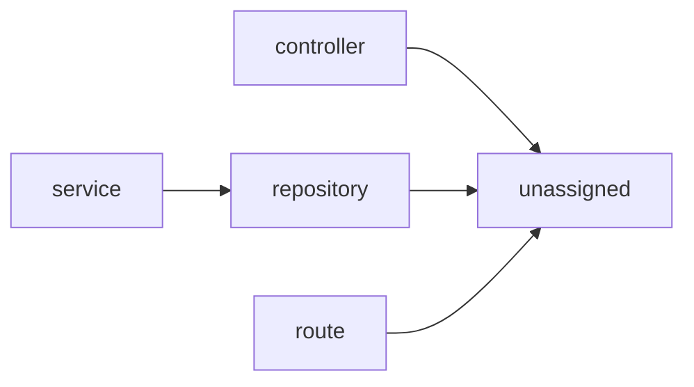

# Architecture — archsteer

> Auto-generated by ArchSteer from source. Do not edit by hand; run `archsteer docs`.

## Overview
- **Components:** 22
- **Layers:** controller, repository, route, service
- **Data stores:** 1, Id, a, count, existing, payments, raw_sql
- **External call sites:** 6

## Layer map

## Components by layer
- **controller** — 1 component(s)
- **repository** — 1 component(s)
- **route** — 1 component(s)
- **service** — 1 component(s)
- **unassigned** — 18 component(s)

## Component catalog

| Component | Layer | Exports | Data access | External |
|---|---|---|---|---|
| `archsteer/__init__.py` | — | — | — | — |
| `archsteer/cli.py` | — | _detect_pack, _pack_dir, _ws, _require_init | — | 6 |
| `archsteer/docs.py` | — | _layer_edges, _mermaid, render_architecture_md | — | — |
| `archsteer/engine/__init__.py` | — | — | — | — |
| `archsteer/engine/baseline.py` | — | Baseline | — | — |
| `archsteer/engine/conformance.py` | — | Violation, RuleResult, ConformanceReport, _in_scope | — | — |
| `archsteer/engine/decisions.py` | — | _slug, DraftADR, DecisionEngine | — | — |
| `archsteer/engine/evolution.py` | — | _now_id, structural_fingerprint, SnapshotMeta, ChangeItem | — | — |
| `archsteer/engine/intent.py` | — | Rule, Intent | — | — |
| `archsteer/engine/mapper.py` | — | _infer_layer, _git_sha, _read_manifest_deps, _resolve_internal | — | — |
| `archsteer/engine/model.py` | — | _utcnow, DependencyEdge, DataAccessPoint, ExternalCall | — | — |
| `archsteer/engine/parser.py` | — | _line_of, CodeParserFacade | existing | — |
| `archsteer/mcp_server.py` | — | _workspace, _normalize, _load, _report | — | — |
| `archsteer/report.py` | — | _sparkline, _mermaid_html, render_report_html | — | — |
| `archsteer/steer.py` | — | _rule_applies_to_files, AgentSteeringEngine | — | — |
| `archsteer/workspace.py` | — | Workspace | — | — |
| `examples/demo-repo/src/controllers/payment_controller.js` | controller | default | payments | — |
| `examples/demo-repo/src/db/client.js` | — | default | — | — |
| `examples/demo-repo/src/repositories/user_repository.js` | repository | default | raw_sql | — |
| `examples/demo-repo/src/routes/users.js` | route | default | raw_sql | — |
| `examples/demo-repo/src/services/user_service.js` | service | default | — | — |
| `tests/test_engine.py` | — | _write, _legacy_repo, _intent, test_model_build_and_layers | 1, Id, a, count, payments, raw_sql | — |
